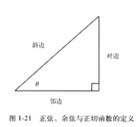
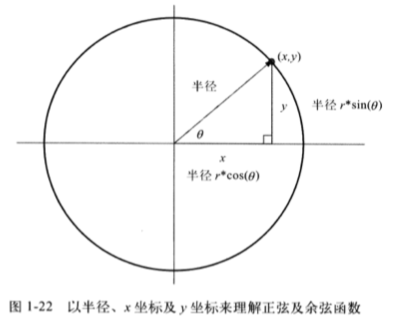
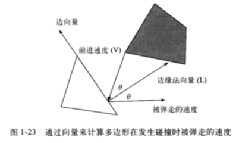
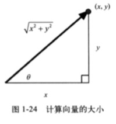
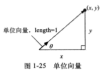
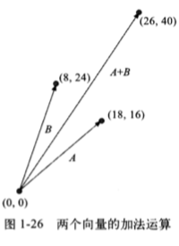
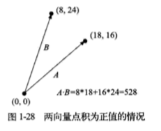
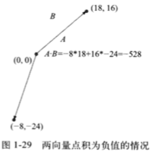
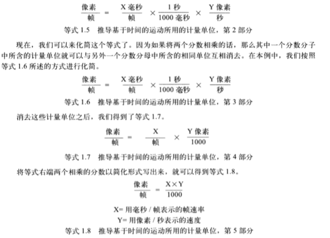

## Canvas元素
```js
var canvas = document.getElementById('canvas),
    context = canvas.getContext('2d');
    context.font = '38pt Arial';
    context.fillStyle = 'cornflowerblue';
    context.fillText('Hello Canvas', canvas.width/2,canvas.height/2);
    context.strokeText('Hello Canvas', canvas.width/2, canvas.heigth/2)
```
* 使用document.getElementById()方法来获取指向canvas引用
* 在canvas对象调用getContext('2d')获取绘图环境变量(**2d必须小写**)
* 使用绘图环境对象在canvas元素上进行绘制
* fillText()与strokeText()都需要三个参数

<strong style="color:red">* 在设置Canvas的宽度与高度时不能使用px后缀</strong>

### canvas的元素大小与绘图表面大小

我们可以通过canvas元素的width与height属性设置，也可以通过css来设置。canvas元素实际上有两套尺寸，一个是元素本身的大小，另一个是元素绘图表面。
* 设置width和height：同时改变元素和绘图表面大小
* 设置css只会改变元素本身大小

<strong style="color:red">* 使用css来修改元素大小，但又没有指定canvas元素的width与height，会导致两者的大小不符，浏览器进行缩放</strong>

### canvas元素的API

| 属性 | 描述 | 类型 | 取值范围 | 默认值 |
| :-----| :-----| :-----| :-----| :-----|
| width | 绘图表面的宽度，浏览器会把元素大小和绘图表面设置成一样大小，否则则进行缩放 | 非负整数 | 任意非负整数，不能以px结尾 | 300 |
| height | 绘图表面的高度| 非负整数 | 同上 | 300 |

| 属性 | 描述 |
| :-----| :-----|
| getContext() | 返回该canvas元素相关的绘图环境 |
| toDataURL(type, quality) | 返回一个数据地址，可以设为img的src，第一个参数是图像类型(image/png...),第二个参数必须是0-1.0之间的double值，表示图像的质量 |
| toBlob(callback, type, args...) | 创建一个表示此canvas的图像文件blob，第一个是回调函数，浏览器会以一个指向blob的引用为参数，去调用回调。之后的参数同上。 |

### canvas元素的绘图环境

#### CanvasRenderingContext2D对象所包含的属性
| 属性 | 描述 |
| :-----| :-----|
| canvas | 指向绘图环境所属的canvas对象，一般用于获取宽高 |
| fillstyle | 绘图环境填充操作所使用的颜色、渐变色或者图案 |
| font | fillText()或strokeText()方法所使用的字型 | 
| globalAlpha | 全局透明设置(0-1.0) |
| globalCompsiteOperation | 浏览器将某个物体绘制在其他物体之上时，采用的绘制方式 | 
| lineCap | 绘制的端点 ['butt', 'round', 'square'] default is butt |
| lineWidth | 线段屏幕像素宽度 (非负 非无穷) default： 1.0 |
| lineJoin | 两线相交的焦点 ['bevel', 'round', 'miter'] default is miter |
| shadowBlur | 延伸阴影效果，值越高，阴影效果延伸越远 (非负且非无穷量的double) |
| shadowColor | 使用何种颜色来绘制阴影 |
| shadowOffsetX | 以像素为单位，指定了阴影的效果的水平方向的偏移量 |
| shadowOffsetY | 以像素为单位，指定了阴影效果的垂直方向的偏移量 |
| strokeStyle | 对路径描边时所用的绘制风格 |
| textAlign | 文本的水平对齐方式 |
| textBaseLine | 文本的垂直对齐方式 |

#### 3d绘图环境WebGl

### canvas状态的保存与恢复

使用Canvas Api提供的两个名为save()和restore()方法

| 属性 | 描述 |
| :-----| :-----|
| save() | 将当前canvas的状态推送到一个保存canvas状态的堆栈顶部 | 
| restore() | 将canvas状态堆栈顶部的条目弹出 |

[codepen-HelloCanvas](https://codepen.io/syun0216/pen/xxKaWrg)

### 性能

* 性能分析器(Profiler)
* 时间轴工具(Timeline)
* jsPerf

### 时钟

## 事件处理

### 鼠标事件

```js
canvas.onmousedown = function(e) {
  ...
}
// 或
cavas.addEventListener('mousedown', function(e) {
  ...
})
```

获取鼠标位置，距离canvas绘图表面位置
```js
function windowToCanvas(canvas,x, y) {
  var bbox = canvas.getBoundingClientRect();
  return {
    x: x - bbox.left * (canvas.width / bbox.width),
    y: y - bbox.top * (canvas.height / bbox.height)
  }
}
canvas.onmousemove = function(e) {
  var loc = windowToCanvas(canvas, e.clientX, e.clientY);
  ...
}

// * (canvas.width / bbox.width) => 浏览器缩放比例 绘图表面大小/元素大小
```

### 键盘事件
键盘事件:
* keydown
* keypress
* keyup

键值码标准化

## 在Canvas中使用HTML元素

尽管我们可以说Canvas是html5之中最棒的功能，在绝大多数，都会将一个或者多个canvas与其他html控件结合起来使用

## 打印Canvas内容

在默认情况下，尽管每个canvas对象其实都一副位图，但他并不是html的img元素，所以用户不能对其进行某些操作。但是canvas api提供了一个toDataURL()方法，该方法返回的引用指向了某个给定canvas元素的数据地址。这个地址可以将图片保存到本地

## 离屏canvas

## 基础数学知识简介

### 三角函数

#### 角度与弧度
Canvas中所有与角有关的API，都需要以弧度(radian)的方式来指定该角的值。JS的Math.sin()、Math.cos()与Math.tan()函数都采用弧度值。

```
1弧度 = (π/180)*度
1度 = (180/π)*弧度
```

#### 正弦、余弦与正切函数

```
cos(θ) = 邻边 / 斜边;
sin(θ) = 对边 / 斜边;
tan(θ) = 对边 / 邻边;
```




#### 向量运算

> 二维向量都含有两个值：方向及大小。  
> 在底部那个多边型中，即将与顶部多边形发生碰撞那条边，成为边向量



#### 向量的大小

利用勾股定理来计算向量的大小



#### 单位向量

单位向量的长度永远是单位1，它只是用来指示方向的向量



#### 向量的加减法

  

图1-26 向量的加法就是将向量的两个分量分别相加即可，代码如下:

```js
var vectorSum = new Vector();
vectorSum.x = vectorOne.x + vectorTwo.x;
vectorSum.y = vectorOne.y + vectorTwo.y;
```

#### 两个向量的点积



首先请注意点积不是向量，我们把这种值叫做标量(scalar,也叫纯量);



点积为负的情况。

> 判断两个矢量的终点是不是大致指向同一个方向，通过计算这两个向量的点积可以精确做到这一点。

#### 根据计量单位来推导等式

为了实现基于时间的运动效果，我们采用**每秒移动的像素数**作为计量移动速度的单位。因此，为了计算动画当前帧所移动的像素数，我们需要知道两个信息： 物体的移动速度每秒是多少像素，以及当前动画的帧速率是每帧持续多少毫秒

