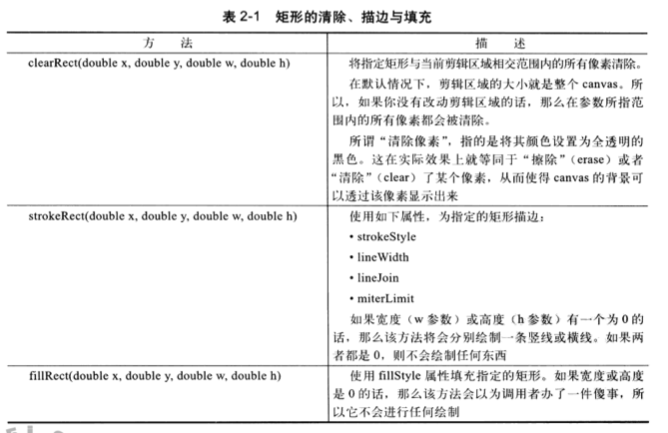
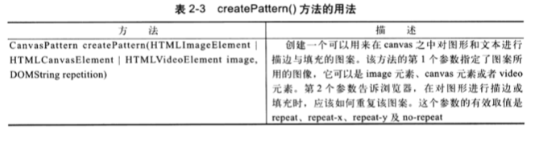

## 绘制

本章会介绍：
* 对线条、弧形、圆、曲线及多边形进行描边与填充
* 通过设置绘图环境的属性来改变所绘图形的外观
* 绘制圆角矩形
* 绘制并编辑贝塞尔曲线
* 对2d绘制环境进行扩展，使之可以绘制虚线
* 使用纯色、渐变色及图案对图形进行描边及填充
* 阴影效果
* 在不影响背景的情况下，使用“剪辑区域”技术来查出图形与文本
* 在canvas中拖动图形对象
* 坐标系统的变换

### 坐标系统

canvas坐标系统以左上角为原点，x坐标向右方增长，y坐标向下方延伸，我们也可以对坐标系统进行平移(translate)或者旋转(rotate)和缩放(scale)


### Canvas的绘制模型

在向canvas之上绘制图形或图像时，浏览器将做以下步骤： 

* 将图形或图像绘制到一个无线大的透明位图，在绘制时使用当前绘制的阴影设定
* 将图形或图像绘制到另外一幅绘图中，绘制时使用当前绘图环境的阴影设定。
* 将阴影中每一个像素的alpha分量乘以绘图环境对象的globalAlpha属性值
* 将绘有引用的位图与经过剪辑区域剪切过的canvas进行图像合成。操作时使用当前合成模式参数。
* 将图形或图像的每一个像素颜色分量，乘以绘图环境对象的globalAlpha属性值
* 将绘有图形或图像的位图，合成到当前经过剪辑区剪切过的canvas位图上， 在操作时使用当前合成操作符

### 矩形绘制

```js
clearReat(double x,double y, double w, double h) //清除某一部分的矩形
strokeReat(double x,double y, double w, double h) // 绘制空心矩形
fillReat(double x,double y, double w, double h) // 绘制实心矩形
```



### 颜色与透明度

strokeStyle与fillStyle的属性值可以是任意有效的css字符串

```css
#ffffff;
#642
rgb(255,255,0)
hsl(20,62%,28%)
hsla(40,82%,33%,0.6)
antiquewhite
burlywood
cadetblue
```

### 渐变色与图案

Canvas元素支持线性(linear)与放射(radial)渐变

* 通过调用createLinearGradient()会返回一个CanvasGradient实例，通过它的唯一方法addColorStop来向渐变色中添加颜色停止点(color stop)。该方法接受两个参数：一个是位于0-1.0之间的double值，代表颜色停止点在渐变线上的位置，另一个是DOMString类型的css3颜色字串值
```js
var canvas = document.getElementById('canvas'),
    context = canvas.getContext('2d'),
    gradient = context.createLinearGradient(0,0,canvas.width,0);
    gradient.addColorStop(0,'blue');
    gradient.addColorStop(0.25,'white');
    gradient.addColorStop(0.5,'purple');
    gradient.addColorStop(0.75,'red');
    gradient.addColorStop(1,'yellow');

    context.fillStyle = gradient;
    context.rect(0,0,canvas.width,canvas.height)
```
* 放射性渐变

```js
var canvas = document.getElementById('canvas'),
    context = canvas.getContext('2d'),
    gradient = context.createRadialGradient(canvas.width/2,canvas.height,10,canvas.width/2,0,100);
gradient.addColorStop(0,'blue');
    gradient.addColorStop(0.25,'white');
    gradient.addColorStop(0.5,'purple');
    gradient.addColorStop(0.75,'red');
    gradient.addColorStop(1,'yellow');

    context.fillStyle = gradient;
    context.rect(0,0,canvas.width,canvas.height);
    context.fill()
```


### 图案




### 阴影

* shadowColor: css3格式颜色
* shadowOffsetX: 水平像素偏移
* shadowOffsetY: 垂直像素偏移
* shadowBlur: 高斯模糊

```js
context.shadowColor = 'rgba(0,0,0,0.7)';
context.shadowOffsetX = 1;
context.shadowOffsetY = 1;
context.shadowBlur = 2;
```

**禁用阴影，将shadowColor设置为undefined**

#### 内嵌阴影

shadowOffsetX与shadowOffsetY设置负偏移量可以形成内嵌阴影  

```js
var drawingContext = document.getElementById('canvas').getContext('2d'),

drawingContext.lineWidth = 1;
drawingContext.shadowColor =  'blue';
drawingContext.shadowOffsetX = -5;
drawingContext.shadowOffsetY = -5;
drawingContext.shadowBlur = 20;
drawingContext.strokeStyle = 'rgba(0,0,255,0.6)'

drawingContext.save();
drawingContext.beginPath();
drawingContext.arc(100,100,60,0,Math.PI*2,false);
drawingContext.clip(); //绘制内容不得超出圆形范围之外
drawingContext.stroke();
drawingContext.restore();
```
效果如下： 


#### CanvasRenderingContext2D之中与阴影效果相关的属性


### 路径、描边、填充

```js
var context = document.getElementById('drawingCanvas').getContext('2d');

context.font = '48pt Heivetica';
context.strokeStyle = 'blue';
context.fillStyle = 'red';
context.lineWidth = '2';

context.strokeText('Stroke', 60, 110);
context.fillText('Fill',440,110);

context.lineWidth = '5';
context.beginPath();
context.rect(400,150,150,100);
context.fill();

context.beginPath();
context.arc(820,370,60,0,Math.Pi/2);
context.stroke();
context.fill();
```

首先调用beginPath()方法来开始一段新的路径，rect()与arc()方法分别用于创建矩形和弧形路径。然后调用stroke与fill方法，对刚才那些路径进行描边或填充。  


### 路径与子路径

在某一时刻，canvas中只能有一条路径存在，canvas称为当前路径。然而这条路径却可以包含许多子路径。而子路径又是由两个或者多个点组成的。
```js
// 绘制连个矩形
context.beginPath();
context.rect(10,10,100,100);
context.stroke();
context.beginPath();
context.rect(50,50,100,100);
context.stroke();
```

#### 填充路径所使用的非零环绕规则


### 剪纸效果