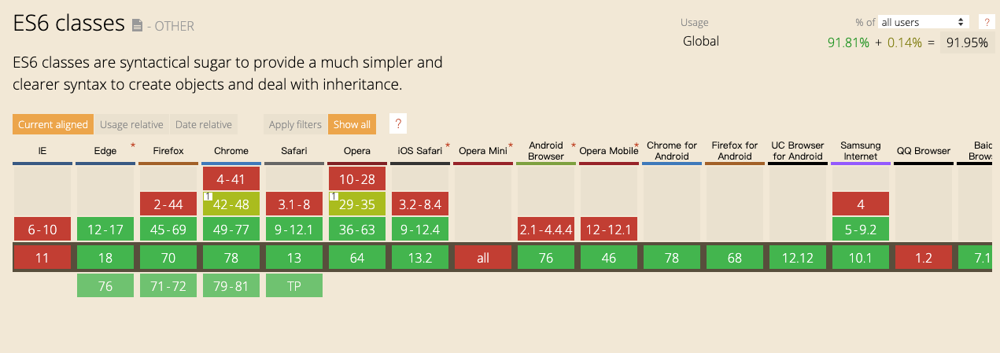

## ES6核心特性

> 参考[ES6核心特性](https://segmentfault.com/a/1190000017139065)


### 开发配置

使用babel编译ES6语法，如何用webpack实现模块化。

#### babel



查询网址[浏览器兼容性查询](https://caniuse.com/#home)

#### 如何配置babel?

```json
npm init
npm i babel-core babel-preset-es-2015 babel-preset-latest -D
//创建并配置.babelrc文件 存放在项目的根目录下
npm i babel-cli -g
babel-version
```

.babelrc的配置

```
//.babelrc文件
{
    "presets": ["es2015", "latest"],
    "plugins": []
}
```

#### 如何配置webpack

```json
npm i webpack bebel-locader -D
创建并配置 webpack.config.js//webpack.config.js文件与package.json同级
·配置 package.json中的scripts
·运行 npm start
```

```js
module.exports = {
  entry: './src/index.js',
  output: {
    path: __dirname,
    filename: './build/bundle.js'
  },
  module: {
    rules: [{
      test: /\.js?$/,
      exclude: /(node_modules)/,
      loader: 'babel-loader'
    }]
  }
}
```

### 块级作用域

ES6提供let和const来代替var声明变量，新的声明方式支持大括号表示的块级作用域，这样带来的好处是：
1. 不需要立即执行的函数表达式(IIFE)
2. 循环体中的闭包不在有问题
3. 防止重复声明变量

### 数组的扩展

1. Array.from()

可以将类数组转化为数组，比如说HTMLCollection

2. Array.of()

Array.of( )方法总会创建一个包含所有传入参数的数组，而不管参数的数量与类型

```js
let items = Array.of(1, 2);  // [1,2]
```

3. 数组实例的find()和findIndex()

数组实例的find方法，用于找出第一个符合条件的数组成员。它的参数是一个回调函数，所有数组成员依次执行该回调函数，直到找出第一个返回值为true的成员，然后返回该成员。如果没有符合条件的成员，则返回undefined。

```js
[1, 4, -5, 10].find((n) => n < 0) // -5
```

数组实例的findIndex方法的用法与find方法非常类似，返回第一个符合条件的数组成员的位置，如果所有成员都不符合条件，则返回-1。

```js
[1, 5, 10, 15].findIndex(function(value, index, arr) {
  return value > 9;
}) // 2
```

4. 数组实例的includes()

```js
[1, 2, 3].includes(2)   // true
[1, 2, 3].includes(3, -1); // true
[1, 2, 3, 5, 1].includes(1, 2); // true
```

5. 数组实例的 entries()，keys() 和 values()

```js
for (let index of ['a', 'b'].keys()) {
  console.log(index);
}
// 0
// 1

for (let elem of ['a', 'b'].values()) {
  console.log(elem);
}
// 'a'
// 'b'

for (let [index, elem] of ['a', 'b'].entries()) {
  console.log(index, elem);
}
// 0 "a"
// 1 "b"
```

### Class 和传统构造函数有何区别

从概念上讲，在 ES6 之前的 JS 中并没有和其他面向对象语言那样的“类”的概念。长时间里，人们把使用 new 关键字通过函数（也叫构造器）构造对象当做“类”来使用。由于 JS 不支持原生的类，而只是通过原型来模拟，各种模拟类的方式相对于传统的面向对象方式来说非常混乱，尤其是处理当子类继承父类、子类要调用父类的方法等等需求时。   
ES6提供了更接近传统语言的写法，引入了Class（类）这个概念，作为对象的模板。通过class关键字，可以定义类。但是类只是基于原型的面向对象模式的语法糖。

#### 对比在传统构造函数和 ES6 中分别如何实现类：

```js
//传统构造函数
function MathHandle(x,y){
  this.x=x；
  this.y=y；
}
MathHandle.prototype.add =function（）{
  return this.x+this.y；
}；
var m=new MathHandle(1,2）；
console.log(m.add()）

//class语法
class MathHandle {
 constructor(x,y){
  this.x=x；
  this.y=y；
}
 add(){
   return this.x+this.y；
  }
}
const m=new MathHandle(1,2);
console.log(m.add()）
```
这两者有什么联系？其实这两者本质是一样的，只不过是语法糖写法上有区别。所谓语法糖是指计算机语言中添加的某种语法，这种语法对语言的功能没有影响，但是更方便程序员使用。比如这里class语法糖让程序更加简洁，有更高的可读性。

#### 对比在传统构造函数和 ES6 中分别如何实现继承：

```js
//传统构造函数继承
function Animal() {
    this.eat = function () {
        alert('Animal eat')
    }
}
function Dog() {
    this.bark = function () {
        alert('Dog bark')
    }
}
Dog.prototype = new Animal()// 绑定原型，实现继承
var hashiqi = new Dog()
hashiqi.bark()//Dog bark
hashiqi.eat()//Animal eat

//ES6继承
class Animal {
    constructor(name) {
        this.name = name
    }
    eat() {
        alert(this.name + ' eat')
    }
}
class Dog extends Animal {
    constructor(name) {
        super(name) // 有extend就必须要有super，它代表父类的构造函数，即Animal中的constructor
        this.name = name
    }
    say() {
        alert(this.name + ' say')
    }
}
const dog = new Dog('哈士奇')
dog.say()//哈士奇 say
dog.eat()//哈士奇 eat
```

Class之间可以通过extends关键字实现继承，这比ES5的通过修改原型链实现继承，要清晰和方便很多。