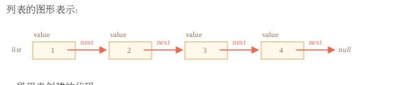
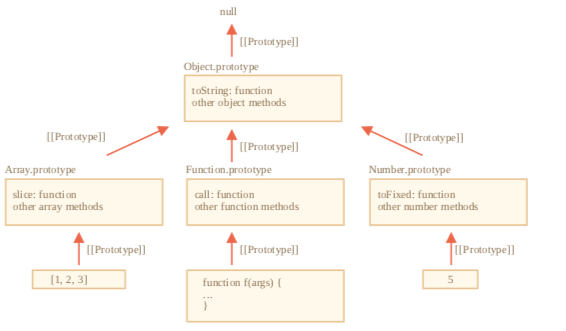

## JSON 方法， toJSON

JSON (JavaScript Object Notation) 是表示值和对象的通用格式。它被描述为 RFC 4627  标 准。最初它是为 JavaScript 编写的，但许多其他语言也有库来处理它。因此，当客户端使用
JavaScript 而服务器使用 Ruby/PHP/Java/Whatever 编写时，使用 JSON 进行数据交换非常容易。

JavaScript 提供方法

- JSON.stringify 将对象转换为 JSON
- JSON.parse 将 JSON 转回对象

请注意，JSON 编码的对象与对象字面量有几个重要的区别:

- 字符串使用双引号。JSON 中没有单引号或反引号。所以 'John' 转成 "John" 。
- 对象属性名称也是双引号的。这是强制性的。所以 age:30 转成 "age":30 。  
  JSON 是跨语言的纯数据规范，因此一些特定于 JavaScript 的对象属性被 JSON.stringify 跳 过。
- 函数属性(方法)。
- Symbolic 属性。
- 存储 undefined 的属性。

```js
let user = {
  sayHi() {
    // ignored
    alert('Hello')
  },
  [Symbol('id')]: 123, // ignored
  something: undefined // ignored
}
user // {}
```

重要的限制:不得有循环引用。  
JSON.stringify 完整语法是:

```js
 let json = JSON.stringify(value[, replacer, space])
 // value 要编码的值
 // replacer 要编码的属性数组或映射函数 function(key, value)
 // space 文本添加缩进、空格和换行符
```

对象可自定义 toJSON 方法，例如：

```js
let room = {
  number: 23,
  toJSON() {
    return this.number
  }
}
JSON.stringify(room) // 23
```

## JSON.parse

```js
let value = JSON.parse(str[, reviver]);
// str JSON字符串解析
// reviver 将为每个(key, value)对调用的可选函数(键, 值)进行转换
```

例如在解析 date 对象上

```js
let str = '{"title":"Conference","date":"2017-11-30T12:00:00.000Z"}'
let meetup = JSON.parse(str)
alert(meetup.date.getDate()) // Error!

let str = '{"title":"Conference","date":"2017-11-30T12:00:00.000Z"}'
let meetup = JSON.parse(str, function(key, value) {
  if (key == 'date') return new Date(value)
  return value
})
alert(meetup.date.getDate()) // now works!
```

总结

- JSON 是一种数据格式，对于大多数编程语言都有自己的独立标准和库。
- JSON 支持 objects，arrays，strings，numbers，booleans 和 null 。
- JavaScript 提供序列化成 JSON 的方法 JSON.stringify  和解析 JSON 方法 JSON.parse  。
- 这两种方法都支持用于智能读/写的转换函数。
- 如果一个对象具有 toJSON ，那么它可被 JSON.stringify 调用。

### Advanced working with functions

递归结构： 
### 链表
一个有序的对象数组，鉴于数组有个问题就是删除元素和插入元素的代价非常大，所以我们用链表来实现快速插入和删除。  
链表元素是一个被递归定义的对象，它有：
* value
* next属性引用下一个链表元素或者代表末尾的null

```js
let list = {
  value: 1,
  next: {
    value: 2,
    next: {
      value: 3,
      next: {
        value: 4,
        next: null
      }
    }
  }
}
```


```js
list.next.next = secondList // 合并元素
list = {value: 'new item', next: list} // 更新列表的头
list.next = list.next.next // 移除中间的一个值
```

总结： 
* 递归是函数自调用的编程术语。这种函数可以被用来优雅解决特定的任务。
* 当一个函数调用自身时，我们称其为递归步骤。递归基础是函数参数使得任务很简单，不需要其它更进一步调用。
* 一个递归定义的数据结构是指可以使用自身来定义的数据结构。 比如，链表可以被定义为由对象引用一个列表(或 null )的组成的数据结构。

### rest参数和spread操作符

```js
function sumAll(...args) { // 数组变量名为args
  let sum = 0;
  for(let arg of args) sum += arg;
  return sum;
}
```

注意：  
箭头函数是没有 "arguments" 的。
如果我们在箭头函数中访问 arguments ，此时的 arguments 并不属于箭头函数，而是属于箭头函数外部的“普通”函数。
```js
function f() {
let showArg = () => alert(arguments[0]); showArg();
}
f(1); // 1
```
总结 

当我们在代码中遇到 "..." 时，它不是 Rest 参数就是 Spread 操作符。  
我们可以使用下列方法区分二者：
* 若...出现在函数的参数列表，那它表示的就是 Rest 参数，它会把函数多余的实参收集 到一个数组中。
* 若...出现在函数调用或类似的表达式中，那它就是 Spread 操作符，它会把一个数组展 开为逗号分隔的元素列表。  

使用场景  
* Rest参数用于创建可接受任意个参数的函数
* Spread 操作符可以在函数调用传参时，把含有参数的数组展开为函数需要的参数列表形 式。

### 闭包 p318
词法环境  在 JavaScript 中，每个运行的函数、代码块或整个程序，都有一个称为 词法环境(Lexical Environment) 的关联对象。   
1. 环境记录(Environment Record)—— 一个把所有局部变量作为其属性(包括一些额外信息，比如 this 值)的对象。
2. 外部词法环境(outer lexical environment) 的引用 —— 通常是嵌套当前代码(当前花括号之外)之外代码的词法环境。 


### 旧时的var

- let
- const
- var

总结  
var声明变量有两点主要区别：
- 变量没有块作用域，它们在最小函数可见；
- 变量声明在函数开头处理

### 全局对象

如果我们在 script 标签上设置特性 ，那么这样的脚本被认为是个单独的 “模块”，它有自己的顶级作用域(词法环境)，不会干扰 。

```js
<script type="module">
  var x = 5;
  alert(window.x); // undefined
</script>
// 两个模块彼此不可见
<script type="module">
let x = 5;
</script>
<script type="module">
alert(window.x); // undefined
alert(x); // 未声明的变量
</script>
```

### 函数

函数就是对象。

- name - 函数名字。不仅仅在函数定义指定时存在，而且在赋值或者对象属性中也会有。
- length - 函数定义时入参个数。余参不参与计计数 
```js
function sayHi(a,b,...rest) {...}
sayHi.name // sayHi
sayHi.length // 2
```
如果函数通过函数表达式被声明的，它附带了名字，那么它被称为命名的函数表达式。它可以用来函数内部调用自己。
```js
let sayHi = function myFunc() {
  if(isYes) {
    myFunc()
  }
}
myFunc() // undefined
sayHi() // worked
```
而且，函数可以有额外的属性。很多知名的 JavaScript 库广泛使用了这个特点。  
它们创建一个「主」函数，然后给它附加很多其它「helper」函数。比如，jquery 库创建了一 个名为 $ 的函数。lodash  库创建一个 _ 函数。然后添加了.add 、 _.keyBy 以及其它属 性(欲了解详情，参见 docs  )。事实上，它们这么做是为了减少对全局空间的污染，这样一个 库就只会产生一个全局变量。这样就降低了命名冲突的可能性。

### new Function 语法

```js
 let func = new Function(arg1, arg2, ..., body);
```
由于历史原因，参数也可以按逗号分隔符的形式给出。
以下三种形式表现一致:

```js
new Function('a', 'b', 'return a + b'); // 基础语法
new Function('a,b', 'return a + b'); // 逗号分隔
new Function('a , b', 'return a + b'); // 逗号和空格分隔
```

使用 new Function 创建出来的函数，它的 [[Environment]] 指向全局词法环境，而不是 函数所在的外部词法环境。

### setTimeout & setInterval

- setInterval(func, delay, ...args) 和 setTimeout(func, delay, ...args)可以让func定期经理一段延时后一次性执行。
- 要取消函数的执行需要调用clearInterval/clearTimeout,只需要将setInterval/setTimeout返回的值传入即可。
- 嵌套 setTimeout比setInterval用起来更加灵活，同时也能保证每一轮执行的最小时间 间隔。
- 0 延时调度setTimeout(..., 0)用来安排在当前代码执行完时，需要尽快执行的函数。
  - 将耗费CPU的任务分割成多块，这样脚本运行就不会进入挂起状态
  - 进程繁忙时也能让浏览器抽身去做其他事情  
有一点需要注意，所有的调度方法都不能保证延时的准确性，所以在调度代码中，万不可依赖它。浏览器内部的定时器会因各种原因而出现降速情况，譬如:
- CPU过载
- 浏览器页签切换到后台模式
- 笔记本电脑用的是电池供电(译者注:使用电池会以降低性能为代价提升续航)。

### 装饰和转发，call/apply

```js
function slow() {
  //这是一个可能会有重负载的CPU密集型工作
}

function cacheDecorator(func) {
  let cache = new Map();
  return function(x) {
    if (cache.has(x)) { // 如果结果在 map 里 return cache.get(x); // 返回它
    }
    let result = func.call(this, x); // "this" 现在被正确的传递了 // 否则就调用函数
    cache.set(x, result); // 然后把结果缓存起来
    return result;
  }
}
```

cachingDecorator 是一个装饰器:一个特殊的函数，它接受另一个函数并 改变它的行为。  
总而言之，使用单独的 cachingDecorator 而不是改变 slow 本身的代码有几个好处:  
* cachingDecorator 是可重用的。我们可以将它应用于另一个函数。
* 缓存逻辑是独立的，它没有增加 slow 本身的复杂性(如果有的话)。
* 如果需要，我们可以组合多个装饰器(其他装饰器将遵循同样的逻辑)。

#### 方法借用

```js
function hash() {
  console.log(arguments.join()) // 报错 arguments.join不是函数
}
function hash() {
  console.log([].join.call(arguments)); // 1,2
}
```

这个技巧叫方法借用，我们从常规数组 [].join 中获取(借用)连接方法。并使用 [].join.call 在 arguments 的上下文中运行它

通常呼叫转移通常使用apply完成：
```js
let wrapper = function() {
  return original.apply(this, arguments)
}
``` 

### 柯里化和偏函数

#### 高级柯里化实现

```js
function curry(func) {
return function curried(...args) { if (args.length >= func.length) {
return func.apply(this, args); } else {
return function(...args2) {
return curried.apply(this, args.concat(args2));
} }
}; }
function sum(a, b, c) { return a + b + c;
}
let curriedSum = curry(sum);
// 依然可以被正常调用
alert( curriedSum(1, 2, 3) ); // 6
// 得到 curried(1) 的偏函数，然后用另外两个参数调用它 alert( curriedSum(1)(2,3) ); // 6
// 完全柯里化形式
alert( curriedSum(1)(2)(3) ); // 6
```

总结

* 当我们确定一个函数的一些参数时，返回的函数(更加特定)被称为偏函数。
  当我们不想一遍又一遍重复相同的参数时，偏函数很方便。比如我们有函数send(from, to) ，并且在我们的任务中 始终是相同的，那么我们可以构造一个偏函数然后对它进行
操作。
* 柯里化是将 可以被以 的形式被调用的转化。JavaScript 实现版本通 常保留函数被正常调用和在参数数量不够的情况下返回偏函数这两个特性。  
当我们想要简单偏函数的时候，柯里化很棒。正如我们在 logging 例子中所看到的那样:通用函 数 在柯里化之后，当我们在调用它的时候传入一个

#### 深入研究箭头函数

* 箭头函数功能没有this
* 没有arguments
* 不能使用new

### Object properties configuration

属性的标志

* writable --- 如果为true,则可以修改，否则它只是已读
* enumerable --- 如果为true，则可在循环中列出
* configurable --- 如果为true，则此属性可以被删除

#### 设定一个全局的封闭对象

* Object.preventExtensions(obj) -- 禁止向对象添加属性
* Object.seal(obj) -- 禁止添加/删除属性， 为所有现在属性设置configurable: false
* Object.freeze(obj) -- 禁止添加/删除/更改属性，configurable: false, writable: false
* Object.isExtensible(obj) -- 属性是否未被禁止
* Object.isSealed(obj) -- 如果禁止/删除属性，则返回true，并且所有现有属性都具有configurable: false
* Object.isFrozen(obj) -- 如果禁止添加/删除/更改属性，并且所有当前属性都是configurable: false, writable: false,则返回true

#### 属性包装器

Getter/setter可以用作“真实”属性值包装器，以便对他们进行更多控制。例如：

```js
let user = {
  get name() {
    return this._name
  },
  set name(value) {
    if(value.length < 4) {
      console.log('Name is too short, need at lease 4 characters');
      return
    }
    this._name = value
  }
}
```
从技术上讲，外部代码仍然可以通过使用 "user._name"直接访问该名称。但是有一个众所周知的 协议，即以下划线 _ 开头的属性是内部的，不应该从对象外部访问。


### 原型、继承 

#### [[Prototype]]

在 JavaScript 中，对象有一个特殊的隐藏属性 [[Prototype]] (如规范中所命名的)，其取值 为 null 或者是另一个对象的引用。该对象称为“原型”:
[[Prototype]] 有一个“神奇”的意义。当我们想要从 object 中读取一个缺失的属性时， JavaScript 会自动从原型中获取它。在编程中，这称为“原型继承”。许多很酷的语言特性和编程技 巧都是基于它的。
* 通过__proto__设置
```js
let animal = { eats: true, walk() {
/* this method won't be used by rabbit */
} };
let rabbit = { __proto__: animal
}
```

总结：
* prototype属性与[[prototype]]不同。F.prototype唯一的作用是: 当new F()被调用时，它设置了新对象的[[Prototype]]。
* F.prototype的值应该是一个对象或null： 其他值将不起作用。
* "prototype"属性在设置为构造函数时仅具有这种特殊效果，并且用new调用。

#### 原生的原型

"prototype" 属性在 JavaScript 自身的核心模块中被广泛应用。所有的内置构造函数都用到了 它。




#### 更改原生的原型

在现代编程中，只有一种情况下修改原生原型是被允许的.那就是polyfills。

#### 原型方法

* Object.create(proto[, descriptors])  —— 利用 proto 作为 [[Prototype]] 和可选的属性 描述来创建一个空对象。
* Object.getPrototypeOf(obj)  —— 返回 obj 对象的 [[Prototype]] 。
* Object.setPrototypeOf(obj, proto)  —— 将 obj 对象的 [[Prototype]] 设置为
proto 。

```js
let animal = {}
let rabbit = Object.create(animal)
Object.getPrototypeOf(rabbit) === animal; // 获取rabbit原型
Object.setPrototypeOf(rabbit, {}); // 将rabbit的原型更改为{}
```

我们可以利用 Object.create 来实现比 for..in 循环赋值属性方式更强大的对象复制功能:
```js
// obj 对象浅复制
let clone = Object.create(Object.getPrototypeOf(obj), Object.getOwnPropertyDescriptors(obj));
// 这样复制玩，obj包含了所有属性，可枚举和不可枚举的属性
```
#### 获取所有属性

获取一个对象的键/值有很多种方法。
我们已知的有:
* Object.keys(obj) / Object.values(obj) / Object.entries(obj) – 返回一个数组，包含所有 可枚举字符串属性名称/值/键值对。这些方法只会列出可枚举属性，而且它们键名为字符串形 式。
如果我们想要 symbol 属性:
* Object.getOwnPropertySymbols(obj) —— 返回包含所有 symbol 属性名称的数组。
如果我们想要非可枚举属性:
* Object.getOwnPropertyNames(obj) —— 返回包含所有字符串属性名的数组。
如果我们想要所有属性:
* Reflect.ownKeys(obj) —— 返回包含所有属性名称的数组。

### class 基本语法

class和function的不同

1. class 创建的函数是由特殊内部属性标记的[[functionKind]]: "classConstructor"。它必须使用new 关键词进行调用：

```js
function fun() {}
func() // undefined
class User{}
User() // Uncaught TypeError: Class constructor User cannot be invoked without 'new'
```
2. 类方法不能枚举。对于prototype中的所有方法，类定义enumerable标记设为false 
3. 默认使用use strict

#### 类继承 构造函数

在 JavaScript 中，“继承类的构造函数”与所有其他的构造函数之间存在区别。在继承类中，相应的 构造函数会被标记为特殊的内部属性 [[ConstructorKind]]:"derived" 。

```js
class C1 {
  constructor(name) {
    this.name = name;
  }
}
class C2 extends C1 {
  constructor(age) {
    super('Miro'); // 重写构造函数 必须将super放在this之前
    this.age = age;
  }
}
```
使用extends和普通函数的区别：
* 当一个普通构造函数执行时，它会创建一个空对象作为 this 并继续执行。
* 但是当继承的构造函数执行时，它并不会做这件事。它期望父类的构造函数来完成这项工作。

#### Super 内部探究:[[HomeObject]] p427

在 JavaScript 语言中 [[HomeObject]] 仅被用于 super 。所以，如果一个方法不使用 super ，那么我们仍然可以视它为自由的并且可在对象之间复制。但是在 super 中可能出错。
* [[HomeObject]]是为类和普通对象中的方法定义的。但是对于对象来说，方法必须确切指定为method()   ，而不是 "method: function()" 。

总结：
1. 扩展类：class Child extends Parent;
   这就意味着child.prototype.__proto__将是Parent.prototype, 所以方法被继承。
2. 重写构造函数：
   在使用this之前，我们必须在Child构造函数中将父构造函数调用为super()
3. 重写方法：我们可以在Child方法中使用super.method()来调用Parent方法
4. 内部工作：方法在内部 [[HomeObject]] 属性中记住它们的类/对象。这就是 super 如何解析父类 方法的。  因此，将一个带有 super 的方法从一个对象复制到另一个对象是不安全的。
5. 箭头函数没有自己的 this 或 super ，所以它们能融入到就近的上下文，像透明似的。

### 静态属性和静态方法

静态方法被用来实现属于整个类的功能，不涉及到某个具体的类实例的功能。
它们在类声明中通过 static 来标记。 当我们想要存储类级别的数据时，我们会使用静态属性，而不是在实例上绑定数据。  
语法:  
```js
class MyClass {
  static property = ...;
  static method() { ...
  } 
}
// 技术上来说，静态声明等同于直接给类本身赋值
MyClass.property = ... 
MyClass.method = ...
```
  
#### 私有的和受保护的属性和方法

只读的”power“。咖啡机的功率永远不变。
```js
class CoffeeMachine {
  construtor(power) {
    this._power = power;
  }

  get power() {
    return this._prower
  }
}

let coffeeMachine = new CoffeeMachine(100);
coffeeMachine.power // 100
conffeeMachine.power = 25 // error (no setter)
```

#### 私有属性

私有属性和方法应该以 # 开头。他们只能从类的内部访问。

### 类型检查 instanceof

instanceof 操作符用于检测对象是否属于某个 class，同时，检测过程中也会将继承关系考虑在内  
instanceof在检测中会将原型链考虑在内，此外，还能借助静态方法Symbol.hasInstance来改善检测效果。

1. 如果提供了静态方法 Symbol.hasInstance ，那就直接用这个方法进行检测:

```js
// 假设具有 canEat 属性的对象为动物类 
class Animal {
static [Symbol.hasInstance](obj) { if (obj.canEat) return true;
} }
let obj = { canEat: true };
alert(obj instanceof Animal); // 返回 true:调用 Animal[Symbol.hasInstance](obj)
```
2. 大部分的类是没有 Symbol.hasInstance 方法的，这时会检查 Class.prototype 是否 与 obj 的原型链中的任何一个原型相等。

#### 使用 Object 的 toString 方法来揭示类型

Object.prototype.toString.call(...)

#### Symbol.toStringTag

对象的 toString 方法可以使用 Symbol.toStringTag 这个特殊的对象属性进行自定义输 出。

```js
let user = { 
  [Symbol.toStringTag]: "User"
};
alert( {}.toString.call(user) ); // [object User]
```

|  | 用于 | 返回 |
|:--- | :--- | :--- |
| typeof | 基本数据类型 | string | 
| {}.toString | 基本数据类型、内置对象以及包含 Symbol.toStringTag 属性对象 | string |
| instanceof | 任意对象 | true/false |