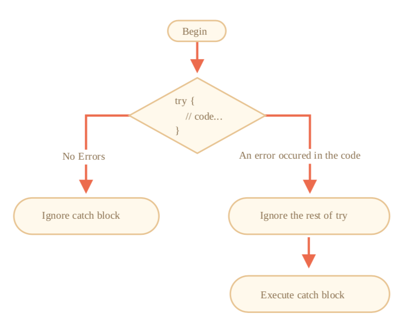

### JavaScript 中的 mixins

```js
let sayMixin = {
  say(phrase) {
    alert(phrase)
  }
}
let sayHiMixin = {
  __proto__: sayMixin, // (或者，我们可以在这里通过 Object.create 来设置原型。)
  sayHi() {
    // 调用父类中的方法
    super.say(`Hello ${this.name}`)
  },
  sayBye() {
    super.say(`Bye ${this.name}`)
  }
}
class User {
  constructor(name) {
    this.name = name
  }
}
// 拷贝方法
Object.assign(User.prototype, sayHiMixin)
// 现在 User 可以说 hi 了
new User('Dude').sayHi() // Hello Dude!
```

请注意在 sayHiMixin 内部对于父类方法 super.say() 的调用会在 mixin 的原型上查找方法 而不是在 class 自身查找。

#### eventMixins

```js
let eventMixin = { /**
* 订阅事件，用法:
* menu.on('select', function(item) { ... } */
on(eventName, handler) {
if (!this._eventHandlers) this._eventHandlers = {}; if (!this._eventHandlers[eventName]) {
this._eventHandlers[eventName] = []; }
this._eventHandlers[eventName].push(handler); },
/**
* 取消订阅，用法:
* menu.off('select', handler) */
off(eventName, handler) {
let handlers = this._eventHandlers && this._eventHandlers[eventName];
if (!handlers) return;
for (let i = 0; i < handlers.length; i++) {
if (handlers[i] === handler) { handlers.splice(i--, 1);
} }
},
/**
* 触发事件并传递参数
* this.trigger('select', data1, data2); */
trigger(eventName, ...args) {
if (!this._eventHandlers || !this._eventHandlers[eventName]) {
return; // 对应事件名没有事件处理函数。 }
// 调用事件处理函数
this._eventHandlers[eventName].forEach(handler => handler.apply(this, args)); }
};
```

### 错误冲突

#### 异常处理 try catch



::: warning try..catch only works for runtime errors
要使得 try..catch 能工作，代码必须是可执行的，换句话说，它必须是有效的 JavaScript
代码。
如果代码包含语法错误，那么 try..catch 不能正常工作，例如含有未闭合的花括号:

```js
try { 
} catch(e) {
alert("The engine can't understand this code, it's invalid");
}
```

JavaScript 引擎读取然后执行代码。发生在读取代码阶段的异常被称为 “parse-time” 异常，它 们不会被 try..catch 覆盖到(包括那之间的代码)。这是因为引擎读不懂这段代码。
:::

try catch 不能捕捉到在计划中的代码，比如 setTimeout

#### Error 对象

对于所有内置的异常，catch 代码块捕捉到的相应的异常的对象都有两个属性:

- name: 异常名称，如：ReferenceError
- message: 异常详情的文字描述。
  还有很多非标准的属性在绝大多数环境中可用。其中使用最广泛并且被广泛支持的是:
- stack: 调用栈

### 抛出自定义异常

#### Throw 运算符

```js
 throw <error object>
```

JavaScript 有很多标准异常的内置的构造器: **Error** 、 **SyntaxError** 、 **ReferenceError** 、 **TypeError** 和其他的。我们也可以用他们来创建异常对象。

#### try...catch...finally

```js
try
{
... 尝试执行的代码 ... } (e) {
 catch
... 异常处理 ... }{
 finally
... 最终会执行的代码 ... }
```
finally 任何情况下都会执行

finally 语法支持任何的结束 try..catch 执行的方式，包括明确的 return 。

总结

```js
try {
// 执行此处代码
} catch(err) {
// 如果发生异常，跳到这里 // err 是一个异常对象
} finally {
// 不管 try/catch 怎样都会执行
}
```

总结：

* 我们能够正常地继承 Error 以及其他内置的错误类，只需要注意 name 属性以及不要忘了调 用 super 。  
* 大多数时候，我们应该使用 instanceof 来检测一些特定的异常。它也能够在继承中使用。 但有时我们会发现来自第三方库的异常，并且不容易得到它的类。那么 name 属性就可用于这 一类的检测。  
* 包装异常是一种广泛应用的技术，当一个函数处理低级别的异常时，用一个高级别的对象来报 告错误。低级别的异常有时会变成这个对象的属性，就像上面例子中的 err.cause ，但这并 不严格要求。

### Promise， async/await

