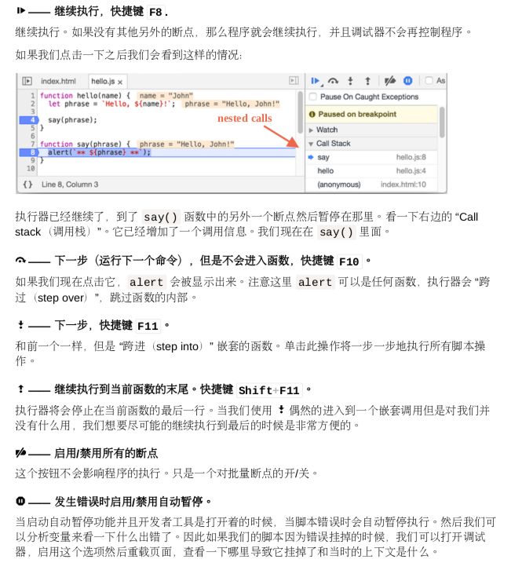
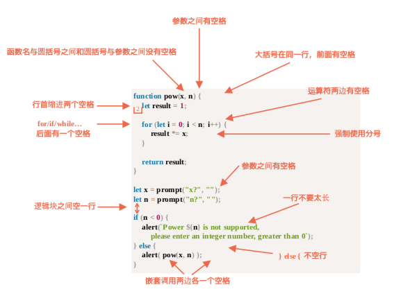
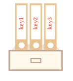

## chrome 之调试



## 代码风格



总结:

- 对于很短的代码，一行是可以接受的:例如 if (cond) return null .
- 但是括号中的每个语句单独一行通常更好些。

## 使用 mocha 进行自动化测试

describe("title", function() { ... })

表示我们正在描述的功能是什么。用于组织 “工人(workers)” – 代码块。在我们的例子中我 们正在描述函数 。

it("title", function() { ... })

it 里面的 “title” 中我们以人类可读的方式描述特定的用例，第二个参数是一个测试它的函数。

assert.equal(value1, value2)

## 开发流程

1. 编写初始规范，测试基本功能
2. 创建一个最出实现
3. 检查它是否工作
4. 现在我们有一个基于测试的能工作的初步实现。
5. 我们增加更多的用例到规范中，或许目前的程序实现还不支持。测试从失败开始。
6. 进行第 3 步，更新程序直到测试不会抛出错误。
7. 重复第 3 步到第 6 步，直到功能完善。

## Babel

当我们使用语言的一些现代特性时，一些引擎可能无法支持这样的代码。  
Babel 包含两个部分：

1. transpiler 程序，就是重写代码的那个。开发者在自己的电脑上运行。诸如 webpack 或者 brunch 这样的现代项目构建系统提供了每次代码改变都会自动运行 transpiler 方法
2. polyfill：transpiler 会重写代码，但对于新特性我们需要写一个特殊的脚本来实现他们。js 是一个高度动态化的语言。脚本可能不仅是添加一些新特性，还会修改一些内置特性，以便于他们表现得符合现代标准。

## Object 对象： 基础知识



总结
对象是具有一些特殊特性的关联数组。
他们存储键值对，其中:

- 属性的键必须是字符串或者 Symbol(通常是字符串)。
- 值可以是任何类型。
  我们可以用下面的方法获取属性:
- 点符号: obj.property 。
- 方括号 obj["property"] ，方括号中可以使用变量 obj[varWithKey] 。 其他操作:
- 删除属性: delete obj.prop。
- 检查属性是否存在: "key" in obj。
- 遍历对象: for(let key in obj) 循环。

对象根据引用来赋值或者复制。换句话说，变量存的不是对象的"值"，而是值的 “引用”(内存地 址)。 所以复制变量或者传递变量到方法中只是复制了对象的引用。 所有的引用操作(像增加， 删除属性)都作用于同一个对象。
深拷贝的话我们可以使用 Object.assign 或者 \_.cloneDeep(obj)  。 我们在这一章学习的叫做“基本对象” — 对象。  
JavaScript 中还有很多其他类型的对象:

- Array 存储有序数据集合
- Date 存储时间日期
- Error 存储错误信息

他们有一些特别的特性，我们将在后面学习到。有时候大家说“数组类型”，“时间类型”，他们都属 于对象类型的一种，都以不同的方式对对象类型做了一些扩展。

## 垃圾回收

可达性
JavaScript 中主要的内存管理概念是可达性。 简而言之，『可达』值是那些以某种方式可访问或可用的值。它们保证存储在内存中。

1. 这里列出固有的可达值基本集合，这些值明显不能被释放。
   比方说:

- 当前函数的局部变量和参数。
- 嵌套调用时，当前调用链上所有函数的变量与参数。
- 全局变量。
- (还有一些内部的)
  这些值被称作根。

2. 如果一个值可以通过引用或引用链，从根值访问到，则认为这个值是可达的。
   比方说，如果局部变量中有一个对象，并且该对象具有引用另一个对象的 property，则该对象被 认为是可达的。而且它引用的内容也是可达的。下面是详细的例子。

内部算法
垃圾回收的基本算法被称为 “mark-and-sweep”。 定期执行以下“垃圾回收”步骤:

- 垃圾收集器找到所有的根，并“标记”(记住)它们。
- 然后它遍历并"标记"来自它们的所有参考。
- 然后它遍历到标记的对象并标记他们的引用。所有被遍历到的对象都会被记住，以免将来再次 遍历到同一个对象。
- ...一直这样，直到有未访问的引用(从根访问到)。
- 没有被标记的所有对象都被删除。

JavaScript 引擎做了很多优化，使其运行速度更快，并且不会影响代码运行

- 分代收集 —— 对象被分成两组:『新的』和『旧的』。许多对象出现，完成他们的工作并快速 释放，他们可以很快被清理。那些长期存活下来的对象会变得『老旧』，而且检查的次数也会 减少。
- 增量收集 —— 如果有许多对象，并且我们试图一次遍历并标记整个对象集，则可能需要一些时 间并在执行过程中带来明显的延迟。所以引擎试图将垃圾收集工作分成几部分来做，然后将这 几部分逐一处理。这需要他们之间额外的标记来追踪变化，但是会有许多微小的延迟而不是大 的延迟。
- 闲时收集 —— 垃圾收集器只会在 CPU 空闲时尝试运行，以减少可能对代码执行的影响。

总结 主要需要掌握的东西:

- 垃圾回收是自动完成的，我们不能强制执行或是阻止执行。
- 当对象是可达状态时，它在内存中是可达的。
- 被引用与可访问(从一个根)不同:一组相互连接的对象可能整体都无法访问。

## Sysmbol 类型

Symbol 保证是唯一的。即使我们创建了许多具有相同描述的 Symbol，它们的值也是不同。描述 只是一个不影响任何东西的标签。

全局 symbol  
正如我们所看到的，通常所有的 Symbol 都是不同的，即使它们有相同的名字。但有时我们想要同  
一个名字的 Symbol 是相同的实体。 比如，我们希望在应用程序的不同部分访问相同的 Symbol "id" 属性 。  
为此，存在一个全局 symbol 注册表。我们可以在其中创建 Symbol 并在稍后访问它们，它可以确 保每次访问相同名称都会返回相同的 Symbol。  
为了在注册表中创建或读取 Symbol，请使用 Symbol.for(key) 。 该调用会检查全局注册表，如果有一个描述为 的 Symbol，则返回该 Symbol，否则将创建一
个新 Symbol( Symbol(key) )，并通过给定的 将其存储在注册表中。 例如:

```js
// 从全局注册表中读取
let id = Symbol.for('id') // 如果该 Symbol 不存在，则创建它
// 再次读取
let idAgain = Symbol.for('id')
// 相同的 Symbol
alert(id === idAgain) // true
```

Symbol.keyFor
对于全局 symbol， 不仅按名称返回一个 symbol，而且还有一个反向调用: Symbol.keyFor(sym)，反过来:通过全局 symbol 返回一个名称。

系统 Symbol

- Symbol.hasIntance
- Symbol.isConcatSpreadable
- Symbol.iterator
- Symbol.toPromitive

### Symbol 总结

Symbol 是标识符的基本类型

Symbol 使用 Symbol 创建的，调用带有一个可选描述。
Symbol 总是不同的值，即使他们有相同的名称。我们希望同名的 Symbol 相等，那么我们使用全局注册表；Symbol.for(key)返回一个以 key 作为名称的全局 Symbol， 返回(如果需要的话创建)一个以 key 作为名称的全局 Symbol。 的多次调用完全返回相同的 Symbol。

Symbol 有两个主要的使用场景:

- 隐藏对象属性。如果需要将属性添加到另一个脚本或库中的对象中，则可以创建 Symbol 并将其用作属性键。Symbol 属性不出现在 for...in 中，因此不会无心列出。另外它不会被直接访问，因为另一个脚本没有我们的符号，所以它不会不小心干预它的操作。
- JavaScript 使用了许多系统 Symbol，这些 Symbol 可以作为 访问。我们可以使用 Symbol.for(key)Symbol.for 它们来改变一些内置行为。例如，在本教程的后面部分，我们将使用 Symbol.iterator 迭代，Symbol.toPrimitive 来设置对象原始值的转换等等。
- Object.getOwnPropertySymbols(obj) 允许我们获取所有的 Symbol。

```js
let obj = { name: 'Miro' }
obj[(Symbol('age') = 25)]
for (let key in obj) {
  console.log(key)
} // name undefined
console.log(obj[Symbol('age')]) // undefined
Object.getOwnPropertySymbols(obj) // [Symbol(age)]
```

## 对象方法与 this

总结

- 存储在对象中函数称之为『方法』。
- 对象执行方法进行『操作』，比如 object.doSomething() 。
- 方法可以将该对象引用为 this 。
  this 的值是在运行时求值的。
- 函数声明使用的 this 只有等到调用时才会有值。
- 函数可以在对象之间进行共用。
- 当函数使用『方法』语法 object.method() 调用时，调用过程中的 this 总是指向 object 。
  请注意箭头函数有些特别:它们没有 this 。在箭头函数内部访问的都是来自外部的 this 值。

### 对象原始值转换

Symbol.toPrimitive 我们从第一个方法开始。有一个名为 Symbol.toPrimitive 的内置符号应该用来命名转换方 法，像这样:

```js
obj[Symbol.toPrimitive] = function(hint) {
  // 返回一个原始值
  // hint = "string"，"number" 和 "default" 中的一个
}
```

```js
let user = {
  name: 'John',
  money: 1000,
  [Symbol.toPrimitive](hint) {
    alert(`hint: ${hint}`)
    return hint == 'string' ? `{name: "${this.name}"}` : this.money
  }
}

// 转换演示:
alert(user) // hint: string -> {name: "John"}
alert(+user) // hint: number -> 1000
alert(user + 500) // hint: default -> 1500
```

对象到原始值的转换，是由许多内置函数和操作符自动调用的，这些函数使用一个原始值作为返回
值的。
它有三种类型(暗示):

- "string"(对于 alert 和其他字符转换)
- "number"(对于 maths)
- "default"(少数操作)
  规范明确描述了哪个操作符使用哪个暗示。极少数操作者“不知道期望什么”并使用 "default" 暗示。通常对于内置对象，"default" 暗示的处理方式与 "number" 相同，因此在实践中最后 两个通常合并在一起。
  转换算法是:

1. 调用 obj[Symbol.toPrimitive](hint)如果这个方法存在的话，
2. 否则如果暗示是"string"  
   2-1. 尝试 obj.toString() 和 obj.valueOf(),无论哪个存在
3. 否则，如果暗示"number"或者"default"  
   3-1. 尝试 obj.valueOf() 和 obj.toString() 无论哪个存在。

在实践中，为了记录或调试目的，仅实现 obj.toString() 作为“全捕获"方法通常就够了，这样所有转换都能返回一种“人类可读”的对象表达形式。

### 构造函数和操作符 new

一个函数作为 new User(...)执行时，它执行以下步骤：

- 一个新的空对象被创建并分配给 this
- 函数体执行。通常它会修改 this，并为其添加新的属性。
- 返回 this 的值

使用 new.target 来检查它是否被调用

```js
function User(name) {
  if (!new.target) {
    return new User(name)
  }
  this.name = name
}
```

### 数字类型

在 JavaScript 中，我们通过在数字后附加字母 “e” 来缩短数字，并指定零的数量来计数  
换句话说， "e" 把数字乘以 1 后面跟着指定数量的 0。
换句话说， e 后面的负数表示除以 1 后面跟着给定数量的 0:

```js
1e3 = 1 * 1000
1.23e6 = 1.23 * 1000000
1e-3 = 1 / 1000 (=0.001)
1.23e-6 = 1.23 / 1000000 (=0.00000123)
```

parseInt 和 parseFloat 会忽略数字后的字符，而 Number 和“+”并不会， 例：

```js
;+'1000px' // NaN
Number('1000px') // NaN
Number('12.3.4') // NaN
parseInt('1000px') // 1000
parseFloat('12.3.4') // 12.3 the second point stops the reading
```

parseInt(str, radix) 第二个参数指定了数字系统的基础，例：

```js
parseInt('0xff', 16) // 255
parseInt('n9c', 36) // 123456
```

总结：
写入非常大的数字，使用 e 来代替 0  
对于不同进制：

- 可以在十六进制 0x，八进制 0o 和二进制 0b 系统中直接写入数字
- parseInt(str, base) 解析来自任何数字系统的整数，
- num.toString(base)将数字转换为数字系统中具有给定 base 的字符串
- 使用 parseInt / parseFloat 进行 软 转换，它从字符串中读取一个数字，然后返回错误发生前可以读取的值。  
  分数:
- 使用 Math.floor，Math.ceil，Math.trunc，Math.round 或 num.toFixed(precision)循环。
- 请记住，使用分数时会损失精度。

用于替代 indexof(x) !== -1 可以用~运算符既~n 的意思跟-(n+1)完全一样，既：

```js
if ([1,2,3].indexOf(4) !== -1)  可以写成
if (~[1,2,3].indexOf(4))
```

es6 更推荐使用 includes 方法

### 获取子字符串

有三种方法 substring, substr, slice

| 方法                  | 选择方式......                        | 负号参数          |
| :-------------------- | :------------------------------------ | :---------------- |
| slice(start, end)     | 从 start 到 end(不含 end)             | 允许              |
| substring(start, end) | start 和 end 之间                     | 负值代表 0        |
| substr(start, length) | 从 start 开始获取长为 length 的字符串 | 允许 start 为负数 |

总结：

- 有 3 种类型的引号。反引号允许字符串跨越多行并可以在 \${...} 中嵌入表达式。
- js 中的字符串使用 UTF-16 进行编码
- 我们可以使用想\n 这样的特殊字符或者通过使用\u...佬操作他们的 unicode 进行字符插入
- 获取字符时使用[]
- 获取子字符串，使用 slice 或 substring 。
- 字符串的大/小写转换，使用: toLowerCase 或 toUpperCase
- 查找子字符串时，使用 indexOf 或 includes、startsWith、endsWith 进行简单的检查
- 根据语言比较字符串时使用 localeCompare，否则将按字符代码进行比较

### 数组

避免用 for...in 循环数组的原因：

- for..in 循环会迭代所有属性，不仅仅是这些数字属性。
  在浏览器和其它环境中有一种“类数组”的对象，它们看似是数组，也就是说，它们有 length 和索引属性，但是也可能有其它的非数字的属性和方法，这通常是我们不需要的。for...in 循环会把它们都列出来。所以如果我们需要处理类数组对象，这些“额外”的属性就会存在问题。
- for..in 循环适用于普通对象，不适用于数组，而且会慢 10-100 倍。当然即使是这样也依然 非常快。只有在遇到瓶颈或者一些不相关的场景增速可能会有问题。但是我们仍然应该了解这其中的不同

通常来说我们不应该用 for...in 来处理数组

### concat

通常 concat 只复制数组中的元素，比如类数组，即使他们看起来像数组，但仍作为一个整体添加：

```js
let arr = [1, 2]
let arrayLike = {
  0: 'something',
  length: 1
}

console.log(arr.concat(arrayLike)) // [1,2,[object Object]]
```

但是如果类似数组的对象具有 Symbol.isdConcatSpreadable 属性，将替换其元素:

```js
let arrLike = {
  0: 'something',
  1: 'else',
  [Symbol.isConcatSpreadable]: true,
  length: 2
}

console.log(arr.concat(arrayLike)) // 1，2，something,else
```

### indexOf 和 includes 的差别

includes 能正常的处理 NaN，例如：

```js
const arr = [NaN]
console.log(arr.indexOf(NaN)) // -1 should be 0,but === equality doesn't work for NaN
console.log(arr.includes(NaN)) // true (correct)
```

### sort 函数

sort 函数会对数组的元素转换为字符串进行排序， 所以进行数字排序的话，它会先把数字转化为字符串然后按照词典顺序进行比较

### 总结

数组方法备忘录：

添加删除元素：

- push --- 从结尾添加元素
- pop --- 从结尾提取元素
- shift --- 从开头提取元素
- unshift --- 从开头添加元素
- splice(pos, deleteCount, ...items) — 从 index 开始:删除 deleteCount 元素并在当前位置插入元素。
- slice(start, end) — 它从所有元素的开始索引 "start" 复制到 "end" (不包括 ) 返回一个新的数组。
- concat --- 返回一个新的数组，复制当前数组的所有成员向其中添加 items

查询元素

- indexOf/lastIndexOf(item, pos) --- 从 pos 找到 item，则返回索引否则返回-1
- includes -- 如果数组中有 value，则返回 true，否则返回 false
- find/filter -- 返回符合条件的第一个值 / 符合条件的所有值
- findIndex -- 返回符合条件的索引

转换函数

- map -- 从每个元素调用 func 的结果创建一个新数组。
- sort(func) — 将数组倒序排列，然后返回。
- reverse() — 在原地颠倒数组，然后返回它。
- split/join -- 将字符串转换为数组并返回
- reduce -- 累加
- forEach -- 为每个元素调用 func，不返回任何东西

- arr.some(fn)  /arr.every(fn)  检查数组。
  在类似于 map 的数组的每个元素上调用函数 fn 。如果任何/所有结果为 true ，则返回 true ，否则返回 false 。
- arr.fill(value, start, end)  — 从 start 到 end 用 value 重复填充数组。
- arr.copyWithin(target, start, end)  — copies its elements from position into itself, at position target (overwrites existing).将其元素从
  位置复制到 本身(覆盖现有)

## iterables(可迭代对象)

Symbol.iterator(一个特殊的内置标记)

- 当 for..of 循环开始，它将会调用这个方法(如果没找到，就会报错)。
- 这个方法必须返回一个迭代器 —— 一个有 next 方法的对象。
-     返回结果的格式必须是{done: Boolean, value: any}, 当done为true时，表示迭代结束，否则value必须是一个未被迭代的新值。

```js
let range = {
  from: 1,
  to: 5
}
// 1. 使用for..of会首先调用它
range[Symbol.iterator] = function() {
// 2. ...它返回一个迭代器: 
return {
current: this.from, last: this.to,
// 3. next() 将在 for..of 的每一轮循环迭代中被调用 
next() {
// 4. 它将会返回 {done:.., value :...} 格式的对象
if (this.current <= this.last) {
  return { done: false, value: this.current++ }; }
else {
  return { done: true }; }
} };
};
// 现在它可以运行了!
for (let num of range) {
alert(num); // 1, 然后 2, 3, 4, 5 }
```
这段代码中有几点需要着重关注: 
* range自身没有next方法
* 相反，是调用range[Symbol.iterator]()将会被创建的另外一个所谓的迭代器对象

所以，迭代器对象和迭代的对象其实是分离的。技术上说，我们可以将它们合并，用 range 自身作为迭代器来简化代码。  

```js
let range = {
  from: 1,
  to: 5,
  [Symbol.iterator]() {
    this.current = this.from
    return this
  },
  next() {
    if(this.current <= this.to) {
      return { done: false, value: this.current++ };
    } else {
      return {done: true}
    }
  }
}
```

### 可迭代对象和类数组对象

这两个正式术语很相似， 但是却非常不同。
* Iterables是应用于Symbol.iterator方法的对象
* Array-likes是有索引和length属性的对象，所以它们很像数组

### 总结

可以应用for...of的对象被称为可迭代的。
* 技术上来说，可迭代对象必须实现方法Symbol.iterator。
  * obj[Symbol.iterator]的结果被称为迭代器。由它处理更深入的迭代过程。
  * 一个迭代器必须有next()方法，它返回一个{done: Boolean, value: any},这里的done: true表明迭代结束，否则value就是下一个值
  * Symbol.iterator方法会被for...of自动调用，但我们也可以直接调用。
  * 内置的可迭代对象例如字符串和数组，都实现了Symbol.iterator。
  * 字符串迭代器能够识别UTF-16扩展字符。

有索引属性和length属性的对象称为类数组对象。这种对象也许也有其他属性和方法，但是没有数组内建方法。  
Array.from(obj[, mapFn, thisArg])将可迭代对象或类数组对象obj转化为真正的Array数组，然后我们就可以对它应用数组的方法。可选参数mapFn和thisArg允许我们队每个元素都应用一个函数。

### Map、Set、WeakMap和WeakSet

Map是一个键值对的集合，很像 Object 。但主要的区别是， Map 允许所有数据类型作为键。  
Map 可以使用对象作为键。

链式调用map： 
```js
map.set(1, 'str1').set(2, 'str2').set(3, 'str3')
```

set是一个值的集合，这个集合中所有的值仅出现一次。


### WeakMap 和 WeakSet

WeakSet是一种特殊的Set，他不会阻止js将它的元素从内存中移除。WeakMap也一样  
WeakMap/WeakSet 不会阻止内存移除对象。  
WeakMap和Map的第一个区别是他的键必须是对象，不能为基础类型的值  
WeakMap 和 WeakSet 最显著的限制就是没有迭代器，也不能获取当前所有内容。这可能会有 点不方便，但是实际上并不妨碍 WeakMap/WeakSet 的主要任务 —— 作为对象的附加存储，该 对象在其他位置被保存或管理。  

总结 
Map —— 是一个键值对集合 和普通 Object 的区别:
* 对象可以作为键。
* 迭代顺序是插入顺序。
* 附加方便的方法，有 size 属性。
Set —— 是一个包含不重复值的集合。
* 和 array 不同，set 不允许元素重新排序。
* 保持插入的顺序。
WeakMap —— Map 的一个变体，仅允许对象作为键，并且当对象由于其他原因不可引用的时 候将其删除。
* 它不支持整体的操作:没有 size 属性，没有 clear() 方法，没有迭代器。
WeakSet —— 是 Set 的一个变体，仅存储对象，并且当对象由于其他原因不可引用的时候
将其删除。
* 同样不支持 size/clear() 和迭代器。

WeakMap和WeakSet被用作主要对象存储的次要数据结构补充。一旦对象从存储移除，那么 存在于WeakMap/WeakSet的数据将会被自动清除。

### 结构赋值

* 解构赋值允许将对象或数组立即映射到多个变量上。
```js
//结构对象
let {prop: varName = default, ...} = object
// 这个属性prop会被赋值给变量varName， 如果没有这个属性的话，就会使用default的值。
//结构数组
let [item1 = default, item2, ...rest] = array
// 数组的第一个元素赋值给item1，第二个元素赋值给item2，剩下的所有组成另一个数组rest
```