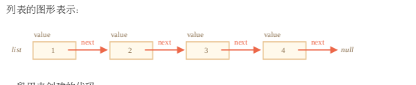

## JSON 方法， toJSON

JSON (JavaScript Object Notation) 是表示值和对象的通用格式。它被描述为 RFC 4627  标 准。最初它是为 JavaScript 编写的，但许多其他语言也有库来处理它。因此，当客户端使用
JavaScript 而服务器使用 Ruby/PHP/Java/Whatever 编写时，使用 JSON 进行数据交换非常容易。

JavaScript 提供方法

- JSON.stringify 将对象转换为 JSON
- JSON.parse 将 JSON 转回对象

请注意，JSON 编码的对象与对象字面量有几个重要的区别:

- 字符串使用双引号。JSON 中没有单引号或反引号。所以 'John' 转成 "John" 。
- 对象属性名称也是双引号的。这是强制性的。所以 age:30 转成 "age":30 。  
  JSON 是跨语言的纯数据规范，因此一些特定于 JavaScript 的对象属性被 JSON.stringify 跳 过。
- 函数属性(方法)。
- Symbolic 属性。
- 存储 undefined 的属性。

```js
let user = {
  sayHi() {
    // ignored
    alert('Hello')
  },
  [Symbol('id')]: 123, // ignored
  something: undefined // ignored
}
user // {}
```

重要的限制:不得有循环引用。  
JSON.stringify 完整语法是:

```js
 let json = JSON.stringify(value[, replacer, space])
 // value 要编码的值
 // replacer 要编码的属性数组或映射函数 function(key, value)
 // space 文本添加缩进、空格和换行符
```

对象可自定义 toJSON 方法，例如：

```js
let room = {
  number: 23,
  toJSON() {
    return this.number
  }
}
JSON.stringify(room) // 23
```

## JSON.parse

```js
let value = JSON.parse(str[, reviver]);
// str JSON字符串解析
// reviver 将为每个(key, value)对调用的可选函数(键, 值)进行转换
```

例如在解析 date 对象上

```js
let str = '{"title":"Conference","date":"2017-11-30T12:00:00.000Z"}'
let meetup = JSON.parse(str)
alert(meetup.date.getDate()) // Error!

let str = '{"title":"Conference","date":"2017-11-30T12:00:00.000Z"}'
let meetup = JSON.parse(str, function(key, value) {
  if (key == 'date') return new Date(value)
  return value
})
alert(meetup.date.getDate()) // now works!
```

总结

- JSON 是一种数据格式，对于大多数编程语言都有自己的独立标准和库。
- JSON 支持 objects，arrays，strings，numbers，booleans 和 null 。
- JavaScript 提供序列化成 JSON 的方法 JSON.stringify  和解析 JSON 方法 JSON.parse  。
- 这两种方法都支持用于智能读/写的转换函数。
- 如果一个对象具有 toJSON ，那么它可被 JSON.stringify 调用。

### Advanced working with functions

递归结构： 
### 链表
一个有序的对象数组，鉴于数组有个问题就是删除元素和插入元素的代价非常大，所以我们用链表来实现快速插入和删除。  
链表元素是一个被递归定义的对象，它有：
* value
* next属性引用下一个链表元素或者代表末尾的null

```js
let list = {
  value: 1,
  next: {
    value: 2,
    next: {
      value: 3,
      next: {
        value: 4,
        next: null
      }
    }
  }
}
```


```js
list.next.next = secondList // 合并元素
list = {value: 'new item', next: list} // 更新列表的头
list.next = list.next.next // 移除中间的一个值
```

总结： 
* 递归是函数自调用的编程术语。这种函数可以被用来优雅解决特定的任务。
* 当一个函数调用自身时，我们称其为递归步骤。递归基础是函数参数使得任务很简单，不需要其它更进一步调用。
* 一个递归定义的数据结构是指可以使用自身来定义的数据结构。 比如，链表可以被定义为由对象引用一个列表(或 null )的组成的数据结构。

### rest参数和spread操作符

```js
function sumAll(...args) { // 数组变量名为args
  let sum = 0;
  for(let arg of args) sum += arg;
  return sum;
}
```

注意：  
箭头函数是没有 "arguments" 的。
如果我们在箭头函数中访问 arguments ，此时的 arguments 并不属于箭头函数，而是属于箭头函数外部的“普通”函数。
```js
function f() {
let showArg = () => alert(arguments[0]); showArg();
}
f(1); // 1
```
总结 

当我们在代码中遇到 "..." 时，它不是 Rest 参数就是 Spread 操作符。  
我们可以使用下列方法区分二者：
* 若...出现在函数的参数列表，那它表示的就是 Rest 参数，它会把函数多余的实参收集 到一个数组中。
* 若...出现在函数调用或类似的表达式中，那它就是 Spread 操作符，它会把一个数组展 开为逗号分隔的元素列表。  

使用场景  
* Rest参数用于创建可接受任意个参数的函数
* Spread 操作符可以在函数调用传参时，把含有参数的数组展开为函数需要的参数列表形 式。

### 闭包 p318
词法环境  在 JavaScript 中，每个运行的函数、代码块或整个程序，都有一个称为 词法环境(Lexical Environment) 的关联对象。   
1. 环境记录(Environment Record)—— 一个把所有局部变量作为其属性(包括一些额外信息，比如 this 值)的对象。
2. 外部词法环境(outer lexical environment) 的引用 —— 通常是嵌套当前代码(当前花括号之外)之外代码的词法环境。 


### 旧时的var

- let
- const
- var

总结  
var声明变量有两点主要区别：
- 变量没有块作用域，它们在最小函数可见；
- 变量声明在函数开头处理

### 全局对象

如果我们在 script 标签上设置特性 ，那么这样的脚本被认为是个单独的 “模块”，它有自己的顶级作用域(词法环境)，不会干扰 。

```js
<script type="module">
  var x = 5;
  alert(window.x); // undefined
</script>
// 两个模块彼此不可见
<script type="module">
let x = 5;
</script>
<script type="module">
alert(window.x); // undefined
alert(x); // 未声明的变量
</script>
```

### 函数

函数就是对象。

- name - 函数名字。不仅仅在函数定义指定时存在，而且在赋值或者对象属性中也会有。
- length - 函数定义时入参个数。余参不参与计计数 
```js
function sayHi(a,b,...rest) {...}
sayHi.name // sayHi
sayHi.length // 2
```
如果函数通过函数表达式被声明的，它附带了名字，那么它被称为命名的函数表达式。它可以用来函数内部调用自己。
```js
let sayHi = function myFunc() {
  if(isYes) {
    myFunc()
  }
}
myFunc() // undefined
sayHi() // worked
```
而且，函数可以有额外的属性。很多知名的 JavaScript 库广泛使用了这个特点。  
它们创建一个「主」函数，然后给它附加很多其它「helper」函数。比如，jquery 库创建了一 个名为 $ 的函数。lodash  库创建一个 _ 函数。然后添加了.add 、 _.keyBy 以及其它属 性(欲了解详情，参见 docs  )。事实上，它们这么做是为了减少对全局空间的污染，这样一个 库就只会产生一个全局变量。这样就降低了命名冲突的可能性。

### new Function 语法

```js
 let func = new Function(arg1, arg2, ..., body);
```
由于历史原因，参数也可以按逗号分隔符的形式给出。
以下三种形式表现一致:

```js
new Function('a', 'b', 'return a + b'); // 基础语法
new Function('a,b', 'return a + b'); // 逗号分隔
new Function('a , b', 'return a + b'); // 逗号和空格分隔
```

使用 new Function 创建出来的函数，它的 [[Environment]] 指向全局词法环境，而不是 函数所在的外部词法环境。

### setTimeout & setInterval

- setInterval(func, delay, ...args) 和 setTimeout(func, delay, ...args)可以让func定期经理一段延时后一次性执行。
- 要取消函数的执行需要调用clearInterval/clearTimeout,只需要将setInterval/setTimeout返回的值传入即可。
- 嵌套 setTimeout比setInterval用起来更加灵活，同时也能保证每一轮执行的最小时间 间隔。
- 0 延时调度setTimeout(..., 0)用来安排在当前代码执行完时，需要尽快执行的函数。
  - 将耗费CPU的任务分割成多块，这样脚本运行就不会进入挂起状态
  - 进程繁忙时也能让浏览器抽身去做其他事情  
有一点需要注意，所有的调度方法都不能保证延时的准确性，所以在调度代码中，万不可依赖它。浏览器内部的定时器会因各种原因而出现降速情况，譬如:
- CPU过载
- 浏览器页签切换到后台模式
- 笔记本电脑用的是电池供电(译者注:使用电池会以降低性能为代价提升续航)。

### 装饰和转发，call/apply