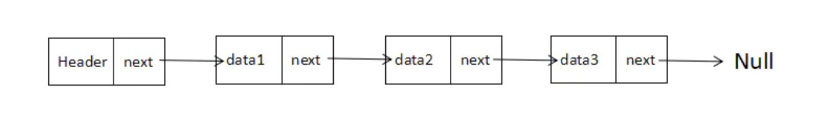
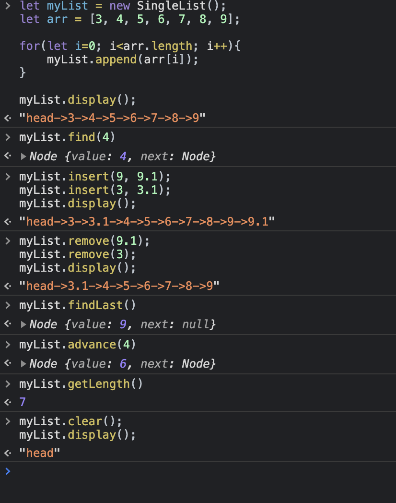

## 链表(Linked-list)

链表是一组节点组成的集合，每个节点都使用一个对象的引用来指向它的后一个节点。指向另一节点的引用讲做链。

### 链表的使用场景

链表的优点除了「插入删除不需要移动其他元素」之外，还在于它是一个局部化结构。就是说当你拿到链表的一个 node 之后，不需要太多其它数据，就可以完成插入，删除的操作。而其它的数据结构不行。比如说 array，你只拿到一个 item 是断不敢做插入删除的。

### 链表的缺点

只能通过顺次指针访问，查询效率低。

### 链表的结构图  
<br>


### js实现单链表

- 定义一个简单的链表
```js
 // Definition for singly-linked list.
 // function 形式
  function ListNode(value) {
      this.value = value;
      this.next = null;
  }
 // class形式
 class ListNode() {
     constructor(value) {
        this.value = value;  // 节点的数据域
        this.next = null;  // 节点的指针域
    }
 }
```

::: tip 实现单链表需要的功能 
find(item)  // 在单链表中寻找item元素  
insert(element, item);  // 向单链表中插入元素  
remove(item);  // 在单链表中删除一个节点  
append(element);  // 在单链表的尾部添加元素  
findLast();  // 获取单链表的最后一个节点  
isEmpty();  // 判断单链表是否为空  
show();  // 显示当前节点  
getLength();  // 获取单链表的长度  
advance(n, currNode);  // 从当前节点向前移动n个位置  
display();  // 单链表的遍历显示  
clear();  // 清空单链表  
:::

- 整体代码
```js
// 创建链表节点
class Node {
    constructor(value, next) {
        this.value = value ? value : 0;
        this.next = next ? next : null;
    }
}

// 创建单链表
class SingleList {
    constructor() {
        this.size = 0; // 单链表长度
        this.head = new Node('head'); // 表头节点
        this.curNode = ''; // 记录当前节点的指向
    }

    // 判断单链表是否为空
    isEmpty() {
        return this.size === 0;
    }

    // 遍历显示
    display() {
        let curNode = this.head;
        let result = '';
        while(curNode) {
            result += curNode.value;
            curNode = curNode.next;
            if( curNode ) result += '->';
        }
        return result;
    }

    // 获取单链表长度
    getLength() {
        return this.size;
    }

    // 显示当前节点
    show() {
        return this.curNode.value;
    }

    // 寻找值为value的元素
    find(value) {
        let curNode = this.head;
        while(curNode && (curNode.value !== value)) {
            curNode = curNode.next;
        }
        return curNode;
    }

    // 获取最后一个
    findLast() {
        let curNode = this.head;
        while(curNode.next) {
            curNode = curNode.next;
        }
        return curNode;
    }
    

    //插入元素
    insert(value, element) {
        let targetNode = this.find(value);
        if(!targetNode) {
            return ;
        }
        let newNode = new Node(element);

        newNode.next = targetNode.next; 
        targetNode.next = newNode;

        this.size++;
        return newNode;
    }

    /* 删除元素 
        1. 删除head节点。单链表的头结点一般情况下是不需要删除的，如果单链表的长度不为0则直接返回；在否则将头结点的next只想null
        2.删除的接口不存在则直接返回
        3.除以上情况，先找到删除元素的前一个元素，然后判断这个元素的next.value是否等于传入的value。此时直接将当前元素的next设置为后一个元素即可。
    */
    remove(value) {
        if(!this.find(value)) {  // 不存在的元素
            return;
        }
        // 删除头结点
        if(value === 'head') {
            if(!this.isEmpty()) {
                return ;
            }else {
                this.head.next = null;
                return;
            }
        }
        let curNode = this.head;
        while (curNode.next.value !== value) {
            if(!curNode.next) {
                return;
            }
            curNode = curNode.next;
        }
        curNode.next = curNode.next.next;
        this.size--;
    }

    // 移动n个节点
    advance(n, curNode = this.head) {
        this.curNode = curNode;
        while((n--) && this.curNode.next) {
            this.curNode = this.curNode.next;
        }
        return this.curNode;
    }

    // 尾部添加元素
    append(value) {
        let curNode = this.findLast();
        let newNode = new Node(value);

        curNode.next = newNode;
        this.size++;
    }

    // 清空单链表
    clear() {
        this.head.next = null;
        this.size = 0;
    }
}
```

- 测试  



### leetcode上经典的链表题目

题目均来源于[https://leetcode-cn.com/](https://leetcode-cn.com/)

### 有环链表

#### 判断链表是否有环 &nbsp; [leetcode 141](https://leetcode-cn.com/problems/linked-list-cycle/)

给定一个链表，判断链表中是否有环。  
如果链表中有某个节点，可以通过连续跟踪 next 指针再次到达，则链表中存在环。 为了表示给定链表中的环，我们使用整数 pos 来表示链表尾连接到链表中的位置（索引从 0 开始）。 如果 pos 是 -1，则在该链表中没有环。注意：pos 不作为参数进行传递，仅仅是为了标识链表的实际情况。  
如果链表中存在环，则返回 true 。 否则，返回 false 。  
进阶：  
你能用 O(1)（即，常量）内存解决此问题吗？  

示例 1：  
```js
输入：head = [3,2,0,-4], pos = 1
输出：true
解释：链表中有一个环，其尾部连接到第二个节点。
```

示例 2：  
```js
输入：head = [1,2], pos = 0
输出：true
解释：链表中有一个环，其尾部连接到第一个节点。
```

示例 3：  
```js
输入：head = [1], pos = -1
输出：false
解释：链表中没有环。
```

提示：

- 链表中节点的数目范围是 [0, 104]  
- -105 <= Node.val <= 105  
- pos 为 -1 或者链表中的一个 有效索引 。  

来源：力扣（LeetCode） 链接：https://leetcode-cn.com/problems/linked-list-cycle 著作权归领扣网络所有。商业转载请联系官方授权，非商业转载请注明出处。  

<span style="color: #ff5050;font-weight: bold;">解答:</span>  网上流传的解题方法有几种，这里只介绍经典的快慢指针法。


```js
/**
 * Definition for singly-linked list.
 * function ListNode(val) {
 *     this.val = val;
 *     this.next = null;
 * }
 */

/**
 * @param {ListNode} head
 * @return {boolean}
 */
var hasCycle = function(head) {
    if( head === null || head.next === null )return false;
    let slow = head;
    let fast = head.next;
    while(fast !== null && fast.next !== null ) {
        slow = slow.next;
        fast = fast.next.next;
        if(slow === fast) {
            return true
        }
    }
    return false;
};
```
--------------------------  
#### 链表寻相遇点 &nbsp; [leetcode 142](https://leetcode-cn.com/problems/linked-list-cycle-ii/)

给定一个链表，返回链表开始入环的第一个节点。 如果链表无环，则返回 null。  
为了表示给定链表中的环，我们使用整数 pos 来表示链表尾连接到链表中的位置（索引从 0 开始）。 如果 pos 是 -1，则在该链表中没有环。注意，pos 仅仅是用于标识环的情况，并不会作为参数传递到函数中。  
说明：不允许修改给定的链表。  
进阶：  
你是否可以使用 O(1) 空间解决此题？  

示例 1：


```js
输入：head = [3,2,0,-4], pos = 1
输出：返回索引为 1 的链表节点
解释：链表中有一个环，其尾部连接到第二个节点。
```
示例 2：


```js
输入：head = [1,2], pos = 0
输出：返回索引为 0 的链表节点
解释：链表中有一个环，其尾部连接到第一个节点。
```
示例 3：


```js
输入：head = [1], pos = -1
输出：返回 null
解释：链表中没有环。
```
提示：

- 链表中节点的数目范围在范围 [0, 104] 内
- -105 <= Node.val <= 105
- pos 的值为 -1 或者链表中的一个有效索引

来源：力扣（LeetCode） 链接：https://leetcode-cn.com/problems/linked-list-cycle-ii 著作权归领扣网络所有。商业转载请联系官方授权，非商业转载请注明出处。

<span style="color: #ff5050;font-weight: bold;">解答:</span>  快慢指针法，head距离环入口与两指针的相遇点到环入口相等，详细请参考  [题解](https://leetcode-cn.com/problems/linked-list-cycle-ii/solution/huan-xing-lian-biao-ii-by-leetcode-solution/)

```js
/**
 * Definition for singly-linked list.
 * function ListNode(val) {
 *     this.val = val;
 *     this.next = null;
 * }
 */

/**
 * @param {ListNode} head
 * @return {ListNode}
 */
var detectCycle = function(head) {
    if(!head || !head.next) return null;

    let slow = head.next;
    let fast = head.next.next;

    let hasCircle = false;
    while(fast && fast.next) {
        slow = slow.next;
        fast = fast.next.next;
        if(slow === fast) {
            hasCircle = true;
            break;
        }
    }
    if(hasCircle) {
        slow = head;
        while(slow !== fast) {
            slow = slow.next;
            fast = fast.next;
        }
        return slow;
    }else {
        return null;
    }
};
```
--------------------------  
#### 快乐数 &nbsp; [leetcode 202](https://leetcode-cn.com/problems/happy-number/)  
编写一个算法来判断一个数 n 是不是快乐数。  
「快乐数」定义为：  
对于一个正整数，每一次将该数替换为它每个位置上的数字的平方和。  
然后重复这个过程直到这个数变为 1，也可能是 无限循环 但始终变不到 1。  
如果 可以变为  1，那么这个数就是快乐数。  
如果 n 是快乐数就返回 true ；不是，则返回 false 。  

来源：力扣（LeetCode）
链接：https://leetcode-cn.com/problems/happy-number
著作权归领扣网络所有。商业转载请联系官方授权，非商业转载请注明出处。

示例1：

```js
输入：19
输出：true
解释：
12 + 92 = 82
82 + 22 = 68
62 + 82 = 100
12 + 02 + 02 = 1
```
示例 2：

```js
输入：n = 2
输出：false
``` 
提示：

- 1 <= n <= 231 - 1

<span style="color: #ff5050;font-weight: bold;">解答:</span>  也是快慢指针，用判断链表是否有环的思想来写，假设可变为1即是链表有环，否则就是无环；

```js
/**
 * @param {number} n
 * @return {boolean}
 */
var isHappy = function(n) {
    if(n===1) return true;
    const squareSum = (m) => {
        let sum = 0;
        while(m!==0) {
            sum+=(m%10)**2;
            m=Math.floor(m/10);
        }
        return sum;
    }
    let fast = squareSum(n);
    let slow = n;
    while(fast !== slow) {
        slow = squareSum(slow);
        fast = squareSum(squareSum(fast));
    }
    return fast === 1;
};
```
--------------------------  
### 反转链表

#### 反转链表 &nbsp; [leetcode 206](https://leetcode-cn.com/problems/reverse-linked-list/)  

反转一个单链表。  
示例:

```js
输入: 1->2->3->4->5->NULL
输出: 5->4->3->2->1->NULL
```
进阶:
你可以迭代或递归地反转链表。你能否用两种方法解决这道题？

来源：力扣（LeetCode）
链接：https://leetcode-cn.com/problems/reverse-linked-list
著作权归领扣网络所有。商业转载请联系官方授权，非商业转载请注明出处。

--------------------------
#### 翻转区间的链表 &nbsp; [leetcode 92](https://leetcode-cn.com/problems/reverse-linked-list-ii/)  

给你单链表的头指针 head 和两个整数 left 和 right ，其中 left <= right 。请你反转从位置 left 到位置 right 的链表节点，返回 反转后的链表 。

示例 1：


```js
输入：head = [1,2,3,4,5], left = 2, right = 4
输出：[1,4,3,2,5]
```
示例 2：
```js
输入：head = [5], left = 1, right = 1
输出：[5]
```

提示：

- 链表中节点数目为 n
- 1 <= n <= 500
- -500 <= Node.val <= 500
- 1 <= left <= right <= n

来源：力扣（LeetCode）
链接：[https://leetcode-cn.com/problems/reverse-linked-list-ii](https://leetcode-cn.com/problems/reverse-linked-list-ii)
著作权归领扣网络所有。商业转载请联系官方授权，非商业转载请注明出处。

--------------------------
#### k个一组的翻转链表 &nbsp; [leetcode 25](https://leetcode-cn.com/problems/reverse-nodes-in-k-group/)  

给你一个链表，每 k 个节点一组进行翻转，请你返回翻转后的链表。  
k 是一个正整数，它的值小于或等于链表的长度。  
如果节点总数不是 k 的整数倍，那么请将最后剩余的节点保持原有顺序。  
进阶：  
你可以设计一个只使用常数额外空间的算法来解决此问题吗？  
你不能只是单纯的改变节点内部的值，而是需要实际进行节点交换。  

示例1：


```js
输入：head = [1,2,3,4,5], k = 2
输出：[2,1,4,3,5]
```
示例2：


```js
输入：head = [1,2,3,4,5], k = 3
输出：[3,2,1,4,5]
```

示例 3：

```js
输入：head = [1,2,3,4,5], k = 1
输出：[1,2,3,4,5]
```
示例 4：

```js
输入：head = [1], k = 1
输出：[1]
```
提示：

- 列表中节点的数量在范围 sz 内
- 1 <= sz <= 5000
- 0 <= Node.val <= 1000
- 1 <= k <= sz

来源：力扣（LeetCode）
链接：https://leetcode-cn.com/problems/reverse-nodes-in-k-group
著作权归领扣网络所有。商业转载请联系官方授权，非商业转载请注明出处。

--------------------------
#### 旋转链表 &nbsp; [leetcode 61](https://leetcode-cn.com/problems/rotate-list/)  

给定一个链表，旋转链表，将链表每个节点向右移动 k 个位置，其中 k 是非负数。

示例 1:

```js
输入: 1->2->3->4->5->NULL, k = 2
输出: 4->5->1->2->3->NULL
解释:
向右旋转 1 步: 5->1->2->3->4->NULL
向右旋转 2 步: 4->5->1->2->3->NULL
```
示例 2:

```js
输入: 0->1->2->NULL, k = 4
输出: 2->0->1->NULL
解释:
向右旋转 1 步: 2->0->1->NULL
向右旋转 2 步: 1->2->0->NULL
向右旋转 3 步: 0->1->2->NULL
向右旋转 4 步: 2->0->1->NULL
```

来源：力扣（LeetCode）
链接：https://leetcode-cn.com/problems/rotate-list
著作权归领扣网络所有。商业转载请联系官方授权，非商业转载请注明出处。

--------------------------
#### 两两交换链表中的节点 &nbsp; [leetcode 24](https://leetcode-cn.com/problems/swap-nodes-in-pairs/)  

给定一个链表，两两交换其中相邻的节点，并返回交换后的链表。  
你不能只是单纯的改变节点内部的值，而是需要实际的进行节点交换。  

示例1：


```js
输入：head = [1,2,3,4]
输出：[2,1,4,3]
```
示例 2：

```js
输入：head = []
输出：[]
```
示例 3：

```js
输入：head = [1]
输出：[1]
```
 

提示：

- 链表中节点的数目在范围 [0, 100] 内
- 0 <= Node.val <= 100

来源：力扣（LeetCode）
链接：https://leetcode-cn.com/problems/swap-nodes-in-pairs
著作权归领扣网络所有。商业转载请联系官方授权，非商业转载请注明出处。

### 链表节点的删除

#### 删除链表倒数的第 N 个节点 &nbsp; [leetcode 19](https://leetcode-cn.com/problems/remove-nth-node-from-end-of-list/) 

给你一个链表，删除链表的倒数第 n 个结点，并且返回链表的头结点。  
进阶：你能尝试使用一趟扫描实现吗？  

示例 1：
  

```js
输入：head = [1,2,3,4,5], n = 2
输出：[1,2,3,5]
```
示例 2：

```js
输入：head = [1], n = 1
输出：[]
```
示例 3：

```js
输入：head = [1,2], n = 1
输出：[1]
```

提示：

- 链表中结点的数目为 sz
- 1 <= sz <= 30
- 0 <= Node.val <= 100
- 1 <= n <= sz


来源：力扣（LeetCode）
链接：https://leetcode-cn.com/problems/remove-nth-node-from-end-of-list
著作权归领扣网络所有。商业转载请联系官方授权，非商业转载请注明出处。

<span style="color: #ff5050;font-weight: bold;">解答:</span>  

```js
/**
 * Definition for singly-linked list.
 * function ListNode(val, next) {
 *     this.val = (val===undefined ? 0 : val)
 *     this.next = (next===undefined ? null : next)
 * }
 */
/**
 * @param {ListNode} head
 * @param {number} n
 * @return {ListNode}
 */
var removeNthFromEnd = function(head, n) {
    if(!head.next) return head.next;
    // if(n === 1) {
    //     return head.next;
    // }
    let p = head;
    let q = new ListNode(0, head);

    while(n>0) {
        --n;
        p=p.next
    }
    while(p) {
        p = p.next;
        q = q.next;
    }
    q.next = q.next.next;
    return head;
};
```

--------------------------
####  删除排序链表中的重复元素 &nbsp; [leetcode 83](https://leetcode-cn.com/problems/remove-duplicates-from-sorted-list/) 

给定一个排序链表，删除所有重复的元素，使得每个元素只出现一次。

示例 1:

```js
输入: 1->1->2
输出: 1->2
```
示例 2:

```js
输入: 1->1->2->3->3
输出: 1->2->3
```

来源：力扣（LeetCode）
链接：https://leetcode-cn.com/problems/remove-duplicates-from-sorted-list
著作权归领扣网络所有。商业转载请联系官方授权，非商业转载请注明出处。

<span style="color: #ff5050;font-weight: bold;">解答:</span>  

```js
/**
 * Definition for singly-linked list.
 * function ListNode(val, next) {
 *     this.val = (val===undefined ? 0 : val)
 *     this.next = (next===undefined ? null : next)
 * }
 */
/**
 * @param {ListNode} head
 * @return {ListNode}
 */
// function ListNode(val, next) {
//       this.val = (val===undefined ? 0 : val)
//       this.next = (next===undefined ? null : next)
//  }
var deleteDuplicates = function(head) {
    if(!head) return head;
    let p = head;
    while(p && p.next) {
        if(p.val == p.next.val) {
            p.next = p.next.next
        }else {
            p = p.next;
        }
    }
    return head;
};
```

--------------------------
####  删除排序排序链表中的重复节点2 &nbsp; [leetcode 82](https://leetcode-cn.com/problems/remove-duplicates-from-sorted-list-ii/) 
给定一个排序链表，删除所有含有重复数字的节点，只保留原始链表中 没有重复出现 的数字。

示例 1:

```js
输入: 1->2->3->3->4->4->5
输出: 1->2->5
```
示例 2:

```js
输入: 1->1->1->2->3
输出: 2->3
```

来源：力扣（LeetCode）
链接：https://leetcode-cn.com/problems/remove-duplicates-from-sorted-list-ii
著作权归领扣网络所有。商业转载请联系官方授权，非商业转载请注明出处。

<span style="color: #ff5050;font-weight: bold;">解答:</span>  

```js
/**
 * Definition for singly-linked list.
 * function ListNode(val, next) {
 *     this.val = (val===undefined ? 0 : val)
 *     this.next = (next===undefined ? null : next)
 * }
 */
/**
 * @param {ListNode} head
 * @return {ListNode}
 */
var deleteDuplicates = function(head) {
    if(!head || !head.next) return head
    let next = head.next;
    if(head.val === next.val) { // 如果相等说明重复
        //如果是这种情况
        //      1 --> 1 --> 1 --> 2 --> 3
        //     head  next
        //1.则需要移动next直到出现与当前head.value不相等的情况（含null）
        //2.并且此时的head已经不能要了，因为已经head是重复的节点
        //--------------else-------------
        //      1 --> 2 --> 3
        //     head  next
        //3.如果没有出现1的情况，则递归返回的节点就作为head的子节点
        while(next !== null && head.val === next.val) {
            next = next.next;
        }
        head = deleteDuplicates(next);
    }else {
        head.next = deleteDuplicates(next);
    }
    return head;
};
```

### 参考

[leetcode](https://leetcode-cn.com/)  
[JS中的算法与数据结构——链表(Linked-list)](https://juejin.cn/post/6844903498362912775)  
[使用JS实现链表（1）——单链表](https://zhuanlan.zhihu.com/p/105644038)