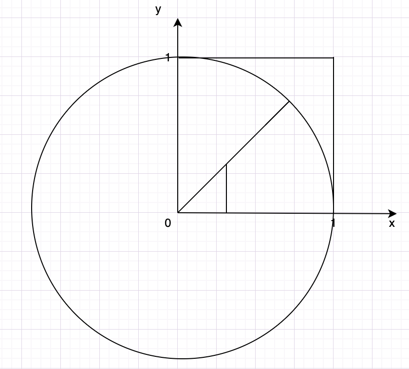

给你一个生成0到1之间随机数的函数，请求出圆周率 π  



OK，知道了，所有的点会落在正方形(0,0,1,1) 的范围内，其中有一部分会落在圆的范围内，如果我们统计落在圆内的点的个数，记为 N，那么 N 与总点数 M 的比值，应该是等于圆的面积比上正方形的面积。

列下公式应该是：

N/M = πr²/4 / r²
​	
 
把公式化简一下，变成：
pi = 4 * N / M  
π=4∗N/M  
为了编程中方便计算任意点距离圆心的距离，可以这样理解这个概率

```js

const n = process.argv.slice(2)

const generatePI = (n) => {
    let innerCount = 0;
    for(let i =0;i<n;i++) {
        let x = Math.random();
        let y = Math.random();
        const squreSum = x*x + y*y; // 勾股定理算是否在圆内
        if(squreSum < 1) {
            innerCount ++;
        }
    }
    return 4* innerCount / n;
}

console.log(generatePI(n));
```

### 参考

[https://segmentfault.com/a/1190000022500810](https://segmentfault.com/a/1190000022500810)