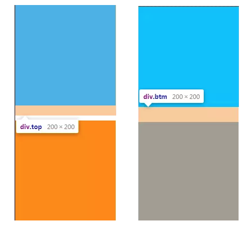
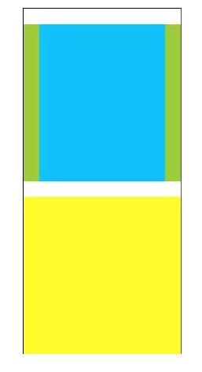
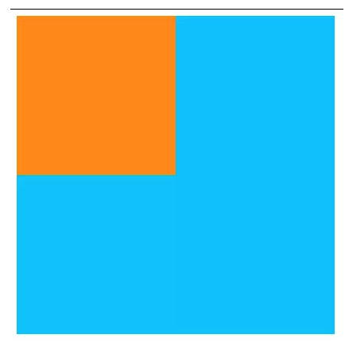
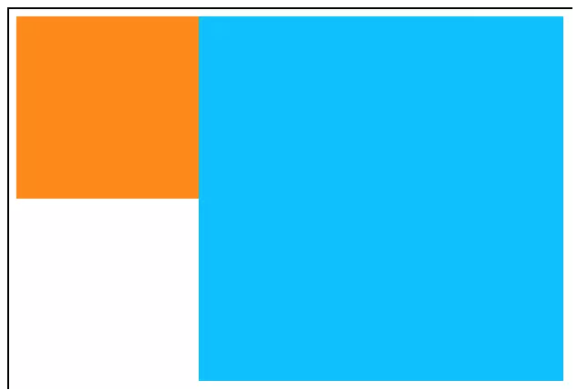

# BFC详解

> 参考[BFC究竟是个什么东东](https://juejin.im/post/5d633ea151882537930bbd8e)
> [前端进阶之什么是BFC？BFC的原理是什么？如何创建BFC？](https://juejin.im/post/5cee1b38e51d4556be5b39e1)

* BFC(block formatting context),块级上下文，用于布局块级盒子的一块渲染区域。
* IFC(grid formatting context),内联元素内的渲染规则
* GFC(grid formatting context),display为grid的元素内的渲染规则
* FFC(flex formatting context),display为flex的元素内的渲染规则

## BFC

### 如何触发BFC?

某一个元素要满足以下条件任何之一：

* 该元素是根元素，即<html></html>标签内就是一个BFC
* float的值不为none
* overflow的值不为visible
* display的值为inline-block、table-cell、table-caption
* position的值为absolute或fixed

### BFC的渲染机制（BFC特性）

* 在块格式化上下文中，从包含块的顶部开始，垂直地一个接一个地排列盒子。  
块级元素是那些在源文档中可视为块的元素（如，段落p标签）。display属性为如下属性的元素是块级元素：block，list-item, table。每个块级元素都会产生一个主要的块级盒子来容纳子元素和生成的内容。一个块级容器盒子要么只容纳块级盒子，要么就会建立内联格式化上下文，因此也只容纳内联级盒子（我的理解：一个盒子要么是块级盒子，要么就是内联级盒子）并不是所有的块级容器盒子都是块级盒子： 非替换内联块和单元格（td, th）不是块级盒子。既是块级盒子，同时又是块级容器才能被称为块盒子。

* 垂直方向上的距离由margin决定，属于同一个BFC的两个相邻Box的margin会发生重叠。
  * 上下相邻(取决于垂直方向上谁的margin大)
  ```html
  <style>
  .top,.btm{
    width: 200px;
    height: 200px;
  }
  .top {
    margin-bottom： 20px;
    background: deepskyblue;
  }
  .btm {
    margin-top: 30px;
    background: darkorange;
  }
  </style>
  <div>
    <div class="top"></div>
    <div class="btm"></div>
  </div>
  ```
  

  可以看出上下两格的间距是30px。我们如何消除重叠

  1. 给上下两格盒子加上float属性
  2. 使用border或者padding代替margin

* 父元素和子元素发生重叠

父元素的margin-top为0，padding-top为0，没有border，而子元素的margin-top不为0，那么父元素上方会出现子元素的margin-top值，margin-bottom同理

```html
<style>
  * {
  padding: 0;
  margin: 0;
}
#app {
  background: yellowgreen;
}

.top {
  background: deepskyblue;
  height: 200px;
  margin: 20px;
}
.footer {
  height: 200px;
  width: 200px;
  background: yellow;
}
</style>
<div id="app">
  <div class="top"></div>
</div>
<div class="footer"></div>
```



消除福字margin重叠的方法：
1. 给父元素加border
2. 设置父元素的padding或者margin
3. 给父元素设置overflow:hidden

* BFC的区域不会和float的元素区域重叠

```html
<style>
.main {
  background: deepskyblue;
  width: 400px;
  height: 400px;
}
.left {
  float: left;
  width: 200px;
  height: 200px;
  background: darkorange;
}
</style>
<div class="left"></div>
<div class="main"></div>
```



可以看到main和left发生了重叠，当main设置了了overflow:hidden，即

```css
.main {
  background: deepskyblue;
  width: 400px;
  height: 400px;
  overflow: hidden;
}
```



* 在块格式化上下文中，每个box的左外边缘都与包含块的左边缘相接触(对于从右到左的格式化，右边缘相接触)[包含块](https://segmentfault.com/a/1190000015653589)

* 计算bfc的高度时，浮动元素也参与计算

这条特性就是就是解决子元素浮动导致父元素无法撑开的关键

```html
<style>
  .main{
    background: deepskyblue;
  }
  .main div {
    height: 100px;
    width: 100px;
    float: left;
  }
</style>

<div class="main">
  <div></div>
  <div></div>
</div>
```

这样的结果是main的高度为0,页面显示一片空白，当我们为class为main的父级div形成BFC之后

```css
.main {
  background: deepskyblue;
  position: absolute;
}
```

* bfc就是页面上的一个独立容器，容器里面的子元素不会影响外面元素。

### 总结

我们可以用BFC机制完成的事情：

* 清除浮动的影响
* 清除margin重叠
