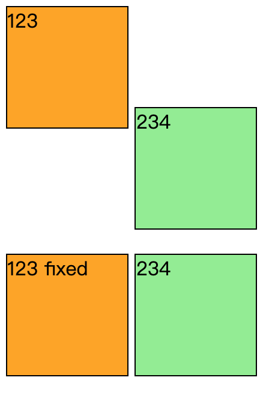
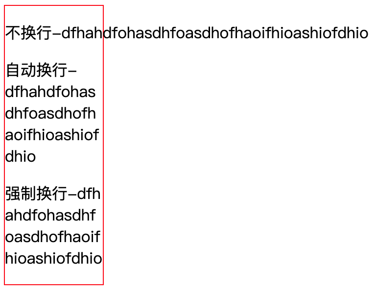
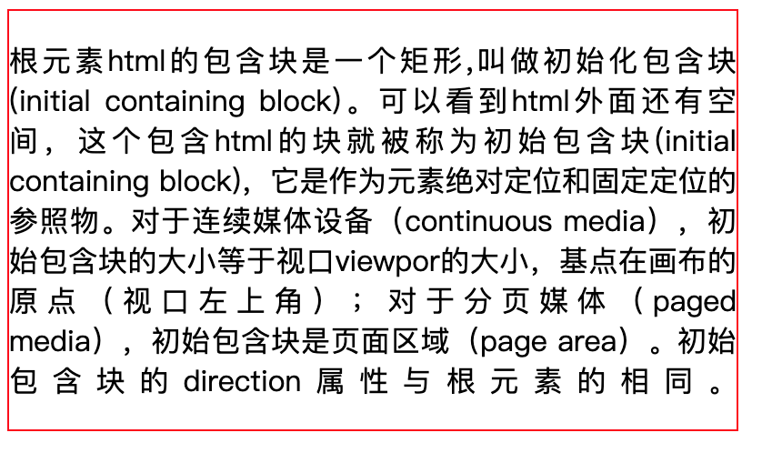
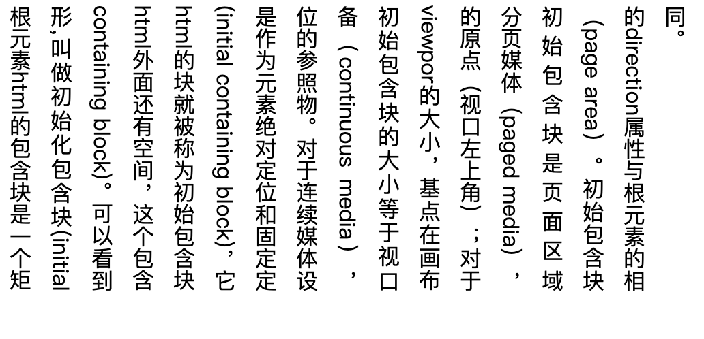
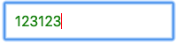
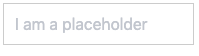

## 26个CSS小技巧

### 解决inline-block设置overflow:hidden导致相邻的行内元素向下偏移

```html
<section>
  <div class="class1">123</div>
  <div class="class2">234</div>
</section>
<section>
  <div class="class1 class-fix">123 fixed</div>
  <div class="class2">234</div>
</section>
<style>
div{
  width: 100px;
  height: 100px;
  border: 1px solid;
  display: inline-block;
}

.class1{
   overflow: hidden;
   background: orange;
}

.class2{
  background: lightgreen;
}
.class-fix {
  vertical-align: bottom;
}
</style>
```



### 超出部分显示省略号

```css
// 单行文本
.wrap {
	overflow:hidden;/*超出部分隐藏*/
	text-overflow:ellipsis;/*超出部分显示省略号*/
	white-space:nowrap;/*规定段落中的文本不进行换行 */
}
// 多行文本
.wrap {
    width: 100%;
    overflow: hidden;
    display: -webkit-box;   //将对象作为弹性伸缩盒子模型显示  *必须结合的属性*
    -webkit-box-orient: vertical;   //设置伸缩盒对象的子元素的排列方式  *必须结合的属性*
    -webkit-line-clamp: 3;   //用来限制在一个块元素中显示的文本的行数
    word-break: break-all;   //让浏览器实现在任意位置的换行 *break-all为允许在单词内换行*
}
```

### css实现不换行、自动换行、强制换行

```css
/* 不换行 */
.wrap {
  white-space: nowrap;
}
/* 自定换行 */
.wrap {
  word-wrap: break-word;
  word-break: normal;
}
/* 强制换行 */
.wrap {
  word-break: break-all;
}
```



### css实现文本两端对齐

```css
.wrap {
    text-align: justify;
    text-justify: distribute-all-lines;  //ie6-8
    text-align-last: justify;  //一个块或行的最后一行对齐方式
    -moz-text-align-last: justify;
    -webkit-text-align-last: justify;
}
```



### 实现文字竖向排版

```css
// 单列展示时
.wrap {
    width: 25px;
    line-height: 18px;
    height: auto;
    font-size: 12px;
    padding: 8px 5px;
    word-wrap: break-word;/*英文的时候需要加上这句，自动换行*/  
}
// 多列展示时
.wrap {
    height: 210px;
    line-height: 30px;
    text-align: justify;
    writing-mode: vertical-lr;  //从左向右    
    writing-mode: tb-lr;        //IE从左向右
    //writing-mode: vertical-rl;  -- 从右向左
    //writing-mode: tb-rl;        -- 从右向左
}
```



### 使鼠标事件失效

```css
.wrap {
  /* 如果按tab能选中该元素，如button，然后按回车还是能执行对应的事件，如click。 */
	pointer-events: none;
  cursor: default;
}
```

### 禁止用户选择

```css
.wrap {
  -webkit-touch-callout: none;
  -webkit-user-select: none;
  -khtml-user-select: none;
  -moz-user-select: none;
  -ms-user-select: none;
  user-select: none;
}
```

### cursor属性

```css
.wrap {
  cursor：pointer; //小手指；
  cursor：help; //箭头加问号；
  cursor：wait; //转圈圈；
  cursor：move; //移动光标；
  cursor：crosshair; //十字光标
}
```

### 使用硬件加速

```css
.wrap {
    transform: translateZ(0);
}
```

### 图片宽度自适应

```css
img {max-width: 100%}
```

### Text-transform和Font Variant

```css
p {text-transform: uppercase}  // 将所有字母变成大写字母
p {text-transform: lowercase}  // 将所有字母变成小写字母
p {text-transform: capitalize} // 首字母大写
p {font-variant: small-caps}   // 将字体变成小型的大写字母
```

### 将一个容器设为透明

```css
.wrap { 
  filter:alpha(opacity=50); 
  -moz-opacity:0.5; 
  -khtml-opacity: 0.5; 
  opacity: 0.5; 
}
```


### 消除transition闪屏

```css
.wrap {
    -webkit-transform-style: preserve-3d;
    -webkit-backface-visibility: hidden;
    -webkit-perspective: 1000;
}
```

### 自定义滚动条

```css
overflow-y: scroll;
整个滚动条
::-webkit-scrollbar {
    width: 5px;
}

滚动条的轨道
::-webkit-scrollbar-track {
    background-color: #ffa336;
    border-radius: 5px;
}

滚动条的滑块
::-webkit-scrollbar-thumb {
    background-color: #ffc076;
    border-radius: 5px;
}
```

### 让 HTML 识别 string 里的 '\n' 并换行

```css
body {
  white-space: pre-line;
}
```

### 实现一个三角形

```css
.wrap {
  border-color: transparent transparent yellow transparent;
  border-style: solid;
  border-width: 0px 300px 300px 300px;
  height: 0;
  width: 0;
}
```

### 移除被点链接的边框

```css
a {outline: none}
a {outline: 0}
```

### 使用CSS显示链接之后的URL

```css
a:after{content:" (" attr(href) ") ";}
```

### select内容居中、下拉内容右对齐

```css
select {
  text-align: center;
  text-align-last: center;
}
select option {
  direaction: rtl;
}
```

### 修改input输入框中光标的颜色不改变字体的颜色

```css
input{
    color:  green;
    caret-color: red;
}
```



### 修改input 输入框中 placeholder 默认字体样式

```css
/* //webkit内核的浏览器  */
input::-webkit-input-placeholder {
    color: #c2c6ce;
}
/* //Firefox版本4-18  */
input:-moz-placeholder {
    color: #c2c6ce;
}
/* //Firefox版本19+ */
input::-moz-placeholder {
    color: #c2c6ce;
}
/* //IE浏览器 */
input:-ms-input-placeholder {
    color: #c2c6ce;
}
```



### 让div里的图片和文字同时上下居中

```css
.wrap {
  height: 100;
  line-height: 100;
}
img {
  vertival-align：middle
}
/* // vertical-align css的属性vertical-align用来指定行内元素（inline）或表格单元格（table-cell）元素的垂直对齐方式。只对行内元素、表格单元格元素生效，不能用它垂直对齐块级元素 */
/* // vertical-align：baseline/top/middle/bottom/sub/text-top; */
```

### 实现宽高等比例自适应矩形

```html
  <style>
    .scale {
        width: 100%;
        padding-bottom: 56.25%;
        height: 0;
        position: relative; 
    }

    .item {
        position: absolute; 
        width: 100%;
        height: 100%;
        background-color: 499e56;
    } 
  </style>
  <div class="scale">
    <div class="item">
        这里是所有子元素的容器
    </div>
  </div>
```

### tranform的rotate属性在span标签下失效

```css
span {
  display: inline-block;
}
```

### 边框字体同色

```css
.wrap {
  width: 200px;
  height: 200px;
  color: #000;
  font-size: 30px;
  border: 1px solid;
}
```
