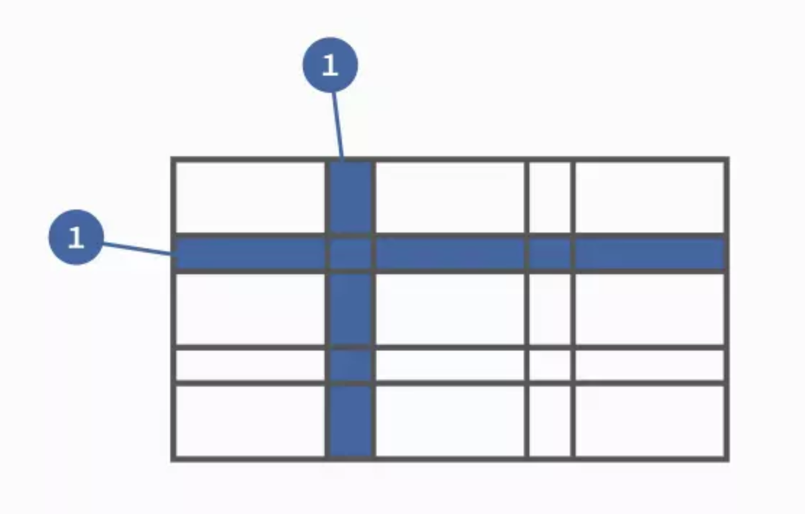
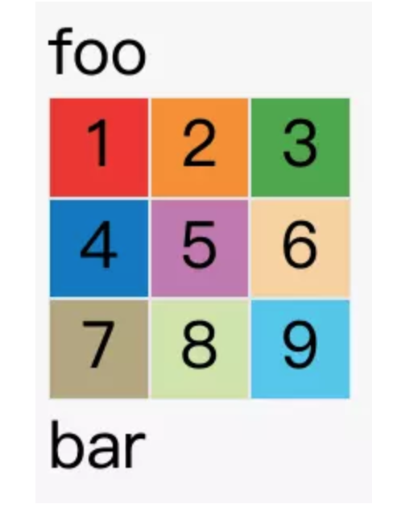
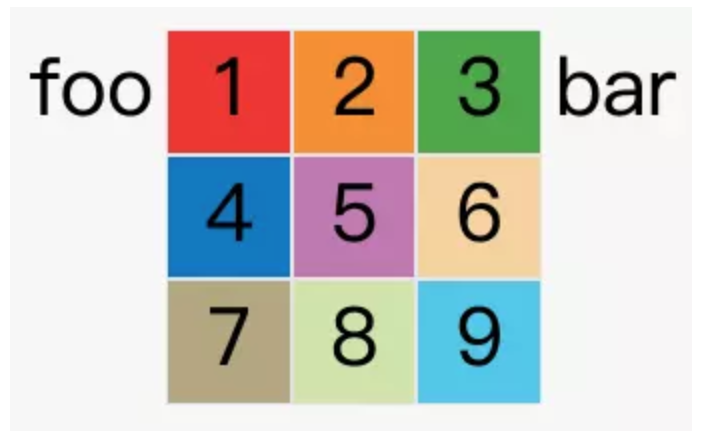
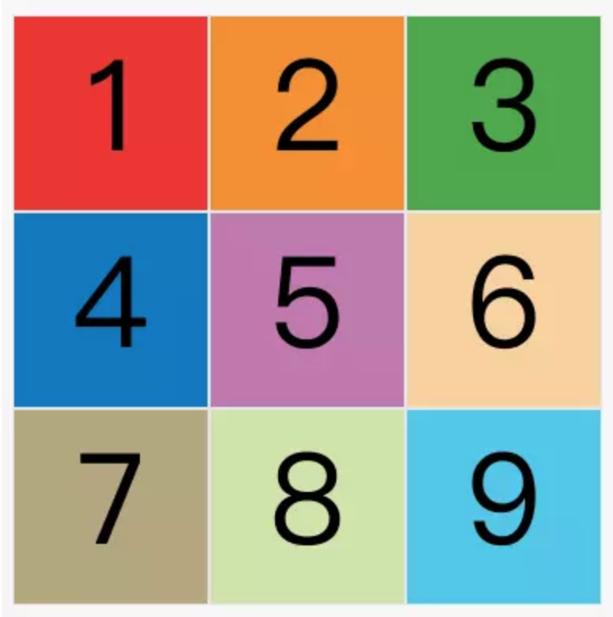
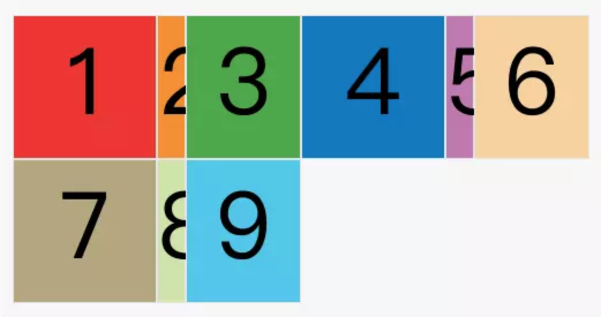
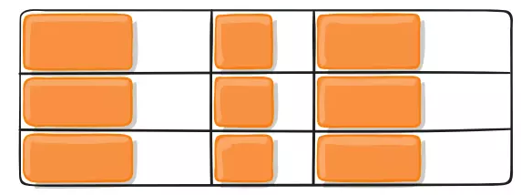
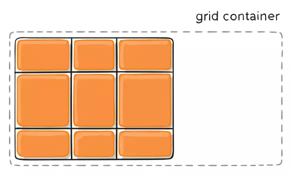

# Grid布局详解

> 摘自掘金[Grid布局详解](https://juejin.im/post/5d2a9649f265da1b7153239d)

Flex布局: 一维布局  
Grid布局: 二维布局

## 基本概念

## 容器和项目

采用网格布局的区域，成为容器(container),容器内部采用网格定位的子元素，成为项目(item)。

```html
<div>
  <div><p>1</p></div>
  <div><p>2</p></div>
  <div><p>3</p></div>
</div>
```

最外层的div就是容器，内层的三个div就是项目

## 行和列

容器里面的水平区域成为行(row),垂直区域成为列(column)



* 图中交叉的区域，成为单元格(cell)
* 正常情况下，n行和m列会产生n*m个单元格

* 划分网格的线成为网格线(grid line)。水平网格线划出行，垂直网格线划出列

正常情况下，n行有n + 1根水平网格线，m列有m + 1根垂直网格线，比如三行就有四根水平网格线。 可以使用方括号[]，指定每一根网格线的名字，方便以后的引用。

```css
.container {
    grid-template-columns: [第一根纵线] 80px [纵线2] auto [纵线3] 100px [最后的结束线];
    grid-template-rows: [第一行开始] 25% [第一行结束] 100px [行3] auto [行4] 60px [行末];
}
```

### 容器属性(父级)

```css
div {
  display: grid;
}
```



```css
div {
  display: inline-grid;
}
```


### grid-template-columns grid-template-rows

```css
.container {
  display: grid;
  grid-template-columns: 100px 100px 100px;
  grid-template-rows: 100px 100px 100px;
}
```



#### fr单位是什么

fr是单词fraction的缩写，表示分数

```css
div{
  .container {
    grid-template-columns: 1fr 1fr 1fr;
  }
}
```

表达的意思即为网格宽度三等分；

#### repeat()

使用repeat函数简化重复值，改写代码为：

```css
.container {
  display: grid;
  grid-template-rows: repeat(3, 33.33%);
  grid-template-columns: repeat(3, 33.33%);
}
//第一个参数为重复的次数，第二个参数为所要重复的值
```

重复某种模式

```css
grid-template-columns: repeat(2, 100px 20px 80px);
```



#### auto-fill

有时候，单元格的大小是固定的，但是容器的大小是不确定的。如果希望每一行尽量多的单元格，这是可以使用auto-fill关键字表示自动填充。

```css
.container {
  display: grid;
  grid-template-columns: repeat(auto-fill, 100px)
}
```

### grid-row-gap、grid-column-gap、grid-gap

* grid-row-gap: 行与行之间的行间距
* grid-column-gap: 列与列之间的行间距
* grid-gap属性是上面两者的合并简写

```css
.container {
  grid-row-gap: 20px;
  grid-column-gap: 20px;
}
// 等同于
.container {
  grid-gap: 20px 20px;
}
//如果grid-gap省略第二个值则浏览器认为第二个值等于第一个值
```

> 根据最新标准，上面三个属性名的`grid-`前缀已经删除，`grid-column-gap`和`grid-row-gap`写成`column-gap`和
`row-gap`，`grid-gap`写成`gap`。


### grid-template-areas

网格布局允许指定区域(area)，一个区域由单个或者多个单元格组成。grid-template-areas属性用于定义区域。

```css
.container {
  display: grid;
  grid-template-columns: 100px 100px 100px;
  grid-template-rows: 100px 100px 100px;
  grid-template-areas: 'a b c'
                       'd e f'
                       'g h i';
}
```

上面代码先划分出9个单元格，然后将其定名为a到i的九个区域，分别对应这九个单元格。  
多个单元格合并成一个区域的写法如下：
```css
grid-template-areas: 'a a a'
                     'b b b'
                     'c c c';

```
如果某些区域不需要利用，则使用点(.)表示：

```css
grid-template-areas: 'a . c'
                     'd . f'
                     'g . i';
```
上面代码中，中间一列为点，表示没有用到该单元格，或者该单元格不属于任何区域。

> 注意，区域的命名会影响到网格线。每个区域的起始网格线，会自动命名为区域名-start，终止网格线自动命名为区域名-end。  
> 比如，区域名为header，则起始位置的水平网格线和垂直网格线叫做header-start，终止位置的水平网格线和垂直网格线叫做header-end。

### grid-auto-flow

划分网格以后，容器的子元素会按照顺序，自动放置在每一个网格。默认的放置顺序是"先行后列"，即先填满第一行，再开始放入第二行。  
这个顺序由grid-auto-flow属性决定，默认值是row，即"先行后列"。也可以将它设成column，变成"先列后行"。  
grid-auto-flow属性除了设置成row和column，还可以设成row dense和column dense。这两个值主要用于，某些项目指定位置以后，剩下的项目怎么自动放置。

### justify-items 属性、align-items属性、place-items属性

* justify-items水平位置(左中右)
* align-items垂直位置(上中下)
* place-items属性是align-items属性和justify-items属性的合并简写形式。

```css
start：对齐单元格的起始边缘。
end：对齐单元格的结束边缘。
center：单元格内部居中。
stretch：拉伸，占满单元格的整个宽度（默认值）。

.container {
  justify-items: start;
}

.container {
  place-items: start end;
}
```
如下图所示：



### justify-content 属性、align-content 属性、place-content 属性

* justify-content属性是整个内容区域在容器里面的水平位置（左中右）
* align-content属性是整个内容区域的垂直位置（上中下）

```css
.container {
  justify-content: start | end | center | stretch | space-around | space-between | space-evenly;
  align-content: start | end | center | stretch | space-around | space-between | space-evenly;  
}

```




### grid-auto-columns 属性，grid-auto-rows 属性

grid-auto-columns属性和grid-auto-rows属性用来设置，浏览器自动创建的多余网格的列宽和行高。它们的写法与grid-template-columns和grid-template-rows完全相同。如果不指定这两个属性，浏览器完全根据单元格内容的大小，决定新增网格的列宽和行高。

## 项目属性(子级)

### grid-column-start 属性 grid-column-end 属性 grid-row-start 属性 grid-row-end 属性

```css
grid-column-start属性：左边框所在的垂直网格线
grid-column-end属性：右边框所在的垂直网格线
grid-row-start属性：上边框所在的水平网格线
grid-row-end属性：下边框所在的水平网格线
```

### grid-column 属性，grid-row 属性

grid-column属性是grid-column-start和grid-column-end的合并简写形式，grid-row属性是grid-row-start属性和grid-row-end的合并简写形式。

### grid-area

grid-area属性指定项目放在哪一个区域

### justify-self,align-self,place-self

* justify-self属性设置单元格内容的水平位置（左中右），跟justify-items属性的用法完全一致，但只作用于单个项目。
* align-self属性设置单元格内容的垂直位置（上中下），跟align-items属性的用法完全一致，也是只作用于单个项目。
* place-self属性是align-self属性和justify-self属性的合并简写形式。

```css
start：对齐单元格的起始边缘。
end：对齐单元格的结束边缘。
center：单元格内部居中。
stretch：拉伸，占满单元格的整个宽度（默认值）。
```