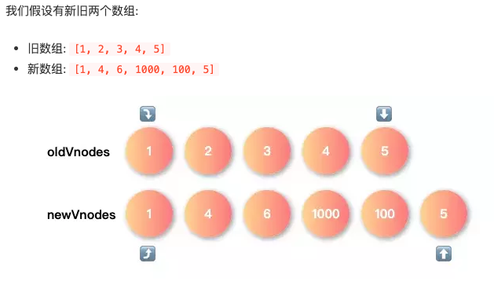
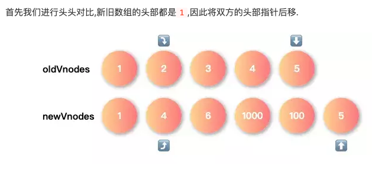
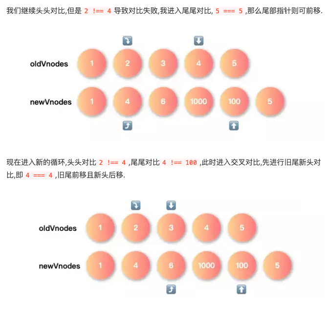
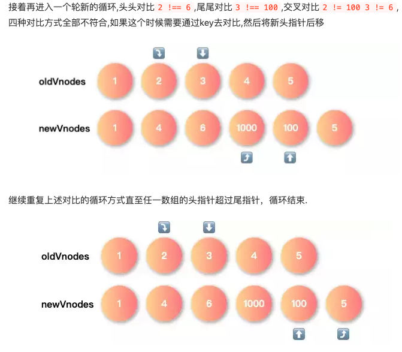

## 什么是virtual dom

Virtual DOM是对DOM的抽象，本质是上是js对象，这个对象就是更加轻量级的对DOM的描述。

### 为什么需要virtual dom

1. 尽可能少地操作DOM，频繁操作DOM会导致回流或者重绘，通过patch一次性将差异更新到DOM，提高了性能  
2. 现代前端框架的一个基本要求就是无须手动操作dom，一方面手动操作dom无法保证程序性能，另一方面省略手动dom操作可以大大提高开发效率

## Virtual DOM的关键要素

创建Virtual DOM函数,接受一定参数，根据参数返回一个对象，这个对象就是DOM的抽象

```js
/**
 * 生成 vnode
 * @param  {String} type     类型，如 'div'
 * @param  {String} key      key vnode的唯一id
 * @param  {Object} data     data，包括属性，事件等等
 * @param  {Array} children  子 vnode
 * @param  {String} text     文本
 * @param  {Element} elm     对应的 dom
 * @return {Object}          vnode
 */
function vnode(type, key, data, children, text, elm) {
  const element = {
    __type: VNODE_TYPE,
    type, key, data, children, text, elm
  }

  return element
}
```

### Virtual DOM Tree的创建

```js
function h(type, config, ...children) {
  const props = {}

  let key = null

  // 获取 key，填充 props 对象
  if (config != null) {
    if (hasValidKey(config)) {
      key = '' + config.key
    }

    for (let propName in config) {
      if (hasOwnProperty.call(config, propName) && !RESERVED_PROPS[propName]) {
        props[propName] = config[propName]
      }
    }
  }

  return vnode(
    type,
    key,
    props,
    flattenArray(children).map(c => {
      return isPrimitive(c) ? vnode(undefined, undefined, undefined, undefined, c) : c
    })
  )
}
```

### Virtual DOM的更新

Virtual DOM更新到真是DOM,函数转化;根据type生成对应的dom，把data里定义的各种属性设置到dom上

```js
function createElm(vnode, insertedVnodeQueue) {
  let data = vnode.data
  let i
  // 省略 hook 调用
  let children = vnode.children
  let type = vnode.type

  /// 根据 type 来分别生成 DOM
  // 处理 comment
  if (type === 'comment') {
    if (vnode.text == null) {
      vnode.text = ''
    }
    vnode.elm = api.createComment(vnode.text)
  }
  // 处理其它 type
  else if (type) {
    const elm = vnode.elm = data.ns
      ? api.createElementNS(data.ns, type)
      : api.createElement(type)

    // 调用 create hook
    for (let i = 0; i < cbs.create.length; ++i) cbs.create[i](emptyNode, vnode)

    // 分别处理 children 和 text。
    // 这里隐含一个逻辑：vnode 的 children 和 text 不会／应该同时存在。
    if (isArray(children)) {
      // 递归 children，保证 vnode tree 中每个 vnode 都有自己对应的 dom；
      // 即构建 vnode tree 对应的 dom tree。
      children.forEach(ch => {
        ch && api.appendChild(elm, createElm(ch, insertedVnodeQueue))
      })
    }
    else if (isPrimitive(vnode.text)) {
      api.appendChild(elm, api.createTextNode(vnode.text))
    }
    // 调用 create hook；为 insert hook 填充 insertedVnodeQueue。
    i = vnode.data.hook
    if (i) {
      i.create && i.create(emptyNode, vnode)
      i.insert && insertedVnodeQueue.push(vnode)
    }
  }
  // 处理 text（text的 type 是空）
  else {
    vnode.elm = api.createTextNode(vnode.text)
  }

  return vnode.elm
}
```

## Virtual DOM 的diff

diff的目的就是比较新旧Virtual DOM

```js
// 遍历 oldCh 和 newCh 来比较和更新
    while (oldStartIdx <= oldEndIdx && newStartIdx <= newEndIdx) {
      // 1⃣️ 首先检查 4 种情况，保证 oldStart/oldEnd/newStart/newEnd
      // 这 4 个 vnode 非空，左侧的 vnode 为空就右移下标，右侧的 vnode 为空就左移 下标。
      if (oldStartVnode == null) {
        oldStartVnode = oldCh[++oldStartIdx]
      } else if (oldEndVnode == null) {
        oldEndVnode = oldCh[--oldEndIdx]
      } else if (newStartVnode == null) {
        newStartVnode = newCh[++newStartIdx]
      } else if (newEndVnode == null) {
        newEndVnode = newCh[--newEndIdx]
      }
      /**
       * 2⃣️ 然后 oldStartVnode/oldEndVnode/newStartVnode/newEndVnode 两两比较，
       * 对有相同 vnode 的 4 种情况执行对应的 patch 逻辑。
       * - 如果同 start 或同 end 的两个 vnode 是相同的（情况 1 和 2），
       *   说明不用移动实际 dom，直接更新 dom 属性／children 即可；
       * - 如果 start 和 end 两个 vnode 相同（情况 3 和 4），
       *   那说明发生了 vnode 的移动，同理我们也要移动 dom。
       */
      // 1. 如果 oldStartVnode 和 newStartVnode 相同（key相同），执行 patch
      else if (isSameVnode(oldStartVnode, newStartVnode)) {
        // 不需要移动 dom
        patchVnode(oldStartVnode, newStartVnode, insertedVnodeQueue)
        oldStartVnode = oldCh[++oldStartIdx]
        newStartVnode = newCh[++newStartIdx]
      }
      // 2. 如果 oldEndVnode 和 newEndVnode 相同，执行 patch
      else if (isSameVnode(oldEndVnode, newEndVnode)) {
        // 不需要移动 dom
        patchVnode(oldEndVnode, newEndVnode, insertedVnodeQueue)
        oldEndVnode = oldCh[--oldEndIdx]
        newEndVnode = newCh[--newEndIdx]
      }
      // 3. 如果 oldStartVnode 和 newEndVnode 相同，执行 patch
      else if (isSameVnode(oldStartVnode, newEndVnode)) {
        patchVnode(oldStartVnode, newEndVnode, insertedVnodeQueue)
        // 把获得更新后的 (oldStartVnode/newEndVnode) 的 dom 右移，移动到
        // oldEndVnode 对应的 dom 的右边。为什么这么右移？
        // （1）oldStartVnode 和 newEndVnode 相同，显然是 vnode 右移了。
        // （2）若 while 循环刚开始，那移到 oldEndVnode.elm 右边就是最右边，是合理的；
        // （3）若循环不是刚开始，因为比较过程是两头向中间，那么两头的 dom 的位置已经是
        //     合理的了，移动到 oldEndVnode.elm 右边是正确的位置；
        // （4）记住，oldVnode 和 vnode 是相同的才 patch，且 oldVnode 自己对应的 dom
        //     总是已经存在的，vnode 的 dom 是不存在的，直接复用 oldVnode 对应的 dom。
        api.insertBefore(parentElm, oldStartVnode.elm, api.nextSibling(oldEndVnode.elm))
        oldStartVnode = oldCh[++oldStartIdx]
        newEndVnode = newCh[--newEndIdx]
      }
      // 4. 如果 oldEndVnode 和 newStartVnode 相同，执行 patch
      else if (isSameVnode(oldEndVnode, newStartVnode)) {
        patchVnode(oldEndVnode, newStartVnode, insertedVnodeQueue)
        // 这里是左移更新后的 dom，原因参考上面的右移。
        api.insertBefore(parentElm, oldEndVnode.elm, oldStartVnode.elm)
        oldEndVnode = oldCh[--oldEndIdx]
        newStartVnode = newCh[++newStartIdx]
      }

      // 3⃣️ 最后一种情况：4 个 vnode 都不相同，那么我们就要
      // 1. 从 oldCh 数组建立 key --> index 的 map。
      // 2. 只处理 newStartVnode （简化逻辑，有循环我们最终还是会处理到所有 vnode），
      //    以它的 key 从上面的 map 里拿到 index；
      // 3. 如果 index 存在，那么说明有对应的 old vnode，patch 就好了；
      // 4. 如果 index 不存在，那么说明 newStartVnode 是全新的 vnode，直接
      //    创建对应的 dom 并插入。
      else {
        // 如果 oldKeyToIdx 不存在，创建 old children 中 vnode 的 key 到 index 的
        // 映射，方便我们之后通过 key 去拿下标。
        if (oldKeyToIdx === undefined) {
          oldKeyToIdx = createKeyToOldIdx(oldCh, oldStartIdx, oldEndIdx)
        }
        // 尝试通过 newStartVnode 的 key 去拿下标
        idxInOld = oldKeyToIdx[newStartVnode.key]
        // 下标不存在，说明 newStartVnode 是全新的 vnode。
        if (idxInOld == null) {
          // 那么为 newStartVnode 创建 dom 并插入到 oldStartVnode.elm 的前面。
          api.insertBefore(parentElm, createElm(newStartVnode, insertedVnodeQueue), oldStartVnode.elm)
          newStartVnode = newCh[++newStartIdx]
        }
        // 下标存在，说明 old children 中有相同 key 的 vnode，
        else {
          elmToMove = oldCh[idxInOld]
          // 如果 type 不同，没办法，只能创建新 dom；
          if (elmToMove.type !== newStartVnode.type) {
            api.insertBefore(parentElm, createElm(newStartVnode, insertedVnodeQueue), oldStartVnode.elm)
          }
          // type 相同（且key相同），那么说明是相同的 vnode，执行 patch。
          else {
            patchVnode(elmToMove, newStartVnode, insertedVnodeQueue)
            oldCh[idxInOld] = undefined
            api.insertBefore(parentElm, elmToMove.elm, oldStartVnode.elm)
          }
          newStartVnode = newCh[++newStartIdx]
        }
      }
    }

    // 上面的循环结束后（循环条件有两个），处理可能的未处理到的 vnode。
    // 如果是 new vnodes 里有未处理的（oldStartIdx > oldEndIdx
    // 说明 old vnodes 先处理完毕）
    if (oldStartIdx > oldEndIdx) {
      before = newCh[newEndIdx+1] == null ? null : newCh[newEndIdx+1].elm
      addVnodes(parentElm, before, newCh, newStartIdx, newEndIdx, insertedVnodeQueue)
    }
    // 相反，如果 old vnodes 有未处理的，删除 （为处理 vnodes 对应的） 多余的 dom。
    else if (newStartIdx > newEndIdx) {
      removeVnodes(parentElm, oldCh, oldStartIdx, oldEndIdx)
    }
  }
```

我们可以假设有新旧两个vnode数组，而且有四个变量充当指针分别指向两个数组的头尾

重复下面对比过程，直到两个数组中任一数组的头指针超过尾指针，结束循环:

* 头头对比：对比两个数组的头部，如果找到，把新节点patch到旧节点，头指针后移
* 尾尾对比：对比两个数组的尾部，如果找到，把新节点patch到旧节点，尾指针前移
* 旧尾新头对比: 交叉对比，旧尾新头，如果找到，把新节点patch到旧节点，旧尾指针前移，新头指针后移
* 旧头新尾对比: 交叉对比，旧头新尾，如果找到，把新节点patch到旧节点，新尾指针前移，旧头指针后移
* 利用key对比: 用新指针对应节点的key去旧数组寻找对应的节点,这里分三种情况,当没有对应的key，那么创建新的节点,如果有key并且是相同的节点，把新节点patch到旧节点,如果有key但是不是相同的节点，则创建新节点

图示：






在上述循环结束后,两个数组中可能存在未遍历完的情况: 循环结束后，

* 先对比旧数组的头尾指针，如果旧数组遍历完了（可能新数组没遍历完，有漏添加的问题），添加新数组中漏掉的节点

```js
if(oldStartIdx > oldEndIdx) {
  before = newCh[newEndIdx+1] == null ? null : newCh[newEndIdx+1].elm
  addVnodes(parentElm, before, newCh, newStartIdx, insertVnodeQueue)
}
```

* 再对比新数组的头尾指针，如果新数组遍历完了（可能旧数组没遍历完，有漏删除的问题），删除旧数组中漏掉的节点

```js
else if(newStartIdx > newEndIdx) {
  removeVnodes(parentElm, oldCh, oldStartIdx, oldEndIdx)
}
```

## Virtual DOM的优化

snabbdom.js: 主流实现  
inferno.js: 最快实现

## 参考

[https://juejin.im/post/5d3f3bf36fb9a06af824b3e2](https://juejin.im/post/5d3f3bf36fb9a06af824b3e2)  
[diff 算法原理概述](https://github.com/NervJS/nerv/issues/3)