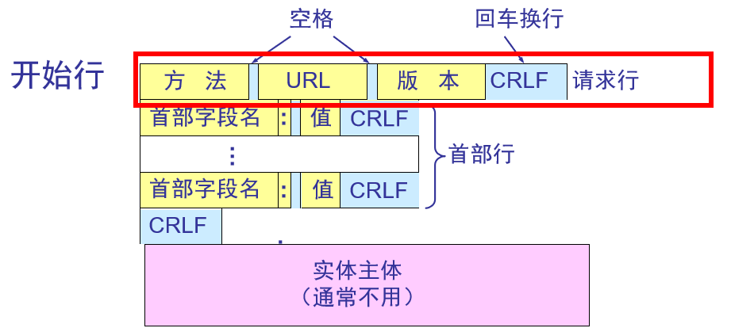

## 介绍jsonp、以及他的原理

[JSONP](https://www.cnblogs.com/lemontea/archive/2012/12/11/2812268.html)

## 什么时候会引起跨域

同源策略：  
| URL | 说明 | 是否允许通信 |
| :--- | :--- | :--- |
| http://www.a.com/a.js <br> http://www.b.com/b.js | 同一域名下 | 允许 |
| http://www.a.com/lab/a.js <br> http://www.b.com/script/b.js | 同一域名下不同文件夹 | 允许 |
| http://www.a.com:8000/a.js <br> http://www.b.com/b.js | 同一域名下不同端口 | 不允许 |
| https://www.a.com/a.js <br> http://www.b.com/b.js | 同一域名下不同协议 | 不允许 |
| http://www.a.com/a.js <br> http://70.32.92.74/b.js | 域名和域名对应的ip | 不允许 |
| http://www.a.com/a.js <br> http://script.a.com/b.js | 主域相同子域不同 | 不允许 |
| http://www.a.com/a.js <br> http://a.com/b.js | 同一域名，不同二级域名(同上) | 不允许（cookie这种情况下也不允许访问） |
| http://www.baidu.com/a.js <br> http://www.a.com/b.js | 不同域名 | 不允许 |

解决跨域的方法：
- JSONP
  - 前端设置好回调函数，并将其作为url的参数
  - 服务端接受到请求后，获得参数中的回调函数名，并将数据放在参数中将其返回
  - 收到script，放在src中执行
  - 优点：
    1. 不受同源策略限制
    2. 兼容性很好，古老的浏览器也能很好的运行
    3. 不需要XMLHttpRequest或ActiveX的支持；可以通过callback的方式回传结果
  - 缺点： 
    1. 只支持get而不支持post等其他类型的http请求
    2. 只支持跨域http请求，不支持不同于的两个页面或者iframe之间进行数据通信的问题
- CORS(Cross-origin resource sharing) 跨域资源共享
  - Access-Control-Allow-Origin
  - 优点/缺点：
    1. 使用简单方便，更为安全
    2. 支持post请求方式
    3. cors是一种新型的跨域问题解决方案，存在兼容问题
- Server Proxy；服务器代理
- location.hash
- window.name
- postMessage
- document.domain

> 参考[关于跨域，你想知道的全在这里](https://zhuanlan.zhihu.com/p/25778815)

## iframe的数据传递

> 参考[iframe父子页面之间的通信](https://www.jianshu.com/p/90cd15e0699f)

1. 同域情况下的父子页面通信
```html
<!-- 父页面 -->
<button id="button" onclick="callChild()"> 调用儿子的方法 </button>
<iframe name="son" src="http://localhost:8080/index.html">
<script>
   function say() {
      console.log("i am father page");
    }

    function callChild() {
      mySon.window.say();
      mySon.window.document.getElementById('button').innerHTML = '调用结束';
    }
</script>
```
```html
<script>
  function say() {
    console.log('i am child page');
  }
  function callFather() {
    parent.say();
    parent.window.document.getElementById('button').innerHTML = '调用结束'
  }
</script>

<button id="button" onclick="callFather()"> 调用爸爸的方法 </button>
```

## 大文件下载用什么请求

## get和post的区别

[get和post到底有什么区别](https://www.zhihu.com/question/28586791)


## https交换过程


1. 客户端发起HTTPS请求，用户在浏览器中输入一个https网址，然后连接到服务端的443端口
2. 服务端配置：采取https协议的服务器必须有一套数字证书，这个证书是一对公钥和私钥
3. 传送证书：这个证书就是公钥，包含（证书颁发机构、过期时间等）
4. 客户端解析证书 这部分工作是由客户端的SSL/TLS来完成的，首先会验证公钥是否有效，如果发现异常，会弹出警示框。若没问题，则生成一个**随机数**，然后用公钥对随机数进行加密
5. 传输加密信息：这部分传送的是用证书加密后的随机值
6. 服务端解密信息，服务端用私钥解密后，得到客户传过来的随机值，然后把内容通过该随机值进行对称加密，将信息和私钥通过算法混合在一起
7. 传输加密后的信息
8. 客户端解密信息 客户端用之前生产的私钥解密服务端传过来的信息，

### 对称加密与非对称加密

对称加密： 值得就是加、解密使用的都是同一串密钥，。对称加密只有一个密钥作为私钥。
常见的对称加密算法：DES,AES等。  
对称加密的优缺点：对称加密相比非对称加密效率要高很多，加密速度要快很多。但是缺陷在于对于密钥的管理和分发上比较困难，不是非常安全，密钥管理负担很重。  
非对称加密：指加解密使用不同的密钥，一把作为公开的公钥，另一把作为私钥。公钥加密的信息，只有私钥才能解密。反之同理。  
非对称加密优缺点：安全行更高，公钥是公开的，密钥是自己保存的，不需要将私钥给别人。缺点：加密和解密花费时间长、速度慢，只适合对少量数据进行加密。


### http请求头构成

> 参考[HTTP的结构](https://juejin.im/post/5cda1426f265da038733c22e)



http请求报文由三部分组成：请求行(请求头)、消息报头、请求正文。
- 请求头以一个方法符号开头，以空格分开，后面跟着请求的URI和协议的版本，先后顺序为: Method Request-URI HTTP-Version CRLF
  - Method: 请求方法
  - Request-URI: 统一资源标识符
  - HTTP-Version：表示请求的HTTP协议版本
  - CRLF表示回车和换行
HTTP结构之消息报文  
HTTP消息由客户端到服务器的请求和服务器到客户端的响应组成。请求消息和响应消息都是由开始行（对于请求消息，开始行就是请求行，对于响应消息，开始行就是状态行），消息报头（可选），空行（只有CRLF的行），消息正文（可选）组成。
HTTP消息报头包括普通报头、请求报头、响应报头、实体报头。
每一个报头域都是由名字+“：”+空格+值 组成，消息报头域的名字是大小写无关的。
- 普通报头
在普通报文头中，有少数报头域用于所有的请求和响应消息，但并不用于被传输的实体，只用于传输的消息。常见的普通报头：Cache-Control、Date、Connection
- 请求报文
请求报头允许客户端向服务器端传递请求的附加信息以及客户端自身的信息。常见的请求报头：Accept、Accept-Charset、Accept-Encoding、Accept-Language
- 响应报头
- 实体报头
Content-Encoding、Content-Language、Content-Length、Content-Type、Last-Modified、Expires

## http缓存

[http缓存详解](https://juejin.im/entry/599afbe5f265da247c4ee6e3)

### if-modified-since 和last-modofied的区别

> 参考[浏览器缓存详解](https://blog.csdn.net/eroswang/article/details/8302191)


在浏览器第一次请求某一个URL时，服务器端的返回状态会是200，内容是你请求的资源，同时有一个Last-Modified的属性标记(HttpReponse Header)此文件在服务期端最后被修改的时间，格式类似这样：

Last-Modified:Tue, 24 Feb 2009 08:01:04 GMT

客户端第二次请求此URL时，根据HTTP协议的规定，浏览器会向服务器传送If-Modified-Since报头(HttpRequest Header)，询问该时间之后文件是否有被修改过：

If-Modified-Since:Tue, 24 Feb 2009 08:01:04 GMT

如果服务器端的资源没有变化，则自动返回HTTP304（NotChanged.）状态码，内容为空，这样就节省了传输数据量。当服务器端代码发生改变或者重启服务器时，则重新发出资源，返回和第一次请求时类似。从而保证不向客户端重复发出资源，也保证当服务器有变化时，客户端能够得到最新的资源。

### Etag是依据什么生成的

文件内容  

HTTP协议规格说明定义ETag为“被请求变量的实体标记”（参见14.19）。简单点即服务器响应时给请求URL标记，并在HTTP响应头中将其传送到客户端，类似服务器端返回的格式：  

Etag:“5d8c72a5edda8d6a:3239″

客户端的查询更新格式是这样的：  

If-None-Match:“5d8c72a5edda8d6a:3239″

如果ETag没改变，则返回状态304。  

即:在客户端发出请求后，HttpReponse Header中包含Etag:“5d8c72a5edda8d6a:3239″  

标识，等于告诉Client端，你拿到的这个的资源有表示ID：5d8c72a5edda8d6a:3239。当下次需要发Request索要同一个URI的时候，浏览器同时发出一个If-None-Match报头(Http RequestHeader)此时包头中信息包含上次访问得到的Etag:“5d8c72a5edda8d6a:3239″标识。  

If-None-Match:“5d8c72a5edda8d6a:3239“  

,这样，Client端等于Cache了两份，服务器端就会比对2者的etag。如果If-None-Match为False，不返回200，返回304(Not Modified) Response。

### cache-control 是绝对时间还是相对时间

Expires与Cache-Control原理：  
他们都是服务端用来约定和客户端的有效时间，格式如下：
```
Expire: Thu, 31 Dec 2037 23:55:55 GMT
Cache-Control: max-age = 31536000
```
1. 浏览器第一次跟服务器请求一个资源，服务器在返回这个资源的同时，在response的header会加上Expires/cache-control的header；
2. 浏览器在请求这个资源时，先从缓存中寻找，找到这个资源后，比较expires或cache-control的max-age字段值做比较，如果在有效期内，则缓存命中，读取缓存内容，否则重新向服务器发送请求；
3. Header在重新加载的时候会被更新  

联系和区别：
- Expires规定了缓存失效时间（Date为当前时间）,而Cache-Control的max-age规定了缓存的有效时间，前者是绝对时间，后者是相对时间
- Expires是HTTP1.0的东西，而Cache-Control是HTTP1.1的
- 若响应头Expires和Cache-Control同时存在，Cache-Control优先级高于Expire  
缺点:
- Exipires返回的是一个绝对时间，在服务器时间与客户端时间相差较大的时候，缓存命中不准确，如：随意修改客户端时钟。

如果单只设置有效时间，如文件过了有效期后，内容并没有发生改变，还是可以用缓存数据，这个时候又怎么判断服务端文件有没有更新呢？主要有两种方式：

[Cache-Control字段值详解](https://juejin.im/post/5c2d6c9ae51d450cf4195a08)

## map和Object的区别

1. Object对象有原型，也就是说他有默认的key值在对象上面， 除非我们使用Object.create(null)创建一个没有原型的对象
2. 在Object对象中， 只能把String和Symbol作为key值， 但是在Map中，key值可以是任何基本类型(String, Number, Boolean, undefined, NaN….)，或者对象(Map, Set, Object, Function , Symbol , null….)
3. 通过Map中的size属性， 可以很方便地获取到Map长度， 要获取Object的长度， 你只能用别的方法了
Map实例对象的key值可以为一个数组或者一个对象，或者一个函数，比较随意 ，而且Map对象实例中数据的排序是根据用户push的顺序进行排序的， 而Object实例中key,value的顺序就是有些规律了， (他们会先排数字开头的key值，然后才是字符串开头的key值)

### 什么时候用map
 
[Object与Map的异同及使用场景](https://juejin.im/post/5c7f6251f265da2dce1f68d3)

## Commonjs和es 6 import 除了写法上还有什么区别

import静态编译，import的地址不能通过计算

require就可以，例如 const url = "a" + "b";

Import url 直接报错了

require(url)不会报错

所以require都会用在动态加载的时候

## requestAnimationFrame和setTimeout的区别、为什么RAF会比较好

window.requestAnimationFrame这个方法是用来在页面重绘之前，通知浏览器调用一个指定的函数  

相当一部分的浏览器显示频率是16.7ms, 一秒60帧，如果我们设置setTimeout 10ms就会出现过度绘制的状态，也就是掉帧  
requestAnimationFrame就是跟着浏览器的绘制走，如果浏览器设备绘制间隔是16.7ms，那我们就用这个间隔绘制；如果浏览器间隔是10ms，就用10ms，这样就不会存在掉帧的现象

## setTimeout和setInterval哪个更准确

[setTimeout与setInterval区别](https://jixianqianduan.com/frontend-javascript/2014/08/25/js-settimeout-setinterval.html)

> setTimeout和setInterval的延时最小间隔是4ms（W3C在HTML标准中规定）；在JavaScript中没有任何代码是立刻执行的，但一旦进程空闲就尽快执行。这意味着无论是setTimeout还是setInterval，所设置的时间都只是n毫秒被添加到队列中，而不是过n毫秒后立即执行。


## 实现一个拖拽组件、怎么防止频繁触发，你会改变哪个属性达到效果

函数节流，改变transfrom属性

## 手写一个节流函数

```js
function throttle(fn, wait) {
  let canrun = true;
  return function() {
    if(!canrun) return
    canrun = false
    setTimeout(() => {
      canrun = true
      fn.apply(this, arguments)
    }, wait)
  }
}
```

## 有以下一个数组，请实现一个单链表

```js
let a = [1,2,3]
```
链表是一种数据结构，单向链表是最简单的一种。它有一个head指针，整个链表都有很多节点构成，head最终会指向链表头节点；每个节点由两个信息组成：节点数据和指向下一个节点的指针，最后一个节点的指针为 null 。

节点  
每个节点包含该节点的数据和指向下一个节点的指针：
```js
/**
 * 单个链表节点
 */
class Node {
  constructor(val) {
    this.val = val;
    this.next = null;
  }
}
```
链表结构  
链表除了包括节点还包括一些属性：比如长度、head指针  
```js
/**
 * 链表
 */
class LinkedList {
  constructor(val = null) {
    this.length = 0; // 链表长度
    this.head = null; // 链表的head指针
    if(val) {
      this.head = new Node(val);
      this.length = 1;
    }
  }
}
```
append
找到链表中next指向为空，进行插入：  

```js
class LinkedList {
  ...
  append(val) { 
    const node = new Node(val); // 创建节点
    if(this.head === null) { // 如果是个空列表
      this.head = node
    }else{
      let current = this.head;
      while(current.next) { // 找到 next 指向为空的节点
        current = current.next;
      }
      current.next = node
    }
    this.length += 1;
  }
}
```

removeAt  
删除指定节点，将前一个节点的next替换成这个节点的next

```js
class LinkedList {
  ...
  removeAt(position) {
    if(position < 0 || position >= this.length) {
      return null
    }
    let current = this.head;
    if(position === 0) { // 删除头节点，只需要改变head指针即可
      this.head = current.next;
    }else {
      let index = 0
      let prev = null
      while(index<position) {
        prev = current
        current = current.next
        index+=1
      }
      prev.next = current.next
    }
  }
}
```

insert 在指定位置插入节点
```js
class LinkedList{
  ...
  insert(position, val) {
    if(position < 0 || position >= this.length) {
      return false
    }
    let currrent = this.head;
    const node = new Node(val);
    if(position === 0) {
      node.next = current
      this.head = node
    }else {
      let index = 0;
      let prev = null;
      while(index < position) {
        index+=1;
        prev = current
        current = current.next
      }
      node.next = current
      prev.next = node
    }
    this.length += 1
    return true
  }
}
```

indexOf 返回指定值的索引

```js
indexOf(val) {
  let index = 0;
  let current = this.head;
  while(index < this.length) {
    if(current.val === val) {
      return index
    }
    current = current.next
    index+=1
  }
  return -1
}
```

remove（移除第一个指定值的节点）

```js
remove(val) {
  let index = this.indexOf(val)
  return this.removeAt(index)
}
```

size 返回链表长度
```js
class LinkedList {
  ...
  size() {
    return this.length;
  }
  ...
}
```
isEmpty（返回是否为空链表）

```js
class LinkedList {
  ...
  isEmpty() {
    return !!this.length;
  }
  ...
}
```

## 数组和链表搜索、删除、查找的复杂度

## 热更新如何做到增量更新、如何做到强制更新
