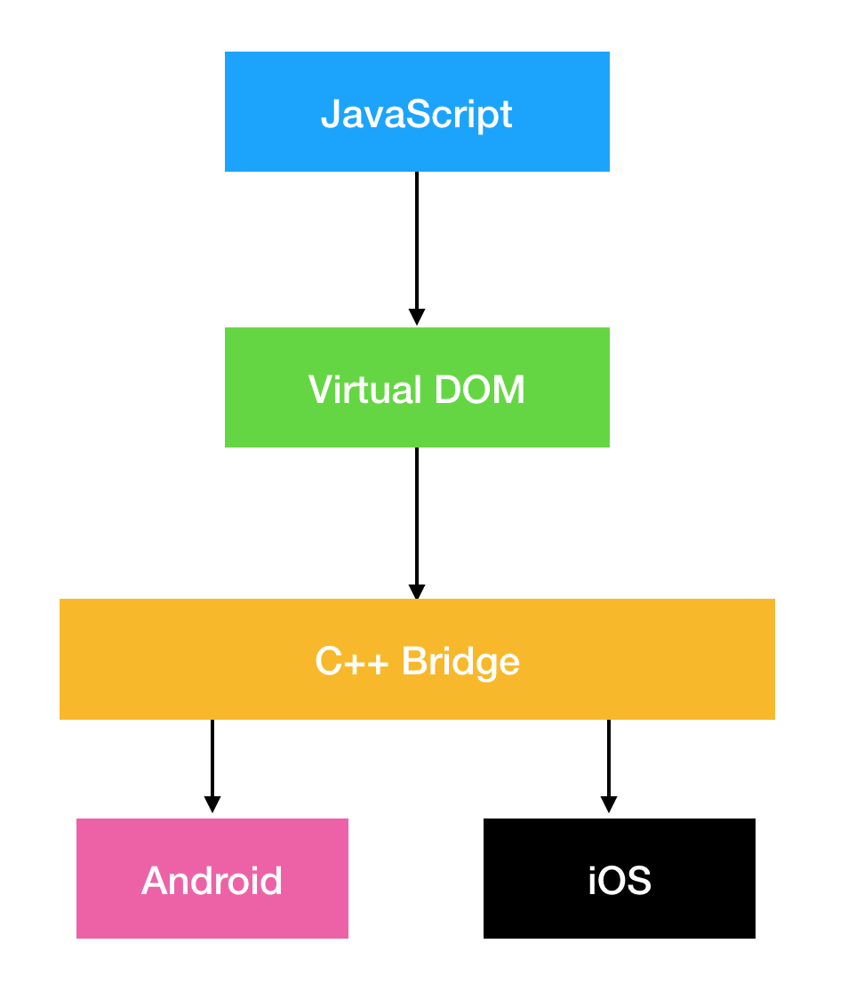
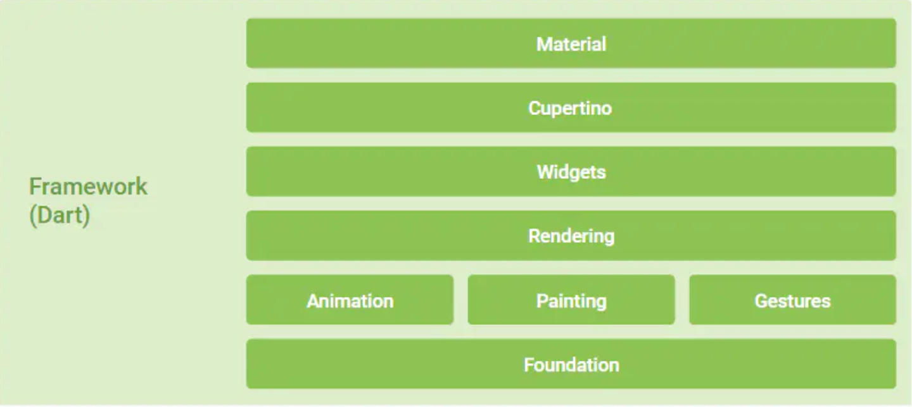
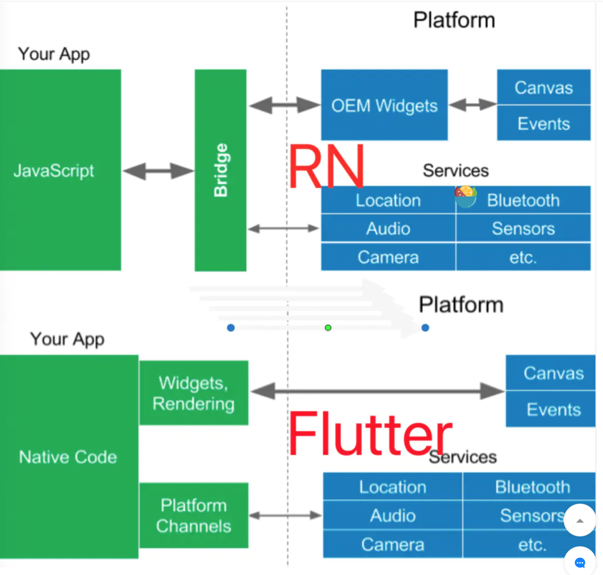
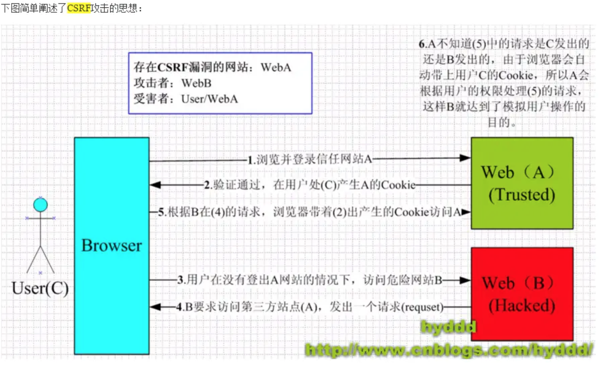

### 对比rn和flutter的性能

| 类型 | React Native | Flutter |
| :--- | :--- | :--- |
| 语言 | JavaScript | dart |
| 环境 | JSCore | Flutter Engine |
| 发布时间 | 2015 | 2017 |

- 在Android和iOS上，默认情况下Flutter和React Native都需要一个原生平台的Activity / ViewController支持，且在原生层面属于一个"单页面应用"，而它们之间最大的不同点在于UI构建
React Native会在Active会在Activity下加载js文件，然后运行在JavaScriptCore中解析Bundle文件布局，最后堆叠出一列列原生控件进行渲染。  


- Flutter 中绝大部分的 Widget 都与平台无关， 开发者基于 Framework 开发 App ，而 Framework 运行在 Engine 之上，由 Engine 进行适配和跨平台支持。这个跨平台的支持过程，其实就是将 Flutter UI 中的 Widget “数据化” ，然后通过 Engine 上的 Skia 直接绘制到屏幕上 。



- Widget 在渲染时会经过 Element 变化， 最后转化为 RenderObject 再进行绘制， 而最终组成的 RenderObject 树才是 “真正的渲染 Dom” ， 每次 Widget 树触发的改变，并不一定会导致RenderObject  树的完全更新。
- 所以在实现原理上 React Native 和 Flutter 是完全不同的思路，虽然都有类似“虚拟 DOM 的概念” ，但是React Native 带有较强的平台关联性，而 Flutter UI 的平台关联性十分薄弱。

- 先说理论性能，在理论上 Flutter 的设计性能是强于 React Native ，这是框架设计的理念导致的，Flutter 在少了 OEM Widget ，直接与 CPU / GPU 交互的特性，决定了它先天性能的优势。

### 为什么rn在ios的性能比android好，他在android上卡在哪里，怎么解决

React Native 同等条件下， Android 比 IOS 大很多 ，这是因为 IOS 自带了 JSCore ，而 Android 需要各类动态 so 内置支持，而且这里 Android 的动态库 so 是经过了 ndk 过滤后的大小，不然还会更大。



### flutter的底层原理

[Flutter原理深度解析](https://juejin.im/post/5d71d2f2518825103e545bdc)

### pwa的工作原理，有没有用过manifest

[深入理解 PWA](https://juejin.im/post/5c07493951882516cd70d213)

[lavas,manifest.json简介](https://lavas.baidu.com/pwa/engage-retain-users/add-to-home-screen/introduction)

manifest.json应该包含如下信息：
```json
{
    "short_name": "短名称",
    "name": "这是一个完整名称",
    "icon": [
        {
            "src": "icon.png",
            "type": "image/png",
            "sizes": "48x48"
        }
    ],
    "start_url": "index.html"
}
```

使用 link 标签将 manifest.json 部署到 PWA 站点 HTML 页面的头部，如下所示：

```html
<link rel="manifest" href="path-to-manifest/manifest.json">
```

### 热更新使用的场景、AppStore被拒的情况
[热更新的几种实现方式](https://www.jianshu.com/p/3bd95bd5c61b)  
1、热更新的技术限制：只能更新js代码，图片等静态资源。原生代码，原生配置都不能（其实能通过jspatch之类的技术能实现，但苹果现在会扫描代码，碰到jspatch会打回）
2、热更新的政策限制：明面上，苹果，谷歌都不允许热更新，所以提交AppStore和play store审核的时候都不能使用热更新，甚至不能出现检查版本之类的字眼。审核通过后可以开启热更新。但是另一方面，所有的大厂都在明目张胆地进行热更新（微信的小程序不是热更是什么？），所以……总的来说都是睁一只眼闭一只眼，只要不太过分玩换皮，热更新是官方不欢迎但也不拒绝的存在。

### h5webview跨平台上架被拒的原因和解决

[Appstore审核反馈废弃UIWebview APIs问题的说明](https://ask.dcloud.net.cn/article/36348)

iOS有UIWebview和WKWebview两种webview。从iOS13开始苹果将UIWebview列为过期API

### http2新特性

[HTTP----HTTP2.0新特性](https://juejin.im/post/5a4dfb2ef265da43305ee2d0)  
HTTP2.0 大幅度的提高了web性能，在HTTP1.1完全语意兼容的基础上，进一步减少了网络的延迟。实现低延迟高吞吐量。  
- 二进制分帧
- 首部压缩
- 流量控制
- 多路复用
- 请求优先级
- 服务器推送

### https的ssl密钥交换过程

[Https之秘钥交换过程分析](https://www.cnblogs.com/lingyejun/p/9210903.html)

### webpack打包的优化手段

参考[关于webpack打包优化总结](https://www.jianshu.com/p/910b3579c454)

1. 合理配置CommonsChunkPlugin: 对所有依赖的chunk进行公共部分的提取(以module为单位进行提取)
  - 传入字符串参数，由chunkplugin自动计算提取
  - 有选择的提取公共代码
  - 将entry下所有的模块的公共部分（可指定引用次数）提取到一个通用的chunk中
  - 抽取entry中的一些lib抽取到vendors中
2. 通过externals配置来提取常用库，CDN，导出为umd模式
3. 利用DllPlugin和DllReferencePlugin预编译模块
4. 使用Happypack加速代码构建(webpack4使用thread loader)
5. 增强uglifyPlugin,并行压缩

### 什么是AMD,CommonJS和UMD

[什么是 AMD，CommonJS 和 UMD？](https://www.jianshu.com/p/ec2844e0aea9)

### cdn有什么用处，他的原理是什么

CDN，Content Distribute Network，可以直译成内容分发网络，CDN解决的是如何将数据快速可靠从源站传递到用户的问题。用户获取数据时，不需要直接从源站获取，通过CDN对于数据的分发，用户可以从一个较优的服务器获取数据，从而达到快速访问，并减少源站负载压力的目的。
[CDN的作用与基本过程](https://blog.csdn.net/lihao21/article/details/52808747)

### 有没有遇到过运营商劫持，怎么解决

[干货！防运营商劫持](https://juejin.im/post/5bea7eb4f265da612859a9e4)

### csrf的产生和防范的手段

[关于csrf,什么是csrf,怎么防范它?](https://juejin.im/post/5b6b08956fb9a04fc67c2263)  
跨站请求伪造(Cross-site requeset forgery)  
防范 CSRF 可以遵循以下几种规则：

1. Get 请求不对数据进行修改
2. 不让第三方网站访问到用户 Cookie
3. 阻止第三方网站请求接口
4. 请求时附带验证信息，比如验证码或者 token



### 网站的性能如何优化，有什么工具，怎么才算一个网站的性能好

[网站性能优化知识整理](https://www.jianshu.com/p/56faa75fb9be)

### 如何捕获前端某一个文件的报错，并上报到系统

[谈谈前端异常捕获与上报](https://segmentfault.com/a/1190000013983109)

### Babel polyfill 解决了什么问题，具体有哪些，es6会带来什么兼容问题

[Babel polyfill知多少](https://zhuanlan.zhihu.com/p/29058936)

- Babel 处于构建时（也就是传统Java等语言的编译时），转译出来的结果在默认情况下并不包括 ES6 对运行时的扩展，例如，builtins（内建，包括 Promise、Set、Map 等）、内建类型上的原型扩展（如 ES6 对 Array、Object、String 等内建类型原型上的扩展）以及Regenerator（用于generators / yield）等都不包括在内。
- 最后来到 babel-polyfill，它的初衷是模拟（emulate）一整套 ES2015+ 运行时环境，所以它的确会以全局变量的形式 polyfill Map、Set、Promise 之类的类型，也的确会以类似 Array.prototype.includes() 的方式去注入污染原型，这也是官网中提到最适合应用级开发的 polyfill，再次提醒如果你在开发 library 的话，不推荐使用（或者说绝对不要使用）。

总结： 
**babel-polyfill**：需要在你自己的代码中手工引入（最好放在 vendor 里），它会以全局变量污染的方式 polyfill 内建类（如 Map、Set、Promise 等），同时也会通过修改 Array、String、Object 等原型的方式添加实例方法（如 Array.prototype.includes()、String.prototype.padStart() 等），内建类的静态方法（如 Array.from() 等）也会被 polyfill。babel-polyfill 适合于开发独立的业务应用，及时全局污染、prototype 被修改也不会受到太大的影响，babel-polyfill 不适合开发第三方类库。

**babel-plugin-transform-runtime**：需要你在 .babelrc 或 Babel 编译选项中将该插件添加到 plugins 中，插件只会 polyfill 你用到的类或方法，由于采用了沙盒（Sandbox）机制，它不会污染全局变量，同时也不会去修改内建类的原型，带来的坏处是它不会 polyfill 原型上的扩展（例如 Array.prototype.includes() 不会被 polyfill，Array.from() 则会被 polyfill）。插件的方式适合于开发第三方类库，不适合开发需要大量使用 Array 等原型链扩展方法的应用。


### 你有为团队写过什么优化的工具

### 如何协同交流，保证团队的进度和质量

[https://www.zhihu.com/question/19798220](https://www.zhihu.com/question/19798220)

### 怎么提高产品提需求的质量

我们开发真正希望的是产品经理在交代需求时，不要求全面细致，但要重点突出。其实工程师不仅仅要了解产品的方案的核心设计思路，还要知道工程上取舍的条件。这样我们可以集中精力解决对公司对整个产品有巨大回报的问题，同时在那些次要的功能点上做变通。而面对那些重点不突出的需求，越是交代得细致，我们越是反感。因为不知道你真正想解决的问题是什么，我们就不知道一处设定是你重点关注的还是随便拍脑袋的，那我们肯定要到处挑刺啦。此外，如果一个名产品经理知道自己方案的核心要点，也是不会为一些次要的细节被挑刺而乱了阵脚的。只要底线没被触及，完全可以让开发有些发挥的余地，降低下整体的成本呀。相反，越是不知道底线在哪的 PM，面对开发的反馈越敏感，越怕自己的方案有一点的变化。所谓一流产品讲故事，二流产品列单子，三流产品哭鼻子，就是这个道理。

### 如果你要引入一个新的技术，怎么去对他进行评估

[我脑海中的优秀技术团队](https://juejin.im/entry/5794e4fad342d30059e987eb)

### 说一个你觉得做得最好的项目，并说明好在哪里

### 如何保证架构清晰

### 有没有关注什么新的技术

### 未来职业规划


### 参考

[全网最全 Flutter 与 React Native 深入对比分析](https://juejin.im/post/5d0bac156fb9a07ec56e7f15)
