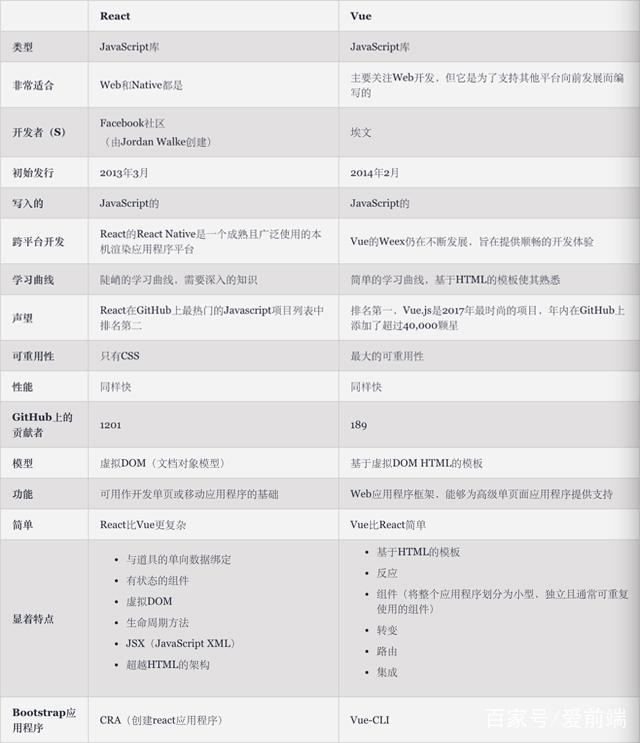

## react高阶组件的props污染

[几种 react 组件的代码复用（mixin-HOC-render props -Hooks）](https://juejin.im/post/5d4fb6b0f265da03d42f95d3)

## react renderprops详解

```js
// https://codepen.io/tudou/full/dmawvY
const Bar = ({ title }) => (<p>{title}</p>);

class Foo extends React.Component {
  constructor(props) {
    super(props);
    this.state = { title: '我是一个state的属性' };
  }
  render() {
    const { render } = this.props;
    const { title } = this.state;
    
    return (
      <div>
        {render(title)}
      </div>
    )
  }
}

class App extends React.Component {
  render() {
    return (
      <div>
        <h2>这是一个示例组件</h2>
        <Foo render={(title) => <Bar title={title} />} />
      </div>
    );
  }
}
ReactDOM.render(<App />, document.getElementById('app'))
```

在上面的例子中，给Foo 组件传递了一个render参数它是一个函数这个函数返回一个Bar组件，这个函数接受一个参数title他来自于Foo 组件调用时传递并且我们又将title 属性传递给了Bar 组件。经过上述的调用过程我们的Bar 组件就可以共享到Foo 组件内部的state 属性`。
                                                                            

## react的diff算法

[React 源码深度解读（十）：Diff 算法详解](https://segmentfault.com/a/1190000017039293)

## 写一个样式，使底部的公司标注在不足一屏的时候就固定在底部，在高于一屏的时候就随页面滚动到底部

## vue和react的区别



## React 的shouldComponentUpdate详解

## vw和vh谈css的优雅降级

## rn和cordova的区别

## vue的Object defineProperty原理和他监听的数据类型