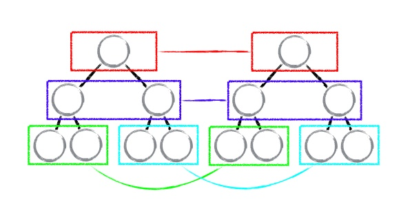
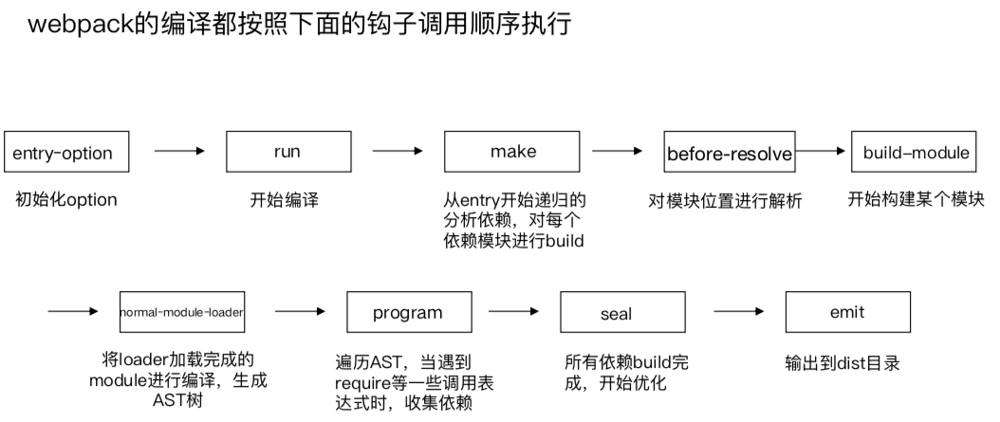
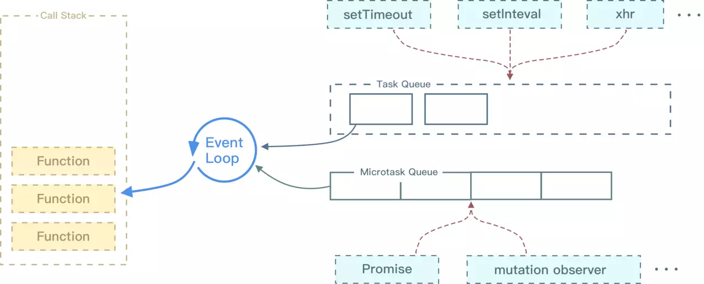

### promise和async、await的区别，什么时候使用promise、什么时候使用async、await

语法: 使用Promise
```js
const makeRequest = () => {
  getJSON().then(data => {
    console.log(data)
    return "done"
  })
}
makeRequest()
```
使用await
```js
const makeRequest = async() => {
  console.log(await getJSON)
  return "done"
}
makeRequest()
```

区别：
1. 函数前async必须要加，如果函数体使用await的话。使用任何一个async函数都会隐式返回一个promise，并且promise resolve的值就是return返回的值
2. 不能在函数开头使用await  
使用async和await的好处：
1. 写法更加简洁
2. 错误处理  
Promise中不能自定义使用try/catch进行错误捕获，但是在async/await中可以
```js
try {
  const data = JSON.parse(await getJSON())
  console.log(data)
} catch(err) {
  console.log(err)
}
```
3. 中间值(多个请求下一个依赖上一个)
在一些场景中，也许需要 promise1 去触发 promise2 再去触发 promise3，这个时候代码应该是这样的
```js
const makeRequest = async () => {
  const value1 = await promise1()
  const value2 = await promise2(value1)
  return promise3(value1, value2)
}
```
4. 错误栈处理方式 
```js
const makeRequest = async () => {
  await callAPromise()
  await callAPromise()
  await callAPromise()
  await callAPromise()
  await callAPromise()
  throw new Error("oops")
}
makeRequest().catch(err => console.log(err))
```

### React的diff算法

传统 diff 算法的复杂度为 O(n^3)，显然这是无法满足性能要求的。**React 通过制定大胆的策略，将 O(n^3) 复杂度的问题转换成 O(n) 复杂度的问题。**
diff策略：  
1. Web UI中的DOM节点跨层级的移动操作特别少，可以忽略不计
2. 拥有相同类的两个组件将会生成相似的树形结构，拥有不同类的两个组件将会生成不同的树形结构
3. 对于同一层级的一组子节点，他们可以通过唯一的id进行区分

#### tree diff


> 注意：在开发组件时，保持稳定的 DOM 结构会有助于性能的提升。例如，可以通过 CSS 隐藏或显示节点，而不是真的移除或添加 DOM 节点。

#### component diff

1. 如果是同一类型的组件，按照原策略继续比较 virtual DOM tree。
2. 如果不是，则将该组件判断为 dirty component，从而替换整个组件下的所有子节点。
3. 对于同一类型的组件，有可能其 Virtual DOM 没有任何变化，如果能够确切的知道这点那可以节省大量的 diff 运算时间，因此 React 允许用户通过 shouldComponentUpdate() 来判断该组件是否需要进行 diff。

#### element diff

当节点处于同一层级时，React diff 提供了三种节点操作，分别为：INSERT_MARKUP（插入）、MOVE_EXISTING（移动）和 REMOVE_NODE（删除）。
- INSERT_MARKUP，新的 component 类型不在老集合里， 即是全新的节点，需要对新节点执行插入操作。
- MOVE_EXISTING，在老集合有新 component 类型，且 element 是可更新的类型，generateComponentChildren 已调用 receiveComponent，这种情况下 prevChild=nextChild，就需要做移动操作，可以复用以前的 DOM 节点。
- REMOVE_NODE，老 component 类型，在新集合里也有，但对应的 element 不同则不能直接复用和更新，需要执行删除操作，或者老 component 不在新集合里的，也需要执行删除操作。

总结  
- React 通过制定大胆的 diff 策略，将 O(n3) 复杂度的问题转换成 O(n) 复杂度的问题；
- React 通过分层求异的策略，对 tree diff 进行算法优化；
- React 通过相同类生成相似树形结构，不同类生成不同树形结构的策略，对 component diff 进行算法优化；
- React 通过设置唯一 key的策略，对 element diff 进行算法优化；
- 建议，在开发组件时，保持稳定的 DOM 结构会有助于性能的提升；
- 建议，在开发过程中，尽量减少类似将最后一个节点移动到列表首部的操作，当节点数量过大或更新操作过于频繁时，在一定程度上会影响 React 的渲染性能。

### webpack打包流程



### EventLoop
执行栈  
可以把执行栈认为是一个存储函数调用的栈结构，遵循先进后出的原则。  
浏览器中的Event Loop
上一小节我们讲到了什么是执行栈，大家也知道了当我们执行 JS 代码的时候其实就是往执行栈中放入函数，那么遇到异步代码的时候该怎么办？其实当遇到异步的代码时，会被挂起并在需要执行的时候加入到 Task（有多种 Task） 队列中。一旦执行栈为空，Event Loop 就会从 Task 队列中拿出需要执行的代码并放入执行栈中执行，所以本质上来说 JS 中的异步还是同步行为。  
  
不同的任务源会被分配到不同的 Task 队列中，任务源可以分为 微任务（microtask） 和 宏任务（macrotask）。在 ES6 规范中，microtask 称为 jobs，macrotask 称为 task。

### 长列表的优化(React)

[在React项目中，如何优雅的优化长列表](https://juejin.im/post/5c048f25e51d450d16620d8d)  
react-virtualized  
react-virtualized是一个实现虚拟列表较为优秀的组件库，react-virtualized提供了一些基础组件用于实现虚拟列表，虚拟网格，虚拟表格等等，它们都可以减小不必要的dom渲染。此外还提供了几个高阶组件，可以实现动态子元素高度，以及自动填充可视区等等。

### React项目有什么优化的手段

[React项目优化](https://juejin.im/post/5b207a84f265da6e4c6d08ba)

### 什么时候应该使用Vue、什么时候应该使用React

[Vue和React的使用场景和深度有何不同？](https://www.zhihu.com/question/31585377)

### display有哪些值、垂直居中

### 有没有给产品提过什么意见