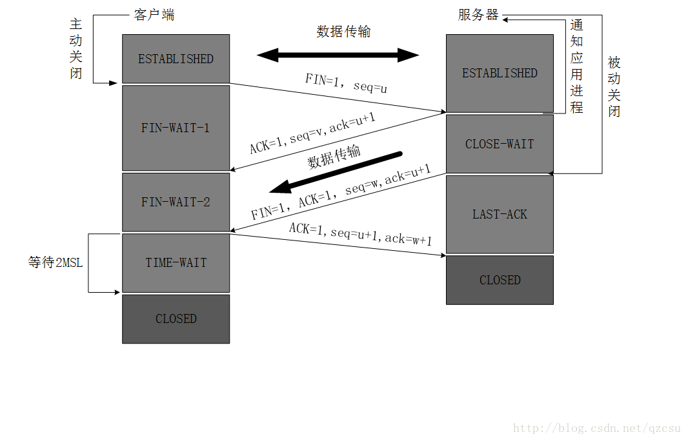

### HTTPS加密过程

1. 客户端发起HTTPS请求，用户在浏览器中输入一个https网址，然后连接到服务端的443端口
2. 服务端配置：采取https协议的服务器必须有一套数字证书，这个证书是一对公钥和私钥
3. 传送证书：这个证书就是公钥，包含（证书颁发机构、过期时间等）
4. 客户端解析证书 这部分工作是由客户端的SSL/TLS来完成的，首先会验证公钥是否有效，如果发现异常，会弹出警示框。若没问题，则生成一个**随机数**，然后用公钥对随机数进行加密
5. 传输加密信息：这部分传送的是用证书加密后的随机值
6. 服务端解密信息，服务端用私钥解密后，得到客户传过来的随机值，然后把内容通过该随机值进行对称加密，将信息和私钥通过算法混合在一起
7. 传输加密后的信息
8. 客户端解密信息 客户端用之前生产的私钥解密服务端传过来的信息，

#### TLS

SSL发展到3.0版本后改成TLS

TLS主要提供的三个基本服务
- 加密
- 身份验证，页而已叫证书验证
- 消息完整性校验

TSL协议是基于TCP协议之上的，图中第一个蓝色返回TCP握手过程，之后两次橙色的往返，可以成为TSL握手：
1. client1: TLS版本号+所支持加密套件列表+希望使用的TSL选项
2. Server1： 选择一个客户端的加密套件+自己的公钥+自己的证书+希望使用的TLS选项+（要求客户端证书）；
3. Client2: (自己的证书)+使用服务器公钥和协商的加密套件加密一个对称秘钥（自己生成的一个随机值）；
4. Server2: 使用私钥解密出对称秘钥（随机值）后，发送加密的Finish消息，表明完成握手

#### 证书机制/证书验证

在TSL中，我们需要证书来保证你所访问的服务器是真实的、可信的。

1. 客户端获取到了站点证书，拿到了站点的公钥；
2. 要验证站点可信后，才能使用其公钥，因此客户端找到其站点证书颁发者的信息
3. 站点证书的颁发者验证了服务端站点是可信的，但客户端依然不清楚该颁发者是否可信
4. 再往上，找到了认证了中间证书商的源头证书颁发者。由于源头证书颁发者非常少，我们浏览器之前就认识了，因此可以认为根证书颁发者是可信的
5. 一路倒推，证书颁发者可信，那么它所颁发的所有站点也是可信的，最终确定了我们所访问的服务端是可信的
6. 客户端使用证书的公钥，继续完成TLS的握手过程

#### 验证策略是怎样的？

CRL和OCSP  
CRL(Certificate Revocation List)既证书撤销名单。证书颁发者会提供一份已经失效证书的名单，供浏览器验证证书使用。当然这份名单是巨长无比的，浏览器不可能每次TLS都去下载，所以常用的做法是浏览器会缓存这份名单，定期做后台更新。这样虽然后台更新存在时间间隔，证书失效不实时，但一般也OK。  
OCSP(Online Certicicate StatusProtocol)即 在线证书状态协议。除了离线文件，证书颁发者也会提供实时的查询接口，查询某个特定证书目前是否有效。实时查询的问题在于浏览器需要等待这个查询结束才能继续TLS握手，延迟会更大。

### HTTP2和HTTP1.1

> 参考[HTTP2 详解](https://juejin.im/post/5b88a4f56fb9a01a0b31a67e)
> [HTTP1.0、HTTP1.1 和 HTTP2.0 的区别](https://juejin.im/entry/5981c5df518825359a2b9476)

http2：
- 新的二进制格式(Binary Format) HTTP1.x的解析是基于文本。基于文本协议的格式解析存在天然缺陷，文本的表现形式有多样性，要做到健壮性考虑的场景必然很多，二进制则不同，只认0和1的组合。基于这种考虑HTTP2.0的协议解析决定采用二进制格式，实现方便且健壮。
- 多路复用(MultiPlexing) 即连接共享，即每一个request都是是用作连接共享机制的。一个request对应一个id，这样一个连接上可以有多个request，每个连接的request可以随机的混杂在一起，接收方可以根据request的 id将request再归属到各自不同的服务端请求里面。
- header压缩，如上文中所言，对前面提到过HTTP1.x的header带有大量信息，而且每次都要重复发送，HTTP2.0使用encoder来减少需要传输的header大小，通讯双方各自cache一份header fields表，既避免了重复header的传输，又减小了需要传输的大小。
- 服务端推送（server push），同SPDY一样，HTTP2.0也具有server push功能。

HTTP1.1存在的问题

1. TCP连接数限制
2. 线头阻塞
3. Header内容过多

### 三次握手和四次挥手

---

### 输入URL 到页面展示发生了什么

> 参考：[从输入URL到页面展示，你想知道些什么？](https://juejin.im/post/5b148a2ce51d4506965908d2)

- URL输入
- DNS解析
- TCP连接
- 发送HTTP请求
- 服务器处理请求
- 服务器响应请求
- 浏览器解析渲染页面
- 连接结束

### 性能优化策略

> 参考[2018前端性能优化清单](https://juejin.im/post/5a966bd16fb9a0635172a50a)
> [前端性能优化总结](https://juejin.im/post/5dddf0a06fb9a0717b5fce15)

- 图片优化：webp, 图片懒加载
- 合理使用缓存：service worker
- webpack优化：按需加载、公共代码提取
- nginx优化： 使用gzip
- 优化网络链接
- 体验优化：骨架屏、服务端渲染

### 浏览器缓存

> 参考[浏览器缓存详解](https://juejin.im/post/5cf72a93f265da1b7b317875)

- service worker
- 内存(memory cache)
- 硬盘(disk cache)
- push cache

### 详解CSRF

防护方法

1. 二次验证，进行重要敏感操作时，要求用户进行二次验证。
2. 验证码，进行重要敏感操作时，加入验证码。
3. 验证 HTTP 的 Referer 字段。
4. 请求地址中添加 Token 并验证。
5. HTTP 头中自定义属性并验证。

### TCP和UDP的区别

