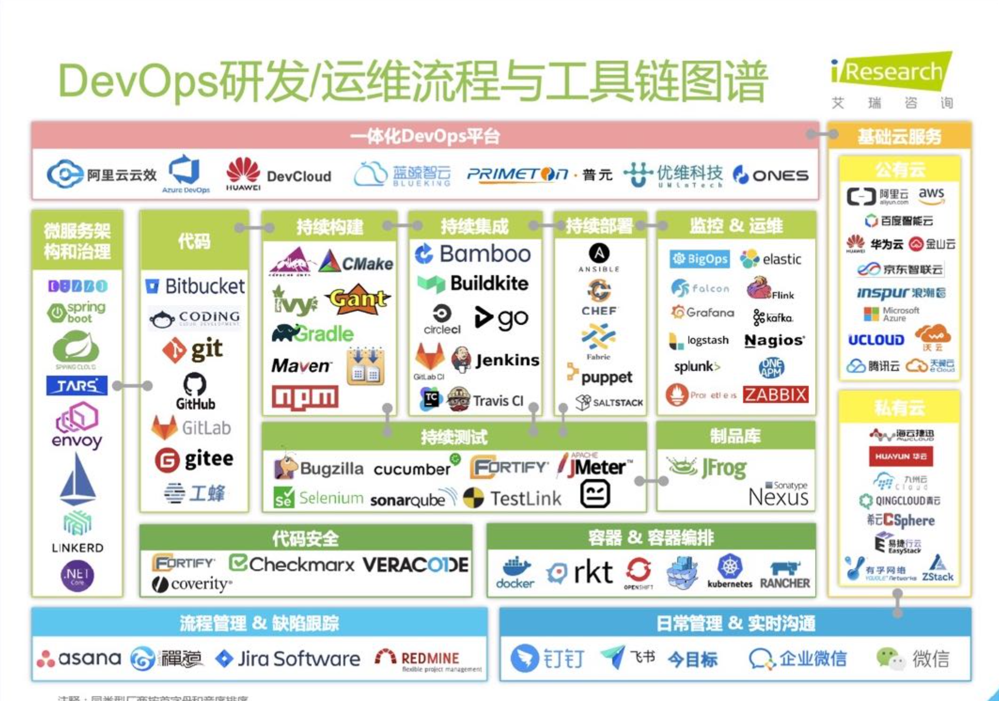
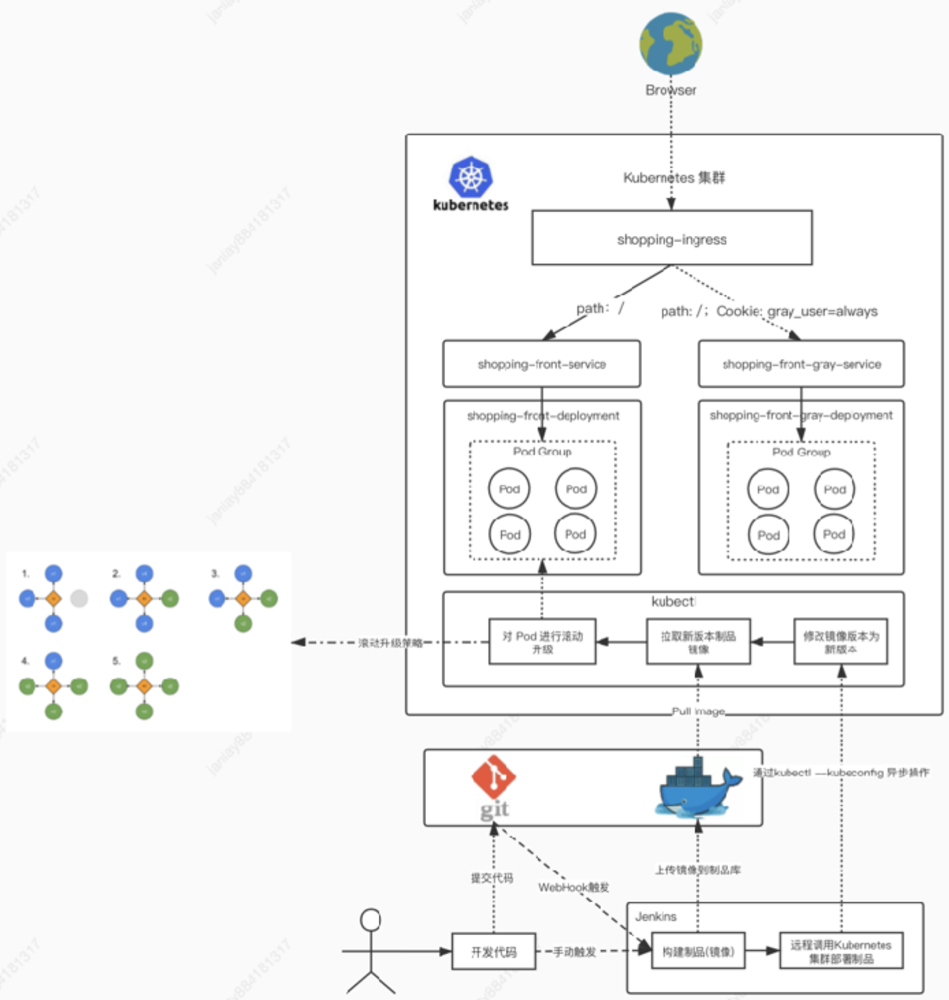
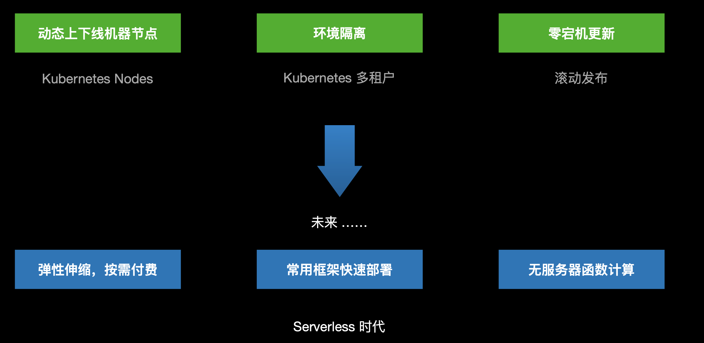
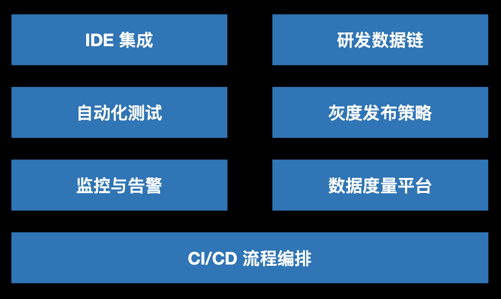

## 如何从0到1一步步成体系地搭建CI

摘自前端早早聊 Gitee私有云前端团队 Janlay

### 现状和困难 & 前端运维之路

#### 字节跳动面试题

1.自我介绍  
是的,我在看那个大厚书  
cicd我现在兴趣很大非常想掌握  
2为什么刚工作不久离职了  
3.业务中负责什么  
4.node偏运维方向的有没有了解过( docker  
这都是晋升的点  
k8s  
5.业务中主要用node干了什么  
6. react.生命周期有了解吗  
的确这俩很接近。弹性伸缩,动态扩容,自动重  
7.说下 react-router源码你看完后印象深刻的部
启,简单部署都有  

### Devops 工具链
<br>


### 演进历史

#### FTP + Nginx

- 与敏捷开发节奏不合拍
- 缺少自动化
- 手动操作,误操作风险大
- 流程繁琐

#### 自动化序章 shell + Nginx

```bash
node -v
npm-v
npminstall-gcnpm--registry=https://registry.npmtaobaoorg
cnpm install
npm run build
#压缩
tar -czvf vue-cli-demo, tar ./dist
scp
/vue-cli-demo tar root@172.16.81. 151
ssh root@172.16.81.151tar zxvf M/vue-cLi-demo tar &d mv dist/*/home/nginx/htmL
```

缺点：  
- 半自动化
- 缺少可视化交互
- 交互操作不友好
- 服务器访问权限泄漏


#### 可视化执行 Jenkins + Nginx

优点：  
- 图形化操作,交互友好
- 可以做权限分配
- 可以集成 Git hook做钩子触发

缺点：  
- 代码运行环境需要高度集成
- 需要版本归档管理
- 快速分发部署

#### 容器时代 Jenkins + Docker + Nexus + Nginx 容器

优点：  
- 服务容器化
- 更加便捷的应用版本管理
- Docker layer分层策略,节省服务包镜像拉取时间

缺点：  
- 多服务器批量部署

#### 基于配置清单服务器批量操作 Jenkins + Docker + Nexus + Ansible + Nginx 容器

优点：  
- 基于服务器配置清单的操作
- 可以批量操作服务器

缺点：  
- 客户/自用服务的负载均衡服务发现，希望自动配置
- 服务发布不停机
- 多套环境/多个业务之间希望做到隔离。互不干扰

#### 容器集群编排 Jenkins + Kubernetes + Docker + Nginx 容器  

<br>

<br>


### 为什么需要自动化？

解决上线部署困难的问题，让产品快速可以上线验证  

- 上线实现了自动化，然而需求上线时间丝毫没影响
手动测试时间占比多少?自动化测试占比多少?全量测试是不是必须?
- 无法打通上线的 “最后一公里”
从业务需求⻆度思考，是否需要手动构造自动化平台?
- 投入和产出不成正比
部署频率特低，CI/CD的意义有多大?

### 做平台而不是工具

<br>


### 最后

- 自动化，只是手段。如果不能通过自动化去打破发布现状，提升效率。做自动化反而是一种成本的浪费 
- 从业务⻆度出发，选择自己合适的工具去做自动化 
- 做好数据度量，持续优化流程

### 书籍

-《Kubernetes进阶实战》
- 《从 0 到 1 实现一套 CI/CD 流程》
- 《Devops 实践指南》