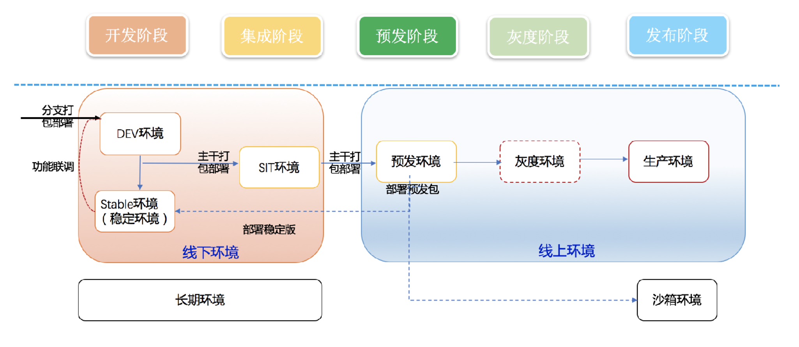
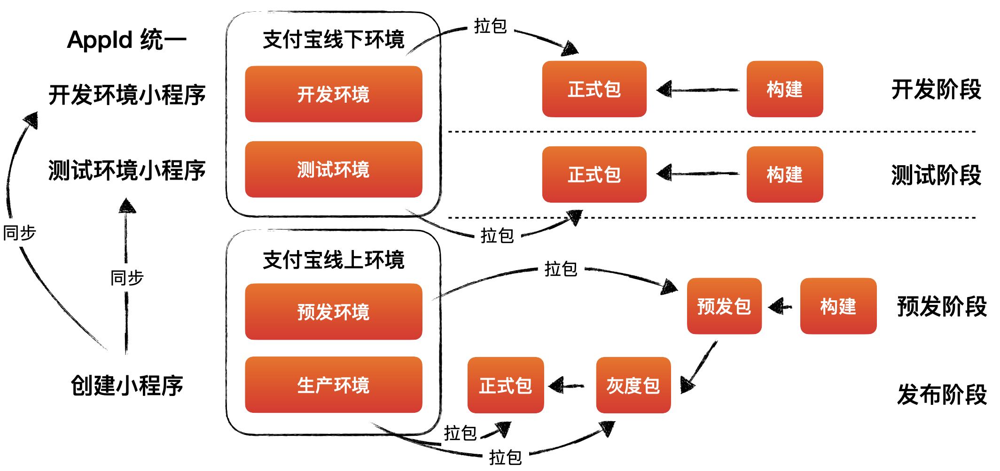
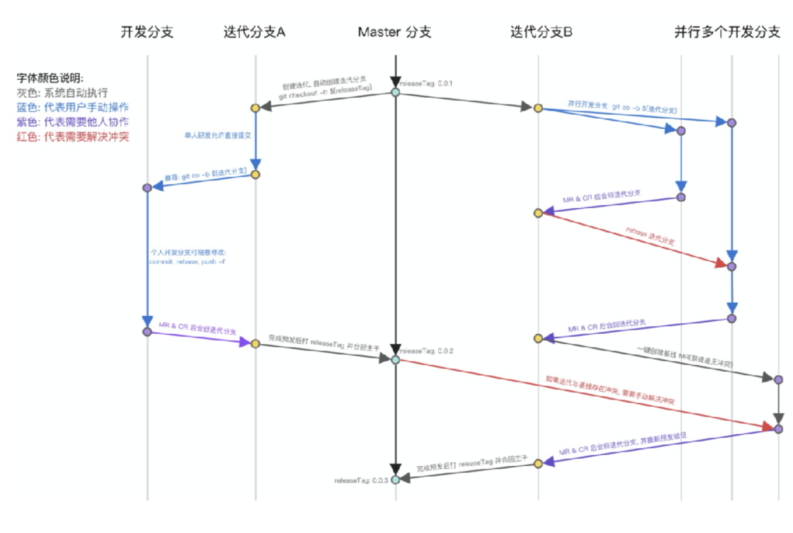
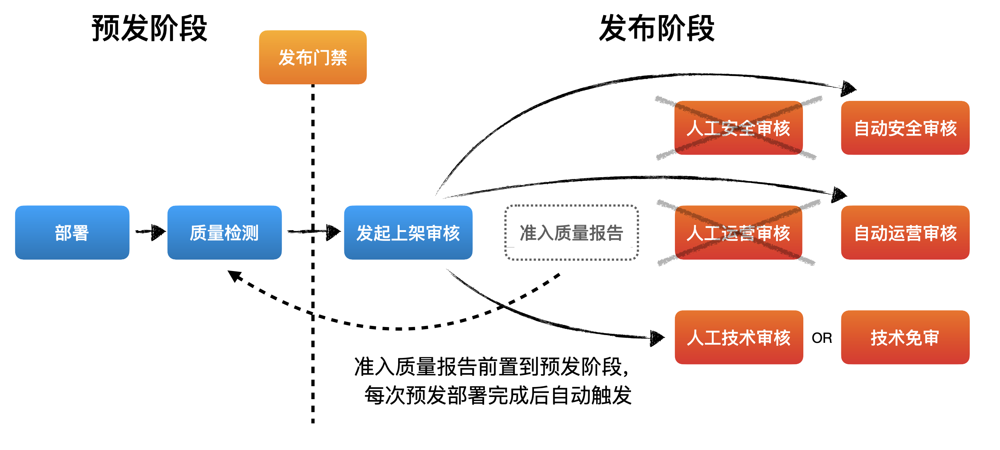
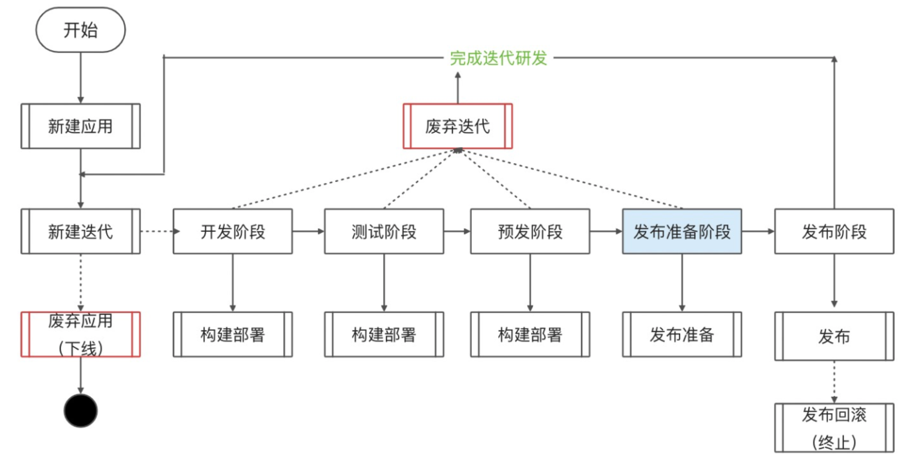
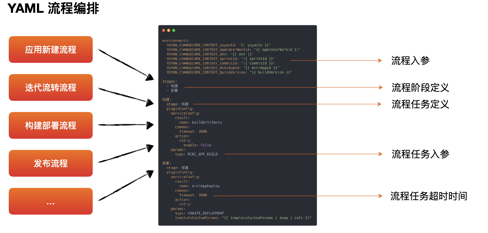
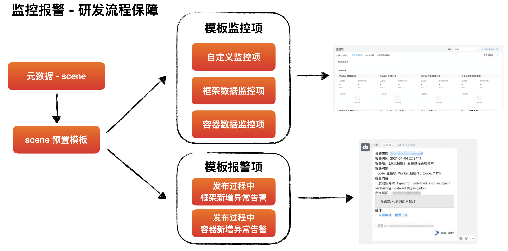
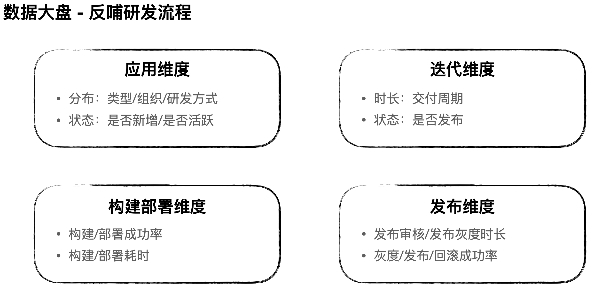

## 如何建立前端标准化研发流程

摘自前端早早聊 蚂蚁集团-淡苍

### 当前研发流程所面临的问题 从蚂蚁内部研发规范与要求看
- 能力问题
  - 没有开发/测试/预发多环境区分，无法与后端进行 rpc 联调 
  - 在本地 IDE 中无法进行多人协同开发小程序
  - 多个迭代无法同时在一个环境下部署，进行测试验证 
  - 没有线上监控报警能力，没有线上变更防御能力
- 体验问题
  - 人工上架审核漫⻓，尤其是半夜的发布，找人困难 
  - 构建速度急需提升，CI 需要加速，达到快速部署验证的目的

### 研发多环境

 

###  小程序研发多环境

 

### 如何进行多人研发协同?

 

- master 为主干分支，不允许直接提 交代码
- 新的迭代分支从 master 最新 release tag checkout
- 迭代分支不允许直接提交代码，提 交代码以 MR 形式合入迭代分支
- 从开发阶段进入测试阶段之后，迭 代必须包含最新发布 release tag

### 一定要MR么？

- 严格模式: 无法直接向迭代分支提交代码，必须 MR 经 code
  - review 后执行迭代分支的代码变更 
- 普通模式:
  - 允许开发者直接向迭代分支提交代码，但在测试阶 段进入预发阶段必须要进行评审，进入预发后相当 于严格模式
- 宽松模式:
  - 允许开发者直接向迭代分支提交代码，仅在迭代发 布前会对所有变更做一次性评审

### 小程序上架审核加速

 

### 小程序构建加速

- 资源投入
  - 使用阿里云 FC(函数计算)，按需调整性能配置
  - 探索 M1 芯片的 mac mini 搭建构建集群
- 策略优化
  - 增加构建 Cache
  - 多进程/并行化构建
  - ⻓耗时任务异步化(sourcemap 构建)
  - 代码变更后自动运行构建

### CI/CD 相关要点回顾

- 持续集成(CI)
  - 良好的代码管理与版本控制能力，满足多人协同 
  - 迭代分支代码要包含发布代码基线，防止大幅偏离主干
  - CI 全程自动化，运行速度要尽可能得快，重点在构建环节进行优化
- 持续交付(CD)
  - 多环境部署/相同环境多版本部署
  - 代码单元测试/自动化集成测试/人工覆盖率测试结合
- 持续部署(CD)
  - 发布过程中的自动化灰度放量与变更防御
  - 要做到真正的自动化持续部署很难

### 为什么要建立标准化的前端研发流程？

- 体验统一
  - 存在多种类型应用， 需要标准流程来统一 心智
  - 开发者在不同应用类 型下面对的是相对一 致的研发流程
- 满足管控
  - 研发流程须符合变更 的基本要求与管控原 则
  - 将必须流程内置到标 准流程当中，潜移默 化研发者，降低学习 成本
- 流程开放
  - 有效帮助业务平台扩 展出结合自身业务特 点的研发流程，无需 进行重复建设
  - 解放研发平台生产能 力，专注于能力建设 与流程管控

###  标准化前端研发流程描述方式

 

### 定义阶段

 

### 标准化前端研发流程配套设施

 

###  标准化前端研发流程配套设施 数据大盘 - 反哺研发流程

 
