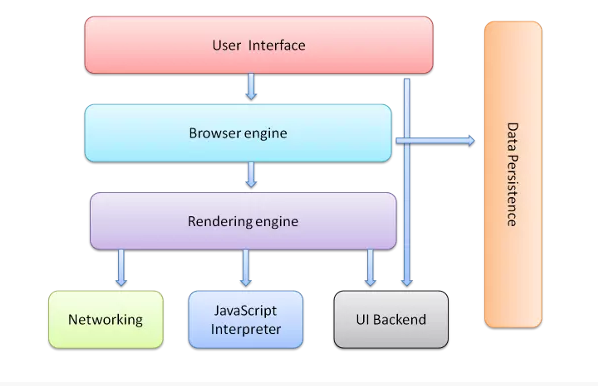
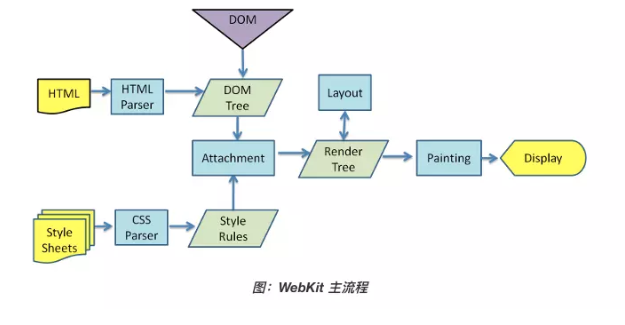
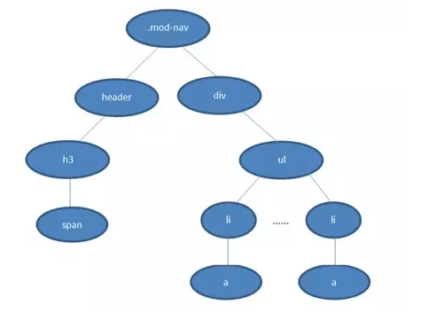
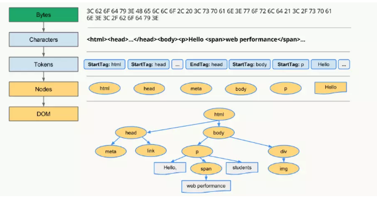
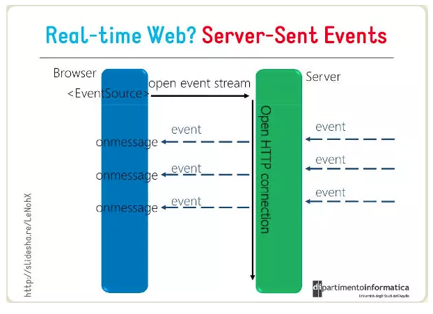
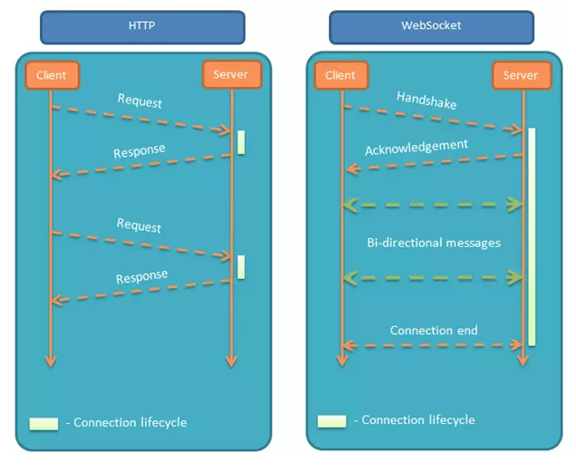
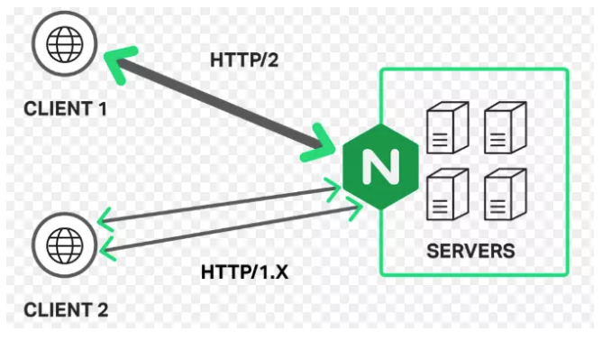

# 浏览器原理

## 常见的浏览器内核

| 浏览器/RunTime | 内核(引擎) | JavaScript引擎 |
| :-----| :-----| :-----|
| Chrome | Blink(28~)/Webkit(Chrome 27) | v8 |
| FireFox | Gecko | SpiderMonkey |
| Safari | Webkit | JavaScriptCore |
| Edge | EdgeHTML | Chakra(for JScript) |
| PhantomJS | Webkit | JavaScriptCore |
| Node.js | - | V8 |

## 浏览器主要组成部分

* 用户界面 - 包括地址栏、前进/后退按钮、书签菜单等。除了浏览器主窗口显示的您请求的页面外，其他显示的各个部分都属于用户界面。
* 浏览器引擎- 在用户界面和呈现引擎之间传送指令。
* 呈现引擎 - 负责显示请求的内容。如果请求的内容是 HTML，它就负责解析 HTML 和 CSS 内容，并将解析后的内容显示在屏幕上。
* 网络 - 用于网络调用，比如 HTTP 请求。其接口与平台无关，并为所有平台提供底层实现。
* JavaScript解析器 - 用于解析和执行 JavaScript 代码。
* 数据存储 - 保存在硬盘上的各种数据



> 值得注意的是，和大多数浏览器不同，Chrome 浏览器的每个标签页都分别对应一个呈现引擎实例。每个标签页都是一个独立的进程。

## 浏览器如何渲染ui的

* 浏览器获取HTML文件，然后对文件进行解析，形成DOM Tree
* 同时，进行CSS解析，生成Style Rules
* 接着将DOM Tree与Style Rules合成Render Tree
* 接着进入布局(Layout)阶段，为每个节点分配在屏幕上的确切坐标
* 随后调用GPU进行绘制，遍历RenderTree节点，将元素呈现



## 浏览器如何解析css选择器

浏览器会『从右往左』解析CSS选择器。

```css
.mod-nav h3 span {font-size: 16px;}
```



从右至左的匹配:

* 先找到所有的最右节点span，对于每一个span，向上寻找节点h3
* 由 h3再向上寻找 class=mod-nav 的节点
* 最后找到根元素 html 则结束这个分支的遍历。

## DOM Tree是如何构建的？

* 转码: 浏览器将接收到的二进制数据按照指定编码格式转化为HTML字符串
* 生成Tokens: 之后开始parser，浏览器会将HTML字符串解析成Tokens
* 构建Nodes: 对Node添加特定的属性，通过指针确定 Node 的父、子、兄弟关系和所属 treeScope
* 生成DOM Tree：通过node包含的指针确定的关系构建出DOM Tree



## 浏览器重绘与重排

* 重排: 部分渲染树（或者整个渲染树）需要重新分析并且节点尺寸需要重新计算，表现为重新生成布局，重新排列元素
* 重绘: 由于节点的几何属性发生改变或者由于样式发生改变，例如改变元素背景色时，屏幕上的部分内容需要更新，表现为某些元素的外观被改变

『重绘』不一定会出现『重排』，『重排』必然会出现『重绘』。

## 前端如何实现即时通讯？

### 短轮询

每隔一段时间发出一个请求
* 优点：兼容性强，实现简单
* 缺点：延迟性高，非常消耗请求资源，影响性能

### comet

comet有两种主要实现手段，一种是基于 AJAX 的长轮询（long-polling）方式，另一种是基于 Iframe 及 htmlfile 的流（streaming）方式，通常被叫做长连接。

长轮询优缺点：
* 优点：兼容性好，资源浪费较小
* 缺点：服务器hold连接会消耗资源，返回数据顺序无保证，难于管理维护

长连接优缺点：
* 优点：兼容性好，消息即时到达，不发无用请求
* 缺点：服务器维护长连接消耗资源

SSE 
SSE（Server-Sent Event，服务端推送事件）是一种允许服务端向客户端推送新数据的HTML5技术。

* 优点：基于HTTP而生，因此不需要太多改造就能使用，使用方便，而websocket非常复杂，必须借助成熟的库或框架
* 缺点：基于文本传输效率没有websocket高，不是严格的双向通信，客户端向服务端发送请求无法复用之前的连接，需要重新发出独立的请求



### Websocket

> [WebSocket教程](http://www.ruanyifeng.com/blog/2017/05/websocket.html)

Websocket是一个全新的、独立的协议，基于TCP协议，与http协议兼容、却不会融入http协议，仅仅作为html5的一部分，其作用就是在服务器和客户端之间建立实时的双向通信。

* 优点：真正意义上的实时双向通信，性能好，低延迟
* 缺点：独立与http的协议，因此需要额外的项目改造，使用复杂度高，必须引入成熟的库，无法兼容低版本浏览器



### Web Worker

Web Worker 的作用，就是为 JavaScript 创造多线程环境，允许主线程创建 Worker 线程，将一些任务分配给后者运行

> [Web Worker教程](http://www.ruanyifeng.com/blog/2018/07/web-worker.html)

### Service workers

Service workers 本质上充当Web应用程序与浏览器之间的代理服务器，也可以在网络可用时作为浏览器和网络间的代理，创建有效的离线体验。

> [Service workers教程](https://developer.mozilla.org/zh-CN/docs/Web/API/Service_Worker_API)

### 什么是浏览器同源策略？

同源策略限制了从同一个源加载的文档或脚本如何与来自另一个源的资源进行交互。这是一个用于隔离潜在恶意文件的重要安全机制。  

同源是指"协议+域名+端口"三者相同，即便两个不同的域名指向同一个ip地址，也非同源。

浏览器中的大部分内容都是受同源策略限制的，但是以下三个标签可以不受限制：
* img src
* link href
* scripe src

### 如何实现跨域？

#### jsonp
优点：
* 实现简单
* 兼容性非常好
缺点
* 只支持get请求
* 有安全性问题，容易遭受xss攻击，因为script标签只能get）
* 需要服务端配合jsonp进行一定程度的改造

```js
function JSONP({  
  url,
  params,
  callbackKey,
  callback
}) {
  // 在参数里制定 callback 的名字
  params = params || {}
  params[callbackKey] = 'jsonpCallback'
    // 预留 callback
  window.jsonpCallback = callback
    // 拼接参数字符串
  const paramKeys = Object.keys(params)
  const paramString = paramKeys
    .map(key => `${key}=${params[key]}`)
    .join('&')
    // 插入 DOM 元素
  const script = document.createElement('script')
  script.setAttribute('src', `${url}?${paramString}`)
  document.body.appendChild(script)
}

JSONP({  
  url: 'http://s.weibo.com/ajax/jsonp/suggestion',
  params: {
    key: 'test',
  },
  callbackKey: '_cb',
  callback(result) {
    console.log(result.data)
  }
})

```

### 最流行的跨域方案cors

cors是目前主流的跨域解决方案，跨域资源共享(CORS) 是一种机制，它使用额外的 HTTP 头来告诉浏览器  让运行在一个 origin (domain) 上的Web应用被准许访问来自不同源服务器上的指定的资源。当一个资源从与该资源本身所在的服务器不同的域、协议或端口请求一个资源时，资源会发起一个跨域 HTTP 请求。 
* express
```js
//CORS middleware
var allowCrossDomain = function(req, res, next) {
    res.header('Access-Control-Allow-Origin', 'http://example.com');
    res.header('Access-Control-Allow-Methods', 'GET,PUT,POST,DELETE');
    res.header('Access-Control-Allow-Headers', 'Content-Type');

    next();
}

//...
app.configure(function() {
    app.use(express.bodyParser());
    app.use(express.cookieParser());
    app.use(express.session({ secret: 'cool beans' }));
    app.use(express.methodOverride());
    app.use(allowCrossDomain);
    app.use(app.router);
    app.use(express.static(__dirname + '/public'));
});
```


### 最方便的跨域方案Nginx

反向代理的原理很简单，即所有客户端的请求都必须先经过nginx的处理，nginx作为代理服务器再讲请求转发给node或者java服务，这样就规避了同源策略。



```bash
 # 直接请求nginx也是会报跨域错误的这里设置允许跨域
    # 如果代理地址已经允许跨域则不需要这些, 否则报错(虽然这样nginx跨域就没意义了)
    add_header Access-Control-Allow-Origin *;
    add_header Access-Control-Allow-Headers X-Requested-With;
    add_header Access-Control-Allow-Methods GET,POST,OPTIONS;

    location /api {
            rewrite ^/b/(.*)$ /$1 break; # 去除本地接口/api前缀, 否则会出现404
            proxy_set_header Host $host;
            proxy_set_header X-Real-IP $remote_addr;
            proxy_set_header X-Forwarded-For $proxy_add_x_forwarded_for;
            proxy_pass http://192.168.0.103:8080; # 转发地址
        }
```

### 其它跨域方案

* HTML5 XMLHttpRequest 有一个API，postMessage()方法允许来自不同源的脚本采用异步方式进行有限的通信，可以实现跨文本档、多窗口、跨域消息传递。
* WebSocket 是一种双向通信协议，在建立连接之后，WebSocket 的 server 与 client 都能主动向对方发送或接收数据，连接建立好了之后 client 与 server 之间的双向通信就与 HTTP 无关了，因此可以跨域。
* window.name + iframe：window.name属性值在不同的页面（甚至不同域名）加载后依旧存在，并且可以支持非常长的 name 值，我们可以利用这个特点进行跨域。
* location.hash + iframe：a.html欲与c.html跨域相互通信，通过中间页b.html来实现。 三个页面，不同域之间利用iframe的location.hash传值，相同域之间直接js访问来通信。
* document.domain + iframe： 该方式只能用于二级域名相同的情况下，比如 a.test.com 和 b.test.com 适用于该方式，我们只需要给页面添加 document.domain ='test.com' 表示二级域名都相同就可以实现跨域，两个页面都通过js强制设置document.domain为基础主域，就实现了同域。