## 浏览器缓存其实就这么一回事儿

### 前言

说到浏览器缓存，做前端的同学可能也不会陌生，他是我们优化前端性能的重要组成部分。但一说到这个东西，大家又觉得跟自己平时开发的业务需求不太沾边，仅仅是面试的时候才会去背一下相关的知识，所以过会就忘了，而且也没有真正了解他。本文中，小编将带着大家去实践一下浏览器缓存的各种使用场景，其实浏览器缓存就这么一回事儿。

### 准备环境

本文中，我们会以mac的环境来讲解，所以相关命令也是mac系统的命令。
1. 首先，我们要在mac系统下安装nginx，nginx是什么这里我也不多讲了。输入一下命令，我们便可进行安装。
```bash
brew update # 更新homebrew
brew search nginx # 查看nginx信息
brew install nginx # 安装nginx
nginx # 运行nginx
nginx -s reload # 重载nginx
```
成功后我们便可看到一下截图：
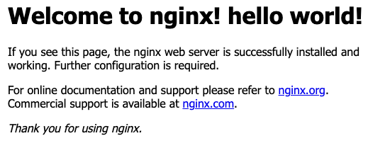

2. 配置nginx的conf
```hash
cd /usr/local/etc/nginx  # 进入nginx根目录
mkdir conf # 创建配置目录
touch ./conf/index.conf # 创建我们的nginx配置
vim nginx.conf # 配置nginx
```
3. 在nginx.conf下的配置以下语句：
```bash
http {
    ...
    include conf/*; # 引入所有conf目录下的配置文件
}
```
4. 配置我们刚才创建的index.conf文件
```bash
server {
    listen 9527;
    server_name localhost;
    location / {
        root html/web;
        index index.html index.htm;
        try_files $uri /index.html;
    }
    location ~ .*dll\.js$ { # 对dll结尾的js文件进行缓存设置
        root html/web;
    }
}
```

### 配置我们的静态资源

#### 创建静态资源文件

```bash
cd /usr/local/var/www # 到nginx存放html的根目录
mkdir web # 创建我们刚才的web文件夹
touch ./web/index.html ./web/react_dll.js ./web/index.js # 创建对应的文件资源, react_dll.js是我们使用 
```

#### 配置我们的index.html

```html
<!DOCTYPE html>
<html lang="en">
<head>
    <meta charset="UTF-8">
    <meta name="viewport" content="width=device-width, initial-scale=1.0">
    <title>hello world</title>
</head>
<body>
    <div id="app"></div>
    <script src="/index.js"></script>
    <script src="/react_dll.js"></script>
</body>
</html>
```

#### 配置index.js
```js
document.querySelector('#app').innerHTML = 'Hello world!';
```

### 不使用缓存

如各位所见，刚才我们配置的index.conf并没有配置浏览器缓存的语句，所以每次请求都会返回200，我们来看下一下截图：
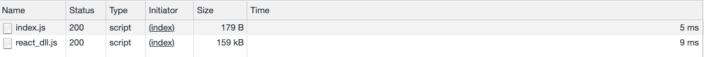
第一次请求，我们从服务器读取我们的资源，当我们刷新一下页面，js资源就会直接从浏览器内存中读取：
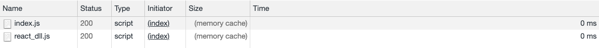
可以看到这个memory cache就是从浏览器缓存中读取的意思，这个时候我们不需要消耗时间来请求文件。<br>
那么当我们关掉浏览器的tab，将会看到什么情况呢：
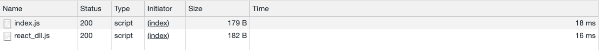
**那么我们可以得出以下结论：当我们没有配置任何浏览器缓存时，我们每次打开浏览器tab来请求我们的资源都会去服务器取，需要耗时，而当我们刷新页面时，浏览器会在内存中取得这些文件。**

### 使用强缓存

强缓存(本地缓存)是指浏览器在发送请求前，会先去缓存里查看是否命中强缓存，如果命中，则直接从缓存中读取资源，不会发送请求到服务器。
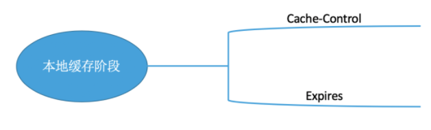

#### Expired
Expired是HTTP/1.0时引入，我们可以设置一个绝对时间，在这个时间之前资源都会走本地缓存而不会去请求服务器。比如我们在index.conf文件中作一下配置：
```bash
location ~ .*dll\.js$ { # 对dll结尾的js文件进行缓存设置
    root html/web;
    expires 1d; # 一天之后过期
}
```
可以看到当我们设置了强缓存，我们首次加载还是会请求我们的服务器:

当我们关掉tab页，再打开，我们发现浏览器会从磁盘直接读取文件：
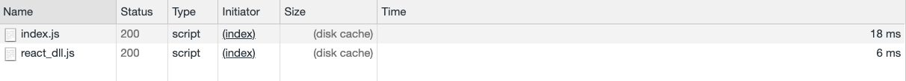
再次刷新，我们就在浏览器的内存读取文件了：

我们也可以从response headers里看到我们设置的expires时间，这个是一个绝对时间。
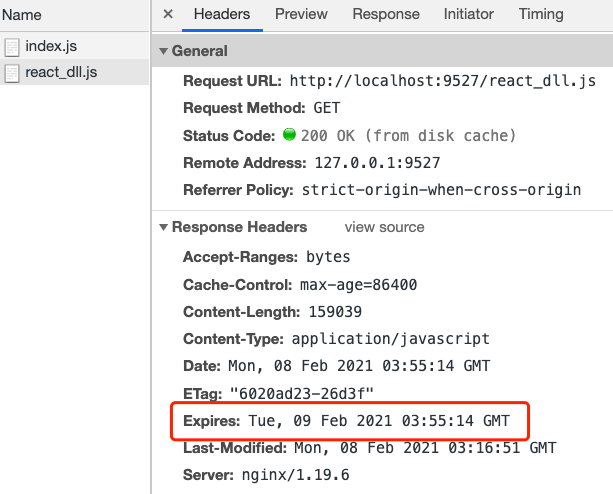

#### cache-control

到了HTTP/1.1, Expire已经被Cache-Control替代，原因在于Expire控制员村的原理是使用客户端的时间与服务端返回的时间对比，如果客户端与服务端的时间因为某些原因发生误差，那么强制缓存就会直接失效。<br>
Cache-Control的主要取值为：
- public: 所有内容都会被缓存(客户端和代理服务器都可缓存)
- private: 所有内容只有客户端可以缓存， Cache-Control的默认值
- no-cache:客户端缓存内容，但是是否使用缓存则需要经过协商缓存来验证决定
- no-store: 所有内容都不会被缓存，即不适用强制缓存也不使用协商缓存
- max-age=xxx: 缓存内容将在xxx秒后失效

我们在index.conf中配置Cache-Control看下真是情况是怎样的：

##### max-age
```bash
location ~ .*dll\.js$ { # 对dll结尾的js文件进行缓存设置
    root html/web;
    # expires 1d; # 一天之后过期
    add_header Cache-Control max-age=30;
}
```
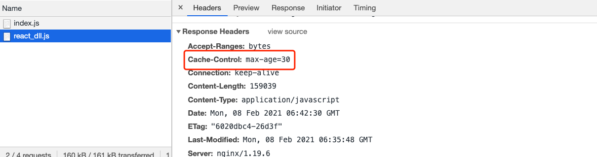
首次请求后，我们就会在磁盘中请求文件，如下图显示：
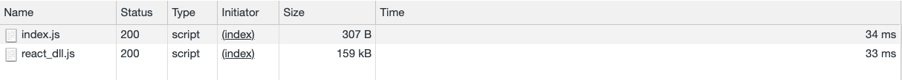
当我们过了30s后再次请求，则会重新向服务器请求资源：
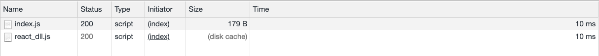

#### public
```bash
location ~ .*dll\.js$ { # 对dll结尾的js文件进行缓存设置
    root html/web;
    # expires 1d; # 一天之后过期
    add_header Cache-Control public;
}
```

#### no-cahce
可以在本地进行缓存，但每次发请求时，都要向服务器进行验证，如果服务器允许，才能使用本地缓存。跟max-age=0;用法相同。那么当我们设置了这个属性后，浏览器加载资源将会怎么样，我们来看一下流程图：

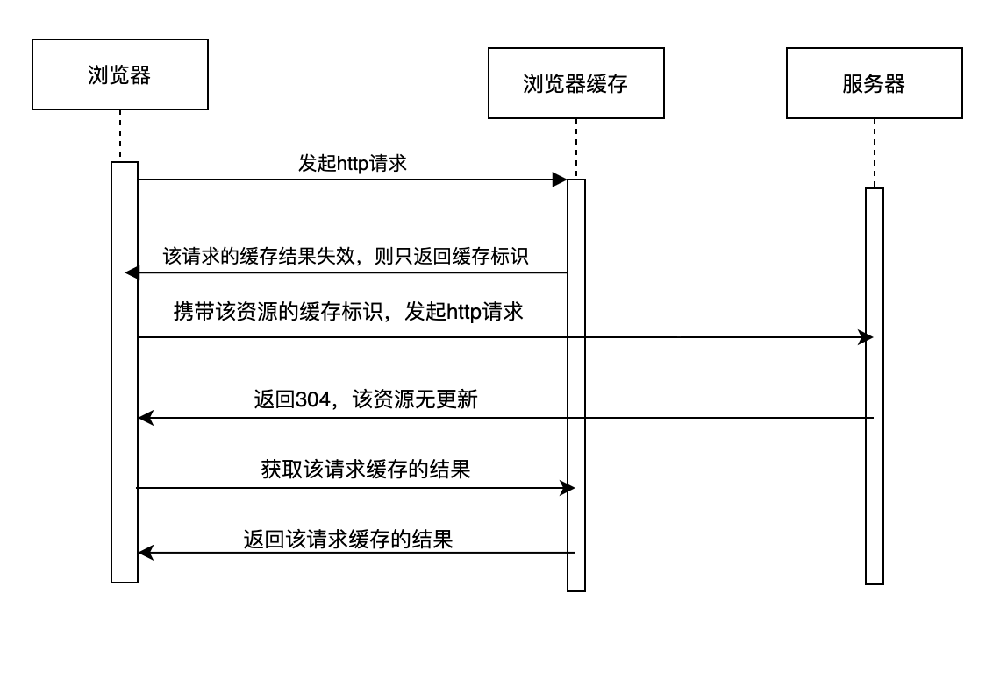


### 使用协商缓存

当我们在nginx上写了如下代码：
```bash
location ~ .*dll\.js$ { # 对dll结尾的js文件进行缓存设置
    root html/web;
    # expires 1d; # 一天之后过期
    add_header Cache-Control no-cache; # 或者设置Cache-Control max-age=0;
} 
```


#### Last-Modified & If-Modified-Since

#### Etag & If-None-Match