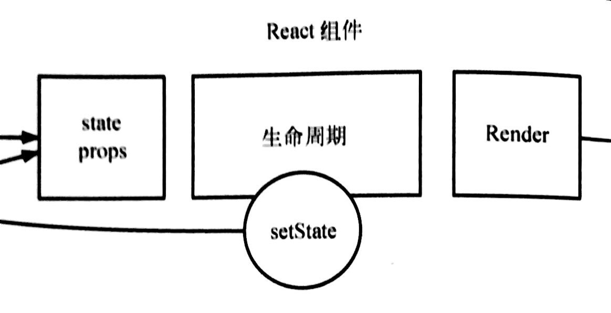
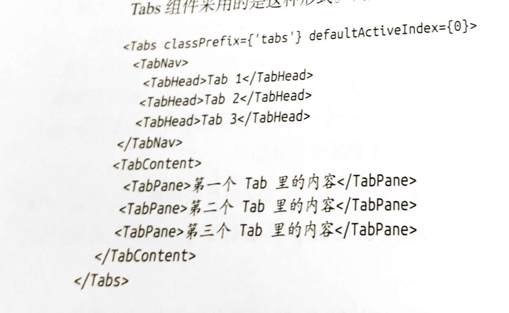
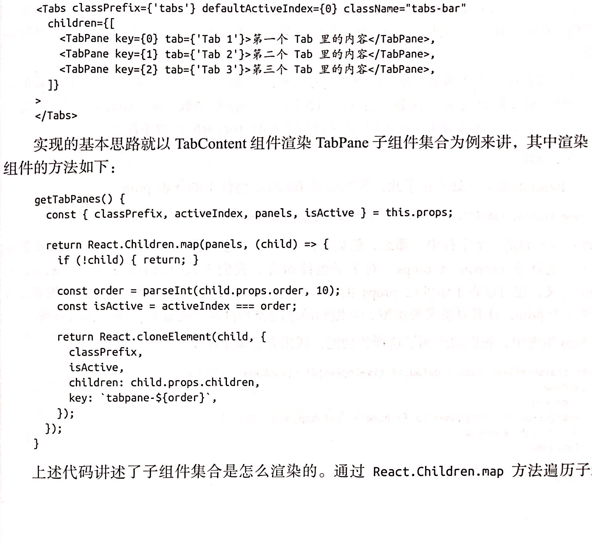
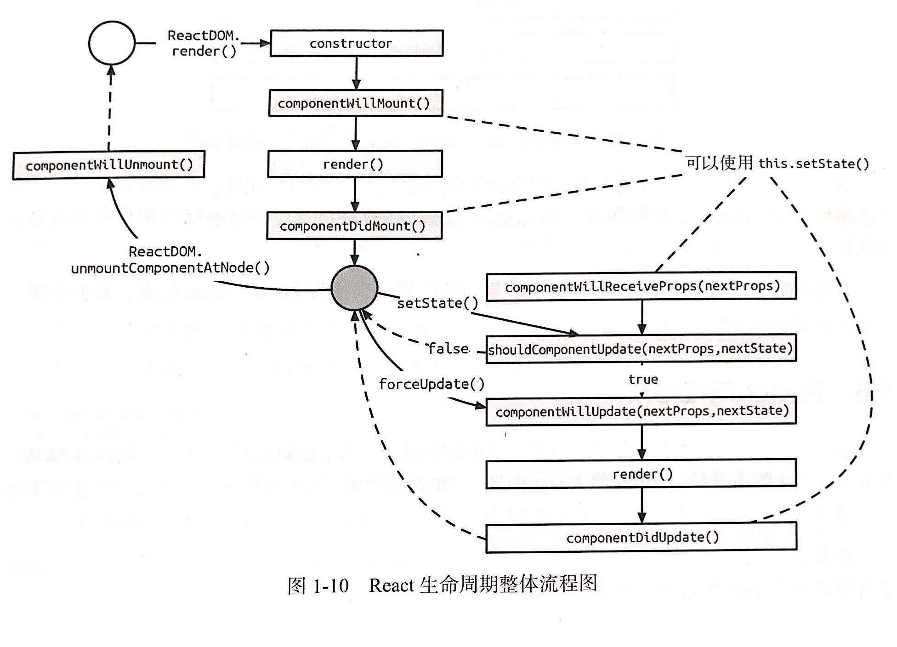

# 第一章 初入React世界

## 重点词汇
- 专注视图层
>  React并不是完整的MVC/MVVM框架，它专注于提供清晰、简介的view层解决方案。而又和模板引擎不同，因为它又是一个包括view和controller的库。
- Virtual DOM
> 我们都知道DOM操作非常昂贵。在前端开发中，性能消耗最大的就是DOM操作。*React把真实DOM树转换成JavaScript对象树，，诶次数据更新后，重新计算Virtual DOM，并和上次生成的VD作对比买对发生变化的部分做批量更新*
- 函数式编程
> 构建一个规则使计算重复被利用。*React充分利用很多函数式方法减少用于代码。此外它本身就是简单函数，所以易于测试。可以说函数式编程才是React的精髓*
- JSX
> jsx的官方定义是类XML语法的ECMAScript扩展。它完美地利用了js自带的语法和特性，并使用大家熟悉的HTML语法来穿件元素。</br>
例如：
```
  const List = () => (
    <div>
      <Title>This is a title</Title>
      <ul>
        <li>list item</li>
        <li>list item</li>
        <li>list item</li>
      </ul>
    </div>
  )
```
<font color=#ff5858 size=4 >* 注意：定义标签时，只允许被一个标签包裹；标签一定要闭合；定义组件时命名应该使用大写字母开头！！！</font>
> 元素属性：js中的class和for均为关键字，*class->className;for->htmlFor*，boolean属性例如：
```
<Checkbox checked={true} /> 
// 可以简写为
<Checkbox checked />
//反之checked为false就可以省略不写
<Checkbox checked={false}/>
//不知道props里与有什么就最好不要设置它，使用es6的rest/spread特性来提高效率
<Component {...data}>
```
- React组件</br> 
代码实例详见p14-p15 <br>
1、基本的封装性。</br>
2、简单的生命周期呈现 </br>
3、明确的数据流动。根据不同的参数得到不同的响应，从而得出不同的渲染结果。
> 在这个阶段，前端在应用级别并没有过多复杂的交互，组件化发展缓慢。这样的逻辑一旦复杂起来，就会存在大量的dom操作，开发和维护成本相当高。
- React组件的构建
> React的本质就是关心元素的构成，它基本上由3个部分组成-----属性（props）、状态（state）以及生命周期方法

- React组件的构建方法：1、使用React.createClass构建的组件时React最传统、也是兼容性最好的方法，例子：
```
const Button = React.createClass({
  getDefaultProps() {
    return {
      color: 'blue',
      text: 'Confirm'
    }
  }

  render() {
    const {text,color} = this.props;
    return (
      <button className={`btn btn-${color}`}>
        <em>{text}</em>
      </button>
    )
  }
})
```
2、ES6 classes
```
import React,{Component} from 'react';
class Button extends Component {
  static defaultProps = {
    color: 'blue',
    text: 'Confirm'
  }
  render() {
    const {color,text} = this.props;
    return (
      <button className={`btn btn-${color}`}>
        <em>{text}</em>
      </button>
    )
  }
}
```
>在React的开发中，常用的方式是将组件拆分到合理的粒度，用组合的方式合成业务组件，也就是HAS-A关系。

<font color=#ff5858 size=4 >* React的多有组件都继承自顶层React.Compoennt。它只是初始化了ReactComponent方法，声明了props、context、refs等，并在原型上定义了setState和forceUpdate方法。</font><br>
3、无状态函数<br>
>无状态组件之传入props和context两个参数，不存在state，也没有生命周期方法。在适合的情况下，我们都应该切且必须使用无状态组件。
- React的数据流
> 在React中，数据是自顶向下单向流动的。这条规则让组件之间的关系变得简单可测。
> - 内部的状态同意成为state。值得注意的是，setState是一个异步的方法，一个生命周期内所有的setState方法都会结并操作。我们并不推荐开发者滥用state，过多的内部状态会让数据流混乱，程序变得难以维护。
> - props 是React中用来让组件之间相互联系的的一种机制，就像方法的参数一样。*对于一个tabs组件它的props会有那些呢，1、className，根节点class方便覆盖原始样式；<br>2、classPrefix:class的前缀，对于组件来说，定义一个统一的class前缀，对样式与交互分离起了重要的作用<br>3、defaultActiveIndex和activeIndex<br>4、onChange：回调函数*

> - 子组件prop
> 在React中有一个重要且内置的prop-children，它代表组件的子组件合计  p25

最后TabContent组件的render方法只需要调用getTabPanes方法渲染即可，
```
  render() {
    return (<div>{this.getTabPanes()}</div>)
  }
```
这种调用方法叫做动态子组件（Dynamic Children）
- 组件prop（component prop）<br>
可以将子组件以props的形式传递
- 用function prop与父组件通信
this.props.onChange({activeIndex, preIndex})<br>
父组件将方法传递给子组件，子通过触发onChange给父亲回调需要的值
- propTypes
propTypes用来规范props类型的与必须的状态，常见的有（string、number、func、array、bool、oneOfType、node）
### React的生命周期
> React的组件的生命周期可以分为挂在、渲染和卸载这几个阶段。大体我们可以分为两类：1、当组件在挂在或卸载时；2、当组件接受新的数据时
- 组件的挂载 componentDidMount componentWillMount
- 组件的卸载 compoentWillUnmount
- 数据的更新过程
```
  class App extends React.Component {
    componentWillReceiveProps(nextProps) {

    }
    shouldComponentUpdate(nextProps, nextState) {

    }
    componentWillUpdate(nextProps,nextState) {

    }
    componentDidUpdate(prevProps, prevState) {

    }
  }
```
> 如果组件发生自身更新那么次执行scu,cwu,render,cdu<br>
>shouldComponentUpdate是一个特别的方法，接受props和state让开发者判断其是否需要更新。<br>
<font color=#ff5858 size=4 >* 值得注意的是stateless组件没有生命周期方法，也意味着每次都会重新渲染。我们可以使用Recompose库的pure方法：const OptimizedComponent = pure(ExpensiveComponent)</font><br>
### 整体流程图

- ReactDOM
主要方法findDOMNode（获取真实dom元素）、render（渲染VirtualDom到dom）、unmountComponentAtNode卸载操作

